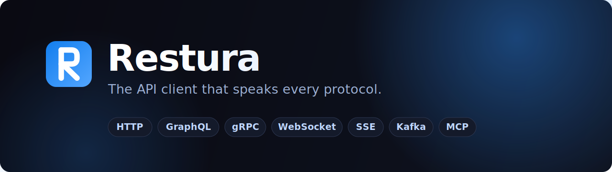

<div align="center">



<br/>

[](https://github.com/dipjyotimetia/restura/actions/workflows/ci.yml)
[](https://securityscorecards.dev/viewer/?uri=github.com/dipjyotimetia/restura)
[](https://github.com/dipjyotimetia/restura/releases/latest)
[](LICENSE)
[](https://nodejs.org)
[](https://www.typescriptlang.org)
[](https://sentry.io)

<br/>

[](https://restura.dev/)
&nbsp;
[](https://github.com/dipjyotimetia/restura/releases/latest)
&nbsp;
<a href="https://docs.restura.dev/" target="_blank" rel="noopener noreferrer"></a>

</div>

<br/>

Restura is one API client that speaks every protocol I actually use — HTTP, GraphQL, gRPC, WebSocket, SSE, Kafka, MQTT, and MCP. It stores everything locally, needs no account, and runs in the browser, as a native desktop app (macOS / Windows / Linux), or self-hosted in Docker behind your firewall. Free — not "free tier with the useful stuff locked," just free.

It started because I was tired of juggling four tools to debug one service, each with its own collection format and auth setup. Then Postman changed its pricing and Insomnia went cloud-first — syncing auth tokens, internal hostnames, and payload bodies to someone's server by default. That felt wrong, so Restura signs auth at the wire and keeps your data on your machine.

<br/>

<!-- ─────────────────────────────────────────────────────────────────────────
     A LOOK INSIDE
     Drop your screenshot at .github/assets/restura-screenshot.png and it
     renders here automatically. See .github/assets/ASSETS.md for specs.
────────────────────────────────────────────────────────────────────────── -->

<div align="center">

### A look inside

<!-- Uncomment the line below once .github/assets/restura-screenshot.png is committed -->
<!--  -->

<sub>Multi-tab requests · response inspector · network console · timing waterfall</sub>

</div>

<br/>

## Protocols

|        | Protocol               | What works today                                                           |
| :----: | ---------------------- | -------------------------------------------------------------------------- |
| `HTTP` | REST / HTTP            | All methods, params, headers, body types, cookies, code gen                |
| `GQL`  | GraphQL                | Query builder, schema introspection, subscriptions                         |
| `RPC`  | gRPC                   | Unary, server streaming, reflection · client/bidi streaming _desktop only_ |
|  `WS`  | WebSocket              | Connect, send/receive, full message history                                |
|  `IO`  | Socket.IO              | Connect, emit/listen events, acks                                          |
| `SSE`  | Server-Sent Events     | Live event stream viewer with reconnection                                 |
| `KFK`  | Kafka                  | Produce / consume, SASL + TLS · _desktop only_                             |
| `MQT`  | MQTT                   | Publish / subscribe, QoS, TLS · _desktop only_                             |
| `MCP`  | Model Context Protocol | Proxy to any MCP server — and Restura _can be_ one                         |

## Highlights

|                        |                                                                                                                                                                |
| ---------------------- | -------------------------------------------------------------------------------------------------------------------------------------------------------------- |
| **Request scripting**  | Pre-request and test scripts in JavaScript, sandboxed in [QuickJS](https://bellard.org/quickjs/) WASM — no DOM, no network escape.                             |
| **Workflows**          | Chain requests, extract variables via JSONPath / regex / headers, set retries with exponential backoff. Runs in the app or in CI.                              |
| **Import everything**  | Postman v2.1, Insomnia, Bruno, OpenAPI / Swagger, Hoppscotch — drop it in and start testing.                                                                   |
| **Environments**       | Scope variables per environment; swap `{{base_url}}` between staging and prod in one click.                                                                    |
| **Auth built-in**      | Basic, Bearer, API Key, Digest, NTLM, OAuth 1.0a/2.0, WSSE, AWS SigV4 — per request or inherited from a collection or folder. mTLS via the Electron transport. |
| **AI assistant**       | Chat with OpenAI, Anthropic, or OpenRouter with the current request and response as context. Secrets are redacted at the wire. _Desktop only._                 |
| **Private by default** | Everything stored locally. No accounts, no cloud sync, no per-user tracking or behavioural profiling — usage metrics are anonymous and aggregate only.         |

## Security

Restura signs auth **at the wire** and guards every outbound request — on both the web Worker and the desktop main process.

- **Desktop (Electron)** — Keys wrapped by the OS keychain via `safeStorage` (macOS Keychain / Windows Credential Manager / libsecret), data sealed with AES-256-GCM. mTLS, custom CA certs, SOCKS proxies, PAC resolution, and TLS-verify-off all run through Node's TLS / `net` stack.
- **Web** — Keys default to ephemeral in-memory (regenerated per session) so the key never sits beside the ciphertext; encrypted data won't survive a reload. mTLS, custom CA, SOCKS, and TLS-verify-off aren't available in the browser sandbox.
- **Network** — SSRF guards (RFC 1918, CGNAT, link-local, cloud-metadata, IPv6 ULA, IPv4-mapped IPv6) on every path; desktop adds a DNS-rebind guard at lookup time. AWS SigV4 is signed in the Worker / Electron handler — never the renderer — so the signature matches the exact bytes upstream receives.
- **Sandbox** — User scripts run in a [QuickJS](https://bellard.org/quickjs/) WASM VM with memory and time limits. No host bridge, no filesystem, no network.
- **Privacy** — No accounts, no cloud sync. Optional, opt-out error reporting (on by default) can be turned off in **Settings › Privacy**. Desktop routes errors to [Sentry](https://sentry.io) via a renderer→main IPC bridge; web routes them to a self-hosted Cloudflare Worker (`/api/telemetry/error`). Either way: error message, stack, version, OS only — never request URLs, headers, bodies, secrets, or identity (`sendDefaultPii: false`). Both paths gate on `settings.telemetry.errorsEnabled` and send nothing until checked. The only usage signal is anonymous aggregate session counts (desktop Sentry Release Health, gated by the same opt-out); the self-hosted server collects nothing. See [`docs/adr/0027-telemetry-and-privacy-preserving-usage-analytics.md`](docs/adr/0027-telemetry-and-privacy-preserving-usage-analytics.md).

See [`docs/adr/0004-security-hardening.md`](docs/adr/0004-security-hardening.md) for the design rationale.

## Quick start

**Prerequisites:** Node.js 24+ and npm. Or skip the setup and [open the web app](https://restura.dev/) directly.

```bash
git clone https://github.com/dipjyotimetia/restura.git
cd restura
npm install
npm run dev          # → http://localhost:5173
```

One command boots the Vite dev server **and** the Cloudflare Worker proxy (via Miniflare).

<details>
<summary><b>Desktop app (build from source)</b></summary>

<br/>

Prebuilt installers live on the [**releases page**](https://github.com/dipjyotimetia/restura/releases/latest). To build locally:

```bash
npm run electron:dev              # development (live reload)

npm run electron:dist:mac         # macOS   → DMG + ZIP  (x64 + arm64)
npm run electron:dist:win         # Windows → NSIS + portable (x64 + ia32)
npm run electron:dist:linux       # Linux   → AppImage + deb + rpm (x64)
```

</details>

<details>
<summary><b>Self-hosting (Docker)</b></summary>

<br/>

Run the web app behind your firewall in a single Node container — no Cloudflare account required.

```bash
cp .env.example .env              # set WORKER_PROXY_TOKEN + ALLOWED_ORIGIN
docker compose up -d --build
curl -fs http://localhost:3000/health
```

See [**docs/SELF_HOSTING.md**](docs/SELF_HOSTING.md) for the full operations guide — auth modes, internal-network access, reverse-proxy examples, healthchecks.

</details>

## How it works

The same React SPA powers both targets. The only thing that differs is the transport layer, chosen at runtime by `isElectron()`.

```
          ┌──────────────────────────────────────┐
          │          React SPA (renderer)        │
          │   Vite · React 19 · React Router v7  │
          └────────────┬─────────────┬───────────┘
                       │             │
                web    │             │   desktop
                       ▼             ▼
          ┌─────────────────┐  ┌──────────────────────┐
          │   Cloudflare    │  │   Electron main       │
          │   Worker (Hono) │  │   Native IPC handlers │
          └────────┬────────┘  └──────────┬────────────┘
                   │                       │
                   └───────────┬───────────┘
                               ▼
                       Target API / Service
```

Protocol logic lives once in `shared/protocol/` — SSRF validation, header policy, body construction, response shaping — and each backend supplies only a thin `Fetcher` adapter. The Cloudflare Worker is never bundled into the desktop app. See [docs/ARCHITECTURE.md](docs/ARCHITECTURE.md) for the full breakdown.

<details>
<summary><b>Project layout</b></summary>

<br/>

```
src/
├── features/
│   ├── http/          # REST request builder & executor
│   ├── grpc/          # gRPC client + server reflection
│   ├── graphql/       # GraphQL builder + schema explorer
│   ├── websocket/     # WebSocket client
│   ├── socketio/      # Socket.IO client
│   ├── sse/           # Server-Sent Events client
│   ├── kafka/         # Kafka producer/consumer (desktop only)
│   ├── mqtt/          # MQTT client (desktop only)
│   ├── mcp/           # MCP client
│   ├── ai/            # AI assistant (chat + request context)
│   ├── ai-lab/        # LLM / prompt eval workbench (desktop only)
│   ├── workflows/     # Request chaining + variable extraction
│   ├── collections/   # Sidebar, runner, Postman/Insomnia import
│   ├── environments/  # Environment variable manager
│   ├── auth/          # Auth config (shared across protocols)
│   ├── load-testing/  # Collection load/perf runner
│   ├── mcp-server/    # Restura-as-MCP-server
│   ├── registry/      # Lightweight service registry / request runner
│   ├── contracts/     # Contract testing (provider / consumer)
│   └── scripts/       # Script editor + QuickJS executor
│
shared/protocol/       # Backend-agnostic protocol orchestrators
shared/capture/        # Browser-capture pipeline (used by the extension)
worker/                # Shared Hono app — Cloudflare Worker + self-hosted Node
electron/main/         # Electron main process + IPC handlers
extension/chrome/      # Browser capture extension (MV3)
extension/vscode/      # VS Code extension (OpenCollection support)
cli/                   # restura-cli — run collections in CI
```

</details>

## Stack

| Concern    | Choice                                                          |
| ---------- | --------------------------------------------------------------- |
| Build      | Vite 8 + `@cloudflare/vite-plugin`                              |
| UI         | React 19 · Tailwind CSS v4 · shadcn/ui · Radix UI               |
| Routing    | React Router v7 (hash mode — works on `file://` and `https://`) |
| State      | Zustand v5 with `persist` middleware                            |
| Validation | Zod v4                                                          |
| Editor     | Monaco Editor                                                   |
| Script VM  | QuickJS WASM (`quickjs-emscripten`)                             |
| Worker     | Hono on Cloudflare Pages Functions                              |
| Desktop    | Electron 42                                                     |
| Tests      | Vitest + React Testing Library + Playwright                     |

## Development

```bash
npm run dev              # web dev server (port 5173)
npm run validate         # type-check + lint + tests (same as CI)
npm run test:run         # run tests once
npm run test:coverage    # coverage report
npm run lint             # Biome lint
npm run format           # Biome format
```

Every PR runs type-check (renderer + Electron main + Worker), lint, security audit, tests, build, and a Cloudflare Pages preview deploy — the URL is posted to the PR automatically.

## Contributing

This started as a personal tool and I'd genuinely love help making it better. Bug fixes, new protocol support, UI polish, docs, security hardening — all welcome.

```bash
git checkout -b fix/my-thing
# make your changes
npm run validate          # type-check + lint + tests — same gates as CI
git commit -m 'fix: my thing'
# open a PR
```

If you're thinking about adding a new protocol or something significant, open an issue first so we can talk through the approach. For smaller things, just send the PR. [`good first issue`](https://github.com/dipjyotimetia/restura/labels/good%20first%20issue) is a good place to start. See [CONTRIBUTING.md](CONTRIBUTING.md) for branch naming and commit format, and [CODE_OF_CONDUCT.md](CODE_OF_CONDUCT.md) for the code of conduct.

## Links

- <a href="https://docs.restura.dev/" target="_blank" rel="noopener noreferrer"><b>Documentation</b></a> — guides, references, and how-tos
- [**Architecture**](docs/ARCHITECTURE.md) — system design, security model, IPC internals
- [**Roadmap**](docs/ROADMAP.md) — what's planned
- [**Changelog**](docs/CHANGELOG.md) — what's shipped
- [**CI/CD & Releases**](docs/CI_CD.md) — pipeline, supply-chain hardening, release runbook
- [**Security**](SECURITY.md) — how to report vulnerabilities
- [**Browser extension**](extension/chrome/README.md) — capture HTTP/GraphQL/WebSocket/SSE/gRPC-web traffic from Chrome into a collection
- [**VS Code extension**](extension/vscode/README.md) — schema validation, Test Explorer, and inline send for OpenCollection files

<br/>

<div align="center">

**MIT License** · Hosted on Cloudflare Pages · Made by [**dipjyotimetia**](https://github.com/dipjyotimetia)

<sub>If this saves you a context-switch, a ⭐ helps other developers find it.</sub>

</div>
