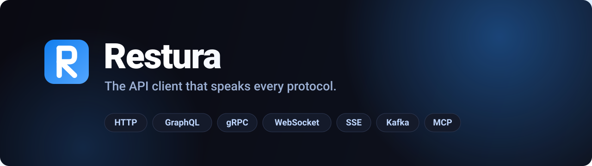

<div align="center">



# Restura

**One local-first API client for HTTP, GraphQL, gRPC, WebSocket, Kafka, MQTT, MCP, and more.**

[](https://github.com/dipjyotimetia/restura/actions/workflows/ci.yml)
[](https://securityscorecards.dev/viewer/?uri=github.com/dipjyotimetia/restura)
[](https://github.com/dipjyotimetia/restura/releases/latest)
[](LICENSE)
[](https://nodejs.org)
[](https://www.typescriptlang.org)

[](https://restura.dev/)
&nbsp;
[](https://github.com/dipjyotimetia/restura/releases/latest)
&nbsp;
<a href="https://docs.restura.dev/" target="_blank" rel="noopener noreferrer"></a>

</div>

Restura lets you debug an HTTP API, inspect a gRPC service, keep a WebSocket transcript, and work with Kafka or MQTT without switching tools—or surrendering your collections to a hosted account. Run it in your browser, as a native desktop app for macOS, Windows, and Linux, or self-host it in Docker behind your firewall.

No account. No cloud sync. Your collections, history, and environments stay in local browser storage or encrypted desktop storage; optional crash reporting is scrubbed and can be disabled. Native networking and AI features are deliberately desktop-only where browser security boundaries make them impossible.

> **Try it your way:** [open the web app](https://restura.dev/) for HTTP-first workflows, [download desktop](https://github.com/dipjyotimetia/restura/releases/latest) for native protocols and OS-backed secrets, or [self-host with Docker](docs/SELF_HOSTING.md) for a controlled deployment.

## Everything your API stack speaks

| Protocol | What works today | Platform |
| --- | --- | --- |
| **REST / HTTP** | All methods, params, headers, body types, cookies, code generation | Web · Desktop |
| **GraphQL** | Query builder, schema introspection, subscriptions | Web · Desktop |
| **gRPC** | Unary calls, server streaming, reflection; native client/bidi streaming | Web · Desktop¹ |
| **WebSocket** | Connect, send/receive, full message history | Web · Desktop |
| **Socket.IO** | Connect, emit/listen events, acknowledgements | Web · Desktop |
| **SSE** | Live event-stream viewer with reconnection | Web · Desktop |
| **Kafka** | Produce, consume, transactions, admin, SASL/OAuth, TLS | Desktop |
| **MQTT** | Publish/subscribe, QoS, TLS | Desktop |
| **MCP** | Connect to MCP servers—or expose Restura as one | Web · Desktop² |

¹ Web supports unary and server-streaming gRPC; client and bidirectional streaming require desktop. ² Web supports streamable HTTP; HTTP-SSE transport requires desktop. See the [capability matrix](docs/CAPABILITY_MATRIX.md) for the complete, generated platform breakdown.

## Why developers choose Restura

| | |
| --- | --- |
| **Bring your existing work** | Import Postman v2.1, Insomnia, OpenAPI 3.x / Swagger 2.0, Hoppscotch, and Bruno collections. Export when you need to move on. |
| **Reuse requests safely** | Organise collections and environments; inherit auth; switch `{{base_url}}` between staging and production without copying requests. |
| **Automate without a fragile script runner** | Run pre-request and test scripts in a bounded QuickJS WASM sandbox with no DOM, filesystem, or network access. Build portable workflows from saved HTTP and GraphQL requests. |
| **Keep authentication close to the wire** | Configure Basic, Bearer, API Key, Digest, NTLM, OAuth 1.0a/2.0, WSSE, AWS SigV4, and more. Desktop also supports mTLS, custom CAs, and SOCKS. |
| **Work with AI on sensitive requests** | Desktop AI chat and AI Lab use request context with secrets and internal URLs redacted before provider calls. Evaluate prompts, models, and bounded agent suites locally. |
| **Use MCP in both directions** | Inspect MCP server traffic as a client, or expose permitted Restura collections through Restura’s MCP server mode. |

## Start in the right place

### Web app

Open [restura.dev](https://restura.dev/) to send HTTP, GraphQL, WebSocket, SSE, and supported gRPC/MCP requests immediately. Browser capabilities are intentionally constrained; consult the [capability matrix](docs/CAPABILITY_MATRIX.md) before relying on native networking features.

### Develop locally

**Prerequisites:** Node.js 24+ and npm.

```bash
git clone https://github.com/dipjyotimetia/restura.git
cd restura
npm ci
npm run dev # http://localhost:5173
```

This starts the Vite app and its local Cloudflare Worker proxy through Miniflare.

### Desktop app

Get prebuilt installers from the [latest release](https://github.com/dipjyotimetia/restura/releases/latest), or build from source:

```bash
npm run electron:dev              # development with live reload
npm run electron:dist:mac         # macOS: DMG + ZIP
npm run electron:dist:win         # Windows: NSIS + portable
npm run electron:dist:linux       # Linux: AppImage + deb + rpm
```

Desktop is the right target for Kafka, MQTT, native gRPC streaming, filesystem/Git collections, OS-keychain secret handles, mTLS, custom CAs, SOCKS, and all AI surfaces.

### Self-host with Docker

Run the web application in one Node container; no Cloudflare account is required.

```bash
cp .env.example .env # set WORKER_PROXY_TOKEN and ALLOWED_ORIGIN
docker compose up -d --build
curl -fs http://localhost:3000/health
```

Read [Self-hosting](docs/SELF_HOSTING.md) before deploying: it covers authentication modes, reverse-proxy configuration, internal-network access, rate limits, and health checks.

## Built to keep request data under your control

- **Local persistence with clear boundaries.** Browser data lives in local IndexedDB. On desktop, encrypted storage is backed by Electron `safeStorage` and the OS keychain; secret handles keep plaintext out of the renderer where supported.
- **Outbound-request protection.** Shared SSRF validation blocks private, link-local, and cloud-metadata targets by default. Desktop adds DNS-rebind protection; self-hosted deployments can explicitly enable private-network access when needed.
- **Wire-accurate signing.** AWS SigV4 is signed in the Worker or Electron handler, not the renderer, so the upstream receives the exact signed bytes.
- **Sandboxed user code.** Pre-request and test scripts run with time and memory limits and have no host bridge.
- **Transparent telemetry.** Error reporting is opt-out and can be disabled in **Settings → Privacy**. It excludes request URLs, headers, bodies, secrets, and identity. Self-hosted deployments collect no usage analytics.

Read the [security architecture](docs/adr/0004-security-hardening.md), [privacy and telemetry decision](docs/adr/0027-telemetry-and-privacy-preserving-usage-analytics.md), and [capability matrix](docs/CAPABILITY_MATRIX.md) for the full model and platform caveats.

## One renderer, three targets

The React SPA runs as a web app, a self-hosted Node/Docker service, and an Electron desktop application. Its transport changes by target; its protocol core does not.

```text
React SPA
  ├─ Web: Cloudflare Worker (Hono) → target API or service
  ├─ Self-hosted: Node/Hono server → target API or service
  └─ Desktop: Electron IPC → native protocol handlers → target API or service
```

`shared/protocol/` owns request construction, header policy, response shaping, and SSRF validation. Worker and Electron handlers supply the transport-specific adapters. See [Architecture](docs/ARCHITECTURE.md) for the details.

<details>
<summary><strong>Project layout</strong></summary>

```text
src/features/          # protocol UI, collections, scripts, workflows, AI
shared/protocol/       # backend-agnostic protocol orchestrators
worker/                # Cloudflare Worker and self-hosted Node/Hono app
electron/main/         # desktop IPC, native handlers, secure storage
extension/             # Chrome capture and VS Code extensions
cli/                   # collection and workflow automation for CI
docs/                  # architecture, operations, security, and guides
```

</details>

## Development and contributing

```bash
npm run dev              # web development server
npm run validate         # static checks, tests, and builds
npm run test:run         # Vitest once
npm run test:coverage    # coverage report
npm run type-check:all   # renderer, Worker, Electron, CLI, extensions
npm run lint             # Biome lint
npm run format:check     # formatting check
```

Contributions across protocol support, bugs, security, docs, and UX are welcome. Read [CONTRIBUTING.md](CONTRIBUTING.md) for setup and conventions; use a [good first issue](https://github.com/dipjyotimetia/restura/labels/good%20first%20issue) to get started. For a new protocol or a larger change, open an issue first so the design can be discussed.

## Explore further

- [Documentation](https://docs.restura.dev/) — installation, protocol guides, and references
- [Capability matrix](docs/CAPABILITY_MATRIX.md) — precise web-versus-desktop support
- [AI Lab](https://docs.restura.dev/guides/ai-lab/) — desktop model evaluation and agent-suite testing
- [Architecture](docs/ARCHITECTURE.md) — shared protocol core, transport boundaries, and security model
- [Self-hosting](docs/SELF_HOSTING.md) — Docker, auth, reverse proxies, and operations
- [Roadmap](docs/ROADMAP.md) and [changelog](docs/CHANGELOG.md) — planned and shipped work
- [Security policy](SECURITY.md) — responsible disclosure
- [Browser extension](extension/chrome/README.md) — capture browser traffic into a collection
- [VS Code extension](extension/vscode/README.md) — OpenCollection validation, Test Explorer, and inline send

<div align="center">

**MIT License** · Hosted on Cloudflare Pages · Made by [dipjyotimetia](https://github.com/dipjyotimetia)

<sub>If Restura saves you a context-switch, a ⭐ helps other developers find it.</sub>

</div>
