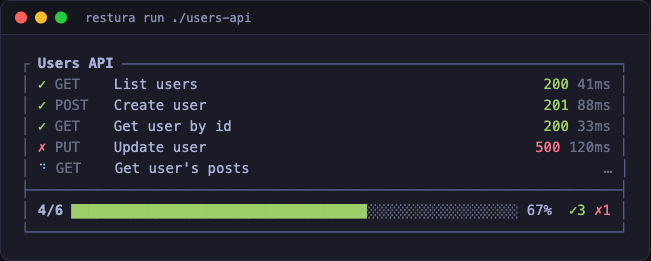
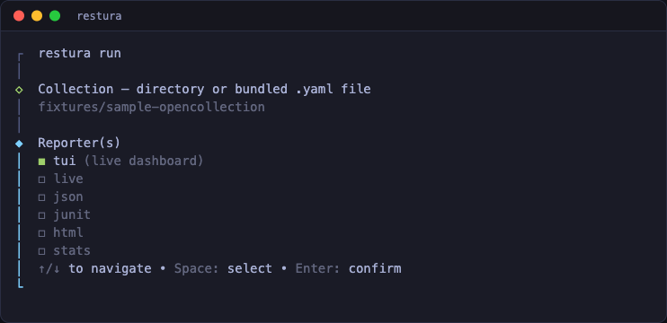
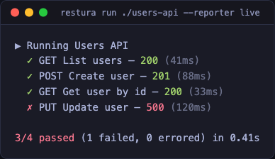

# restura-cli

Run Restura API collections in CI — assert with scripts, get JUnit / HTML / JSON reports.



## Install

```bash
npm install -g restura-cli
# or, no install:
npx restura-cli run ./my-collection
```

Requires Node.js 24+.

## Quick start

Export a collection from the Restura app (File → Export → OpenCollection directory), then:

```bash
restura run ./my-collection --reporter junit --reporter-output junit=results.xml
```

Exit code is `0` when every request passed, `1` if any failed, `2` on internal errors (missing collection, bad flags).

## OWS workflows

Run a portable Open Workflow Specification artifact from an OpenCollection workspace:

```bash
restura workflow run ./my-workspace billing --env ./ci.env
```

The workspace must contain `opencollection.yml` and `workflows/billing/` with
`workflow.ows.json`, `bindings.restura.json`, and `layout.restura.json`. The
CLI accepts only the safe OWS profile: sequential `do`, `set`, `wait`, timeout
/ cancellation, and binding-only HTTP calls to saved requests. Inline endpoints,
credentials, non-HTTP calls, and controls without a bounded runtime are rejected
before any network request is made.

## Interactive mode

Run `restura` (or `restura run`) with **no collection** in a terminal to launch a guided wizard — pick the collection, reporters, output paths, an optional env file, and whether to allow localhost, then it runs:

```bash
restura            # bare → wizard
restura run        # also → wizard when no <collection> is given
```



The wizard is **terminal-only**: piped output and CI never prompt. There, a missing collection is an error (exit 2) and bare `restura` prints help — so existing scripts and pipelines are unaffected. Cancelling (Ctrl-C / Esc) exits `130`.

By default, an interactive run shows a live dashboard (the `tui` reporter); piped/CI runs fall back to plain line output (the `live` reporter). See [Reporters](#reporters).

## Supported collection formats

The loader auto-detects three layouts:

| Layout                                   | Detected when…                                                  |
| ---------------------------------------- | --------------------------------------------------------------- |
| **OpenCollection directory** (preferred) | the target directory contains `opencollection.yml` (or `.yaml`) |
| **OpenCollection bundled file**          | the target path ends in `.yaml`/`.yml`                          |
| **Legacy file-collection** (deprecated)  | the target directory contains `_collection.yaml`                |

The legacy format prints a stderr deprecation warning the first time it's loaded.

## Supported protocols

- **HTTP / REST** — full support
- **GraphQL** — runs as HTTP with body type `graphql`
- **gRPC** — via Connect protocol (JSON-encoded, no proto compilation needed)
- **SSE** — captures events for `--sse-duration` ms, or until `--sse-events N`
- **MCP** — single JSON-RPC POST per request
- **WebSocket** — not run in collection batches (matches the desktop collection runner, which skips streaming protocols). A standalone executor exists for future wiring (`executors/websocket.ts`) but no collection format routes to it yet.

Header-based auth (Bearer, Basic, API-key, OAuth2) is applied to HTTP/GraphQL, gRPC (as metadata), SSE, and MCP requests. For OAuth2, a pre-supplied access token is used as-is; if the auth instead carries a token endpoint + client id (and no token), the CLI fetches one via the **client_credentials** grant — the only non-interactive grant suited to CI — caching it per token-url/client/scope for the run. Wire-signed schemes (AWS SigV4, OAuth1, WSSE) are signed at the wire on the HTTP path. Auth configured at the collection or folder level is inherited by descendant requests (nearest-ancestor-wins), and collection/folder-level pre-request and test scripts run against every descendant. `x-www-form-urlencoded` bodies are sent for both inline (`raw`) and structured (OpenCollection field-array) forms. `multipart/form-data` is supported with text fields and file parts (file content must be inline base64 on the part; file parts that reference a path on disk are not read). `protobuf` bodies are not yet supported by the CLI fetcher.

## CLI reference

```
restura run [collection] [options]
```

`[collection]` accepts a directory (any supported layout) or a bundled `.yaml`/`.yml` file. Omit it in a terminal to choose one via the [interactive wizard](#interactive-mode); in CI it is required.

| Flag                        | Default       | Description                                                                                                                       |
| --------------------------- | ------------- | --------------------------------------------------------------------------------------------------------------------------------- |
| `--env <file>`              |               | JSON or YAML env file. `${VAR}` placeholders are expanded from `process.env`.                                                     |
| `--reporter <list>`         | _auto_        | Comma-separated: `tui`, `live`, `json`, `junit`, `html`, `stats`. Defaults to `tui` in a terminal, `live` otherwise (piped / CI). |
| `--output <file>`           |               | Shorthand for single file reporter.                                                                                               |
| `--reporter-output <kv...>` |               | Per-reporter output: `--reporter-output junit=results.xml html=report.html`.                                                      |
| `--bail`                    | `false`       | Stop on first failure.                                                                                                            |
| `--timeout <ms>`            | `30000`       | Per-request timeout.                                                                                                              |
| `--allow-localhost`         | `false`       | Permit requests to `localhost` / `127.0.0.1`. Off by default (SSRF guard).                                                        |
| `--folder <path>`           |               | Only run requests under this folder path (slash-joined).                                                                          |
| `--include <pattern...>`    |               | Substring or glob (e.g. `users/*`). Repeatable.                                                                                   |
| `--exclude <pattern...>`    |               | Same syntax as `--include`. Applied after.                                                                                        |
| `--data <file>`             |               | CSV (with header row) or JSON array. Runs the collection once per row; row keys are exposed as vars.                              |
| `--max-iterations <n>`      |               | Cap iterations when a `--data` file is large.                                                                                     |
| `--retry <n>`               | `0`           | Retry attempts per failing request.                                                                                               |
| `--retry-on <list>`         | `network,5xx` | Comma-separated triggers: `network`, `5xx`, `4xx`, or specific status codes (`429,503`).                                          |
| `--sse-duration <ms>`       | `5000`        | How long to keep SSE streams open.                                                                                                |
| `--sse-events <n>`          |               | Stop SSE early after N events.                                                                                                    |
| `--insecure`                | `false`       | Skip TLS certificate verification (self-signed / staging). Insecure — use only when you trust the target.                         |
| `--ca <file>`               |               | PEM CA bundle to trust (private CA) without disabling verification.                                                               |
| `--client-cert <file>`      |               | PEM client certificate for mutual TLS (mTLS).                                                                                     |
| `--client-key <file>`       |               | PEM client private key for mutual TLS.                                                                                            |
| `--cert-passphrase <value>` |               | Passphrase for an encrypted `--client-key`.                                                                                       |
| `--proxy <url>`             |               | HTTP(S) proxy URL. Overrides `HTTP_PROXY`/`HTTPS_PROXY` and composes with the TLS options.                                        |

TLS options apply to all HTTPS traffic for the run (HTTP/GraphQL/gRPC/SSE/MCP). They are global flags rather than per-request settings; per-domain client certificates (collection `clientCertificates`) are not yet honored — pass the cert that the run needs via `--client-cert`.

Proxies: the standard `HTTP_PROXY` / `HTTPS_PROXY` / `NO_PROXY` environment variables are honored automatically, or pass `--proxy <url>` to set one explicitly (this is the form that composes with the TLS flags above — the env var does not). SOCKS proxies and collection-scoped proxy config are not yet supported.

## Scripts and assertions

Pre-request and test scripts run in a sandboxed QuickJS WASM VM (no DOM, no filesystem, no network escape; 64 MB memory cap, 5 s sync / 30 s async execution timeout).

```yaml
# request.http.yaml
name: Get user
method: GET
url: '{{API_BASE}}/users/1'
testScript: |
  pm.test("status is 200", () => pm.response.to.have.status(200));
  pm.test("response has name", () => {
    pm.expect(pm.response.json()).to.have.property("name");
  });
```

When a test script runs and defines any `pm.test(...)` assertion, those drive pass/fail. Otherwise pass/fail falls back to the transport outcome (HTTP 2xx, gRPC OK, etc.).

Variables set inside a script (`pm.environment.set('K', 'v')`) propagate to subsequent requests in the same run.

## Variables

Three layered sources, in order of precedence (later wins):

1. `--env` file
2. Collection variables (declared in `opencollection.yml` or `_collection.yaml`)
3. Iteration row (when `--data` is set)

Substitutions are `{{NAME}}`. Unknown vars are left in place so the upstream sees them and you notice the gap.

### Dynamic helpers

Postman-compatible `{{$random*}}` / `{{$timestamp}}` helpers are expanded after user var substitution:

| Helper                 | Example                     |
| ---------------------- | --------------------------- |
| `{{$randomUUID}}`      | `f4d2e3...`                 |
| `{{$timestamp}}`       | `1700000000` (unix seconds) |
| `{{$isoTimestamp}}`    | `2026-05-22T13:42:00Z`      |
| `{{$randomEmail}}`     | `alice.42@example.com`      |
| `{{$randomFirstName}}` | `Olivia`                    |
| `{{$randomIP}}`        | `192.0.2.4`                 |

Full list in `src/lib/shared/dynamicVariables.ts`.

## Data-driven runs

```bash
restura run ./users-api --data ./users.csv --reporter junit --reporter-output junit=junit.xml
```

```csv
# users.csv
username,role
alice,admin
bob,viewer
charlie,editor
```

Each row exposes `username` and `role` as variables, overriding any same-named env or collection variable for that iteration only. JUnit testcase names carry an `[iter N]` suffix so each iteration is distinct in CI dashboards.

## Reporters

- **`tui`** — live, in-place dashboard with a progress bar and a spinner on the in-flight request. The default in an interactive terminal; on completion it collapses to a clean failure list + summary.
- **`live`** — plain one-line-per-request progress. The default when output is piped or in CI (no ANSI cursor control). Force it with `--reporter live` if the dashboard misbehaves.
- **`json`** — full `RunResult` dumped as JSON. Path required (`--output` or `--reporter-output json=...`).
- **`junit`** — JUnit XML for CI dashboards. One `<testcase>` per request.
- **`html`** — self-contained HTML page with embedded data + summary table.
- **`stats`** — latency percentiles + throughput at the end of the run.

The default reporter is chosen automatically: `tui` when stdout is a TTY (and `NO_COLOR` is unset), `live` otherwise. Combine reporters with a comma: `--reporter live,junit --reporter-output junit=results.xml`.

The `live` reporter (also what CI logs get) prints one line per request:



## Exit codes

| Code | Meaning                                                                         |
| ---- | ------------------------------------------------------------------------------- |
| `0`  | Every request passed AND at least one request ran                               |
| `1`  | One or more requests failed or errored (or no requests matched after filtering) |
| `2`  | Internal error: missing collection, bad reporter name, IO failure, …            |

## Troubleshooting

- **`No recognised collection layout`** — your target directory needs one of `opencollection.yml`, `opencollection.yaml`, or `_collection.yaml`. Re-export from the Restura app if unsure.
- **`Invalid URL`** — the URL after `{{var}}` resolution isn't a valid absolute URL. Check that `--env` is loaded and your var names match.
- **`Localhost URLs are not allowed`** — add `--allow-localhost` for local upstreams. Off by default to prevent SSRF in shared CI.
- **gRPC requests return `UNKNOWN`** — the upstream likely doesn't speak Connect protocol. The CLI uses Connect-over-HTTP, not gRPC-over-HTTP/2 binary framing.
- **`auth uses a desktop-only secret handle…`** — your auth references a secret handle that only the desktop app can decrypt. The request is errored (not sent unauthenticated); re-export the collection with inline secret values for CI use.

## Development

```bash
# from cli/
npm install
npm test                   # vitest
npm run type-check         # tsc --noEmit
npm run build              # tsup → dist/
```

The CLI imports from the parent project at compile-time via path aliases (`@/`, `@shared/`); `cli/tsconfig.json` controls which parent modules participate in type-checking.

## License

MIT.
