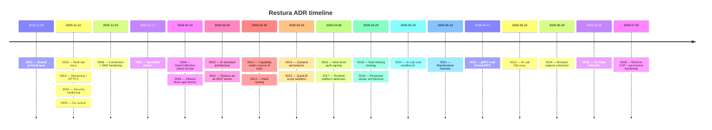

import { LinkCard, CardGrid } from '@astrojs/starlight/components';

Architecture Decision Records capture significant design choices, the alternatives considered, and the reasoning. They're the single best resource if you want to understand *why* the code is shaped the way it is.

<CardGrid>
  <LinkCard
    title="0001 — Shared protocol layer"
    description="One implementation per protocol (HTTP, gRPC, MCP, SSE), three thin Fetcher adapters. The architectural keystone."
    href="/architecture/adrs/0001-shared-protocol-layer/"
  />
  <LinkCard
    title="0002 — Multi-tab store"
    description="The request state model — tabs[] + activeTabId — and why it replaced the previous single-active store."
    href="/architecture/adrs/0002-multi-tab-store/"
  />
  <LinkCard
    title="0003 — Streaming and HTTP/2"
    description="How server-streaming gRPC, SSE, and chunked HTTP are handled across Worker, Node, and Electron."
    href="/architecture/adrs/0003-streaming-and-http2/"
  />
  <LinkCard
    title="0004 — Security hardening"
    description="SSRF guards, keychain integration, QuickJS sandbox, wire-level signing — the consolidated security design."
    href="/architecture/adrs/0004-security-hardening/"
  />
  <LinkCard
    title="0005 — CLI runner"
    description="The restura-cli executor architecture and the JUnit / HTML / JSON reporter design."
    href="/architecture/adrs/0005-cli-runner/"
  />
  <LinkCard
    title="0006 — Connection + DNS hardening"
    description="Idempotent renderer-cleanup, walk-and-dispose helper, pre-flight DNS guard, connect-time IP pinning for ws/sse/grpc."
    href="/architecture/adrs/0006-connection-and-dns-hardening/"
  />
  <LinkCard
    title="0007 — SecretRef pattern"
    description="Handle-based secrets: plaintext never leaves the main process; renderer, Zustand, and exports only see SecretRef handles."
    href="/architecture/adrs/0007-secret-ref-pattern/"
  />
  <LinkCard
    title="0008 — OpenCollection native format"
    description="A vendor-neutral, round-trippable collection format with JSON-Schema-generated types and a CI drift gate."
    href="/architecture/adrs/0008-opencollection-native-format/"
  />
  <LinkCard
    title="0009 — Shared Hono app factory"
    description="One createApp() reused by the Cloudflare Worker and the self-hosted Node server, with platform-specific adapters."
    href="/architecture/adrs/0009-shared-hono-app-factory/"
  />
  <LinkCard
    title="0010 — AI assistant architecture"
    description="Electron-first, provider-agnostic chat; context and secrets redacted before anything leaves the machine."
    href="/architecture/adrs/0010-ai-assistant-architecture/"
  />
  <LinkCard
    title="0011 — Restura as an MCP server"
    description="Restura as an MCP server: pure tool dispatch, consent gating, and SecretRef redaction on every response."
    href="/architecture/adrs/0011-mcp-server-mode/"
  />
  <LinkCard
    title="0012 — Capability matrix source of truth"
    description="capabilities.ts drives UI badges, the generated matrix doc, and a CI gate that fails on drift."
    href="/architecture/adrs/0012-capability-matrix-source-of-truth/"
  />
  <LinkCard
    title="0013 — Hash routing"
    description="createHashRouter so the identical SPA build runs under both https:// (Pages) and file:// (Electron)."
    href="/architecture/adrs/0013-hash-routing/"
  />
  <LinkCard
    title="0014 — Zustand persistence"
    description="One persist pattern; Dexie on web, encrypted secure-storage on desktop, Zod-validated on rehydrate."
    href="/architecture/adrs/0014-zustand-persistence/"
  />
  <LinkCard
    title="0015 — QuickJS script sandbox"
    description="User scripts run in a capability-gated WASM VM; the sandbox — not source inspection — is the boundary."
    href="/architecture/adrs/0015-quickjs-script-sandbox/"
  />
  <LinkCard
    title="0016 — Wire-level auth signing"
    description="SigV4 / OAuth1 / WSSE sign on the backend after the body is built, so signatures match the exact upstream bytes."
    href="/architecture/adrs/0016-wire-level-auth-signing/"
  />
  <LinkCard
    title="0017 — Runtime platform detection"
    description="isElectron() picks IPC vs HTTP transport from a single bundle, with the platform seam confined to executors."
    href="/architecture/adrs/0017-runtime-platform-detection/"
  />
  <LinkCard
    title="0018 — Rate limiting strategy"
    description="Independent throttling at each boundary: an internet-facing Worker limiter and per-channel IPC limiters."
    href="/architecture/adrs/0018-rate-limiting-strategy/"
  />
  <LinkCard
    title="0019 — Response viewer architecture"
    description="Monaco for finite bodies; a 5000-event capped incremental viewer for streams to stay memory-bounded."
    href="/architecture/adrs/0019-response-viewer-architecture/"
  />
  <LinkCard
    title="0020 — AI Lab eval workbench"
    description="Desktop-only prompt/model testing: dataset evals, LLM-as-judge, and a loopback-only SSRF carve-out for local runtimes."
    href="/architecture/adrs/0020-ai-lab-eval-workbench/"
  />
  <LinkCard
    title="0021 — Maintenance harness"
    description="Claude Code tooling for production-grade upkeep: type-check:all closes the renderer-only gap, plus verify/maintain skill, review subagents, and a docs-parity steward."
    href="/architecture/adrs/0021-maintenance-harness/"
  />
  <LinkCard
    title="0022 — gRPC over ConnectRPC"
    description="One ConnectRPC stack across web and desktop: Connect protocol on web, native gRPC over connect-node on desktop, one runtime descriptor registry. Replaces Connect-Web + grpc-js."
    href="/architecture/adrs/0022-grpc-connectrpc-transport/"
  />
  <LinkCard
    title="0023 — AI Lab http-exec"
    description="Scoring AI-generated requests by executing them through the real request executor — inheriting the SSRF guard, redirects, and cookie jar instead of building a parallel client."
    href="/architecture/adrs/0023-ai-lab-http-exec/"
  />
  <LinkCard
    title="0024 — Browser capture extension"
    description="One backend-agnostic capture core, thin adapters: a multi-protocol Chrome extension sharing the desktop app's audited redaction path, with a loopback-only Send-to-Desktop bridge."
    href="/architecture/adrs/0024-browser-capture-extension/"
  />
  <LinkCard
    title="0025 — VS Code extension"
    description="A focused editor integration for OpenCollection files — schema diagnostics, a Test Explorer that shells out to the restura CLI, and inline Send through the shared protocol core. No re-implemented execution or assertions."
    href="/architecture/adrs/0025-vscode-extension/"
  />
  <LinkCard
    title="0026 — Electron CSP + permission hardening"
    description="Default-deny web permissions (single clipboard allowlist entry) and CSP object-src/worker-src pinning, with header/meta parity enforced by a structural test."
    href="/architecture/adrs/0026-electron-csp-and-permission-hardening/"
  />
</CardGrid>
