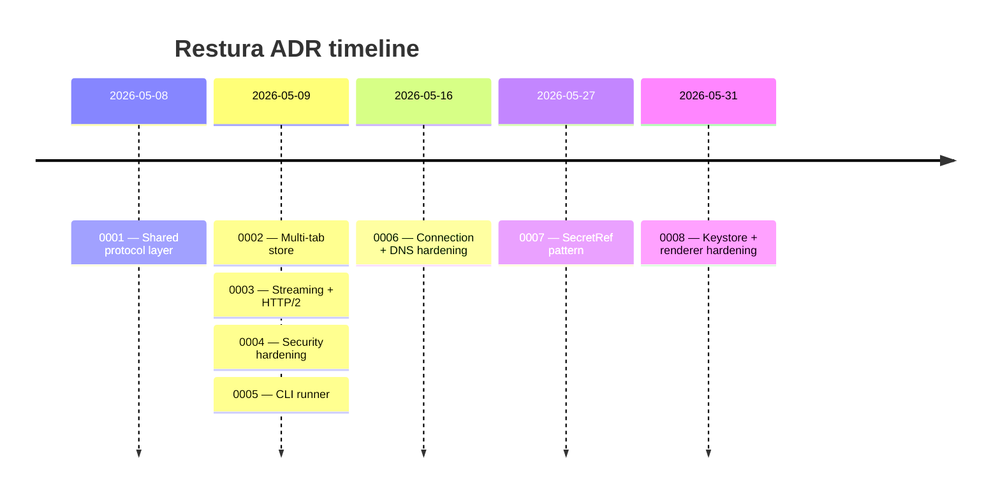

import { LinkCard, CardGrid } from '@astrojs/starlight/components';

Architecture Decision Records capture significant design choices, the alternatives considered, and the reasoning. They're the single best resource if you want to understand *why* the code is shaped the way it is.

<CardGrid>
  <LinkCard
    title="0001 — Shared protocol layer"
    description="One implementation per protocol (HTTP, gRPC, MCP, SSE), three thin Fetcher adapters. The architectural keystone."
    href="/architecture/adrs/0001-shared-protocol-layer/"
  />
  <LinkCard
    title="0002 — Multi-tab store"
    description="The request state model — tabs[] + activeTabId — and why it replaced the previous single-active store."
    href="/architecture/adrs/0002-multi-tab-store/"
  />
  <LinkCard
    title="0003 — Streaming and HTTP/2"
    description="How server-streaming gRPC, SSE, and chunked HTTP are handled across Worker, Node, and Electron."
    href="/architecture/adrs/0003-streaming-and-http2/"
  />
  <LinkCard
    title="0004 — Security hardening"
    description="SSRF guards, keychain integration, QuickJS sandbox, wire-level signing — the consolidated security design."
    href="/architecture/adrs/0004-security-hardening/"
  />
  <LinkCard
    title="0005 — CLI runner"
    description="The @restura/cli executor architecture and the JUnit / HTML / JSON reporter design."
    href="/architecture/adrs/0005-cli-runner/"
  />
  <LinkCard
    title="0006 — Connection + DNS hardening"
    description="Idempotent renderer-cleanup, walk-and-dispose helper, pre-flight DNS guard, connect-time IP pinning for ws/sse/grpc."
    href="/architecture/adrs/0006-connection-and-dns-hardening/"
  />
  <LinkCard
    title="0007 — SecretRef pattern"
    description="Handle-based secrets: plaintext never leaves the main process; renderer, Zustand, and exports only see SecretRef handles."
    href="/architecture/adrs/0007-secret-ref-pattern/"
  />
  <LinkCard
    title="0008 — Keystore + renderer hardening"
    description="Async rotation-aware safeStorage keys, deny-by-default permissions, uniform IPC sender validation, fail-closed macOS signing."
    href="/architecture/adrs/0008-keystore-and-renderer-hardening/"
  />
</CardGrid>
