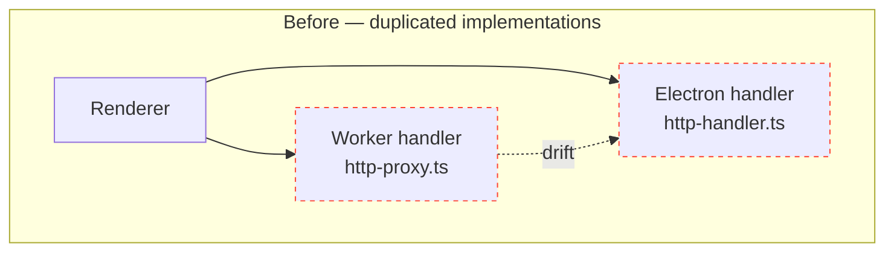
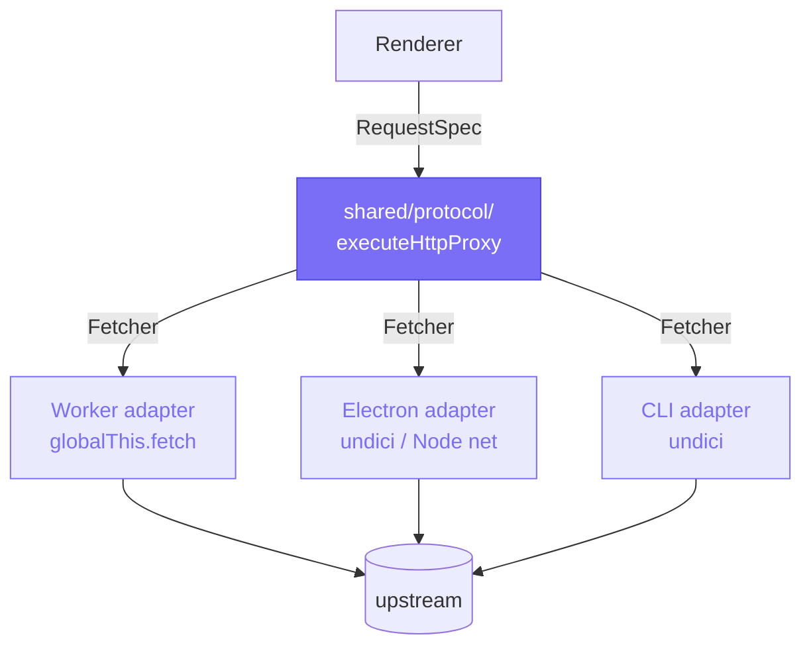

import { Badge, Aside } from '@astrojs/starlight/components';

<Badge text="Accepted · 2025-11-05" variant="success" />

## Context

Restura ships as both a Cloudflare Pages SPA (which proxies network calls through a Hono Worker) and an Electron desktop app (which uses native Node IPC handlers). Before this refactor, each protocol — HTTP, gRPC, MCP — was implemented twice with subtly different SSRF guards, header denylists, body-builders, and error-mapping.

Concretely, two `isPrivateAddress` helpers existed (`worker/shared/url-validation.ts` and an inline copy in `electron/main/http-handler.ts`), which had already drifted: the Electron version covered carrier-grade NAT (`100.64.0.0/10`) while the Worker version did not. Each new protocol added meant two implementations to keep in sync.

## Decision

Promote protocol logic to `shared/protocol/`. Each protocol is implemented once as `executeXxxProxy(spec, fetcher, options)` returning a discriminated `ExecuteResult` union. The `Fetcher` interface (`(req: FetcherRequest) => Promise<FetcherResponse>`) lets each backend supply its own transport while sharing validation, sanitisation, body construction, response shaping, and timeout handling.

## Consequences

**Positive**

- New protocols slot in by adding one shared module and two ~30-line adapters.
- SSRF rule changes happen in one place. The unified `isPrivateAddress` is now a strict superset of both prior implementations.
- Worker handlers shrank significantly — `proxy.ts`: 232 → 115 lines; `grpc.ts`: 227 → 59; `mcp.ts`: 224 → 162.
- Test coverage on the core (>80 tests across the shared modules) is reused by both backends.

**Negative**

- Adds a `@shared/*` path alias which increases tsconfig surface area (renderer, worker, and Electron each declare their own paths block — TypeScript's `extends` does not merge `paths`).
- Electron-specific features (PAC, SOCKS, mTLS, interceptors) require thoughtful placement — they live inside the fetcher closure, not in shared, but the boundary takes care to maintain.

## Out of scope (handled in later plans)

- Streaming responses end-to-end. Today the shared core buffers the response body. The `Fetcher` interface is designed so a streaming variant can be added without breaking the existing buffered path. Tracked in [ADR 0003](/architecture/adrs/0003-streaming-and-http2/).
- HTTP/2 negotiation. Tracked in [ADR 0003](/architecture/adrs/0003-streaming-and-http2/).
- Web interceptor parity. Tracked in a later plan.
- Real keychain encryption. Tracked in [ADR 0004](/architecture/adrs/0004-security-hardening/) and [ADR 0007](/architecture/adrs/0007-secret-ref-pattern/).
- Multi-tab request store. Tracked in [ADR 0002](/architecture/adrs/0002-multi-tab-store/).

## Alternatives considered

- **No-op (status quo):** Two independent code paths. Rejected — review identified active drift between the two `isPrivateAddress` implementations.
- **Single backend (Electron only or Worker only):** Either drops the web or desktop deployment. Rejected — both are strategic.
- **Plugin/extension model first:** Skip the refactor, build a plugin layer over the duplicated handlers. Rejected — plugins built atop diverged handlers inherit the divergence.
- **Centralise `paths` in `tsconfig.base.json`:** Initially attempted but reverted. TypeScript's `extends` doesn't merge `paths`, so any child tsconfig declaring its own (worker, electron, renderer all need to) overrides the base entirely. Decentralised paths in each child tsconfig is the actually-working model.

## References

- Architecture overview: [Shared protocol layer](/architecture/shared-protocol/)
- Source: [`docs/adr/0001-shared-protocol-layer.md`](https://github.com/dipjyotimetia/restura/blob/main/docs/adr/0001-shared-protocol-layer.md)
