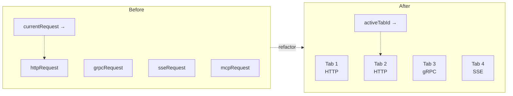

import { Badge } from '@astrojs/starlight/components';

<Badge text="Accepted · 2025-11-12" variant="success" />

## Context

The pre-Plan-2 `useRequestStore` had four mutually-exclusive slots: `httpRequest`, `grpcRequest`, `sseRequest`, `mcpRequest`, plus a `currentRequest` pointer at one of them. This made it impossible to hold two requests of the same protocol open at once — switching protocols swapped the slot, and saving a request to the sidebar then opening another replaced the first.

Postman, Hoppscotch, Insomnia, and Bruno all support multi-tab. It is the **#1 day-one ergonomic gap users hit**. Adding it later requires reshaping every consumer of `currentRequest`, so this lands before public launch.

## Decision

Replace per-protocol slots with `tabs: RequestTab[]` + `activeTabId`. Existing action names (`updateRequest`, `setCurrentResponse`, `setScriptResult`, `setLoading`) are preserved but operate on the active tab. Tab lifecycle has its own action set (`openTab` / `closeTab` / `switchTab` / `duplicateTab` / `reorderTabs`).

Persist tabs (including their last response and dirty state) to a new Dexie table `requestTabs` (schema v2) so a refresh restores the entire workspace.

Editor state preserves per-tab via Monaco's `path` prop — each editor uses `path="tab-<id>-<role>"`, and `@monaco-editor/react` automatically maintains a separate `ITextModel` per path.

Built-in dynamic variables (`{{$timestamp}}`, `{{$randomUUID}}`, `{{$randomEmail}}`, etc.) are extracted into `src/lib/shared/dynamicVariables.ts` with Postman-name parity.

Legacy `src/lib/shared/storage.ts` (localStorage adapter) is removed — all stores now persist through Dexie (web) or electron-store (desktop), unified.

## Consequences

**Positive**

- Users can hold N requests open across any mix of protocols; opening a saved request from the sidebar focuses the existing tab if any.
- Editor state (cursor, undo, fold) preserves per tab.
- Last response is preserved on restart — no more "where did my response go" after a refresh.
- Action surface compatible with most existing consumers — the entry point changes (read from active tab via selectors) but the per-tab mutator names are unchanged.
- Single storage backend (Dexie/electron-store) — simpler mental model.

**Negative**

- Larger persisted state (a full response per tab × N tabs). Bounded by the existing `MAX_RESPONSE_SIZE` cap, but power users with 20 tabs × 5 MB responses persist 100 MB to Dexie. Monitor and add per-tab response trimming if dogfooding shows this is a problem.
- `RequestMode` and `RequestType` diverge: `'graphql'` and `'websocket'` are pseudo-modes that don't map to a `RequestType`. The page-level UI tracks an explicit `modeOverride` for these two cases. Cleaner long-term: extend `RequestType` (or split GraphQL/WS into their own tab kinds). Out of scope for Plan 2.

## Alternatives considered

- **Keep single-request, add a "recent requests" pin list:** Strictly worse than multi-tab — users want concurrent edit, not just history.
- **Tabs as separate stores:** Would scatter state and break the "switch tab → see editor state" expectation. Rejected.
- **Sidebar-as-tab-list (no separate TabBar):** Couples navigation and tab state. Rejected — the sidebar is for saved collections, the TabBar is for the current working set.

## References

- Source: [`docs/adr/0002-multi-tab-store.md`](https://github.com/dipjyotimetia/restura/blob/main/docs/adr/0002-multi-tab-store.md)
- Related: [ADR 0001](/architecture/adrs/0001-shared-protocol-layer/) (foundation).
