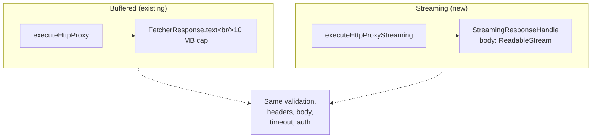

import { Badge, Aside } from '@astrojs/starlight/components';

<Badge text="Accepted · 2025-11-12" variant="success" />

<Aside type="caution" title="Superseded in part">
  The gRPC-transport decision below (§3 — Connect-Web + `grpc-js`) was replaced by [ADR
  0022](/architecture/adrs/0022-grpc-connectrpc-transport/): gRPC now runs on ConnectRPC
  (`connect-node` on desktop, Connect protocol on web). The HTTP-streaming and response-viewer
  decisions on this page still stand.
</Aside>

## Context

ADR-0001's foundation shipped a buffered Fetcher contract: `FetcherResponse.text(): Promise<string>` with a 10 MB cap. This was the right minimum to unify Worker + Electron HTTP, but it collapses streaming responses (NDJSON, SSE-via-HTTP, large CSV) into one blob in memory. For NDJSON streams of operational telemetry or SSE feeds of model tokens, this means: (a) the user can't see partial output, (b) responses > 10 MB OOM the worker isolate or the renderer, and (c) gRPC streaming methods don't actually stream.

Modern API workloads also negotiate HTTP/2 by default (Cloudflare, Stripe, Shopify all advertise h2 via ALPN). The Electron HTTP fetcher used `node:http` / `node:https`, which silently downgrades every connection to HTTP/1.1.

## Decision

Three coordinated changes:

1. **Add a streaming variant to the shared protocol layer.** `executeHttpProxyStreaming(spec, fetcher, options)` returns a `StreamingResponseHandle` with `body: ReadableStream<Uint8Array>` instead of buffering. Same validation, header policy, body construction, and timeout logic — only the response shape differs. Does NOT enforce `MAX_RESPONSE_SIZE` (streaming is unbounded by intent; consumers apply their own per-chunk budgets).

2. **Replace `node:http` / `https` in Electron with `undici.request`.** undici handles ALPN negotiation, h2 multiplexing, h1.1 fallback, connection pooling, and provides streaming response bodies via `Readable.toWeb`. PAC, SOCKS, mTLS, CA, DNS-rebind, and manual redirect handling are preserved by routing them through undici's `Agent` / `ProxyAgent` / custom dispatcher pattern.

3. **gRPC streaming bypasses the Worker.** Connect-Web speaks HTTP/2 to the upstream directly when CORS permits (server-streaming, client-streaming, bidi). The Worker stays in the unary path and as a fallback for CORS-blocked endpoints. Server-streaming ships in this plan; client-streaming and bidi throw a clear "not yet implemented" message.

## Consequences

**Positive**

- Streaming responses (SSE, NDJSON) render incrementally in the new `StreamingResponseViewer`, with windowed virtualization for unbounded streams.
- Electron now negotiates HTTP/2 automatically when the upstream supports it; the response viewer surfaces the negotiated protocol.
- gRPC server-streaming methods produce useful output instead of timing out.
- The `Fetcher` contract is unchanged for buffered paths — every existing consumer (worker proxy, gRPC unary, MCP) still works without modification. The streaming additions are purely opt-in.

**Negative**

- `executeHttpProxyStreaming` doesn't enforce `MAX_RESPONSE_SIZE`. A misbehaving upstream can stream multi-GB responses; the renderer's `StreamingResponseViewer` caps retained events at 5000 by default but the Worker pipe doesn't. This is the streaming contract — users opting into streaming accept the trade-off. A future enhancement could add a per-stream byte budget.
- undici is a new direct dependency for Electron (was a transitive dep before). Bundles with the Electron main process; modest size increase.
- gRPC client-streaming and bidi remain stubbed. Server-streaming is the most common case; client/bidi UI is a follow-up.

## Alternatives considered

- **A single `executeHttpProxy` with a `streaming?: boolean` flag.** Rejected — the return shape is different (`text` vs `body`), and the size-cap contract is different. A discriminated boolean on the return type would be misleading; a separate function name is clearer.
- **Direct `node:http2` instead of undici.** Rejected — `node:http2` exposes raw h2 frames; we'd reimplement connection pooling, h1.1 fallback, and ALPN handshake state machines. undici handles all of that.
- **Generated bufbuild clients for gRPC streaming.** Rejected — Restura uses runtime proto reflection (no codegen). Hand-stubbing `MethodInfo` descriptors against `@bufbuild/protobuf` v2 is brittle. The manual Connect-envelope encoding in `grpcStreamingClient.ts` is more aligned with the runtime-proto pattern.
- **`react-window` for the streaming viewer.** Rejected — the use case is constrained (uniform item height, append-only). The custom 95-LOC `windowedList.tsx` helper is enough and avoids a dep.
- **Worker-as-tunnel for gRPC streaming.** Rejected — HTTP/2 client streams tunnel through the Worker poorly (CF runtime constraints). Same-origin restrictions only matter for unary; for streaming Connect-Web speaks directly to the upstream. The Worker remains a fallback if CORS blocks the upstream.

## References

- Source: [`docs/adr/0003-streaming-and-http2.md`](https://github.com/dipjyotimetia/restura/blob/main/docs/adr/0003-streaming-and-http2.md)
- Related: [ADR 0001](/architecture/adrs/0001-shared-protocol-layer/), [ADR 0002](/architecture/adrs/0002-multi-tab-store/).
