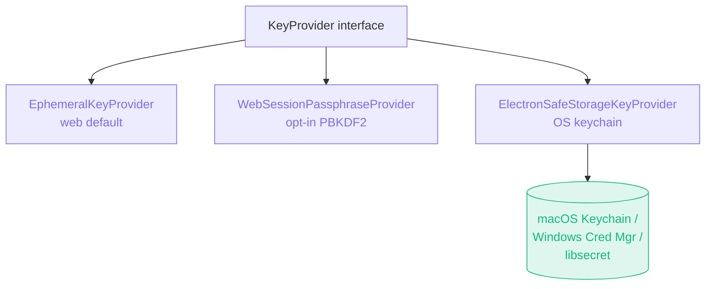

import { Badge, Aside } from '@astrojs/starlight/components';

<Badge text="Accepted · 2026-05-09" variant="success" />

## Context

The architectural review on 2026-05-08 identified four security gaps:

1. **Encryption-at-rest was theatre.** The renderer's Dexie encryption key was generated on first use and stored in the IndexedDB metadata table — right next to the ciphertext. Anyone with disk access trivially decrypted. The "AES-256-GCM at rest" README claim was misleading.
2. **Soft validation in the request store.** `useRequestStore.updateRequest` caught `validateRequestUpdate` errors and applied the partial update anyway with a `console.error`. The type system's invariants were aspirational at runtime; downstream consumers (test scripts, codegen, exporters) could see malformed `KeyValue` shapes with `enabled: undefined`.
3. **Source-level pattern blocklist in scriptExecutor.** A regex blocked `eval`, `Function(`, `__proto__`, `constructor[`, `Object.prototype` on the user's source string before QuickJS saw it. Inside the WASM sandbox, none of these are dangerous (no host bridge to escape). The regex provided no security but broke legitimate user code.
4. **AWS SigV4 signed too early.** The renderer's `applyAuthHeaders` signed the request before the Worker proxy potentially mutated it (e.g., re-encoding form-data with a different boundary). Users hit cryptic `SignatureDoesNotMatch` errors.

## Decision

Four coordinated fixes:

1. **`KeyProvider` interface** with three implementations (`EphemeralKeyProvider`, `WebSessionPassphraseProvider`, `ElectronSafeStorageKeyProvider`). The Electron path uses the existing `electronAPI.store` IPC, which is itself `safeStorage`-protected via `electron/main/store-handler.ts`. Net effect: **Electron data at rest is encrypted with a key the user's OS keychain holds.** Web data at rest is encrypted with an ephemeral key (better than the prior TOFU theatre because the key never persists alongside the ciphertext); a future passphrase-prompt UI swaps to `WebSessionPassphraseProvider` for cross-session persistence.

2. **`updateRequest` hard-fails on validation error.** The action no longer applies invalid updates. Users see a `toast.error` with the validation message; a `console.warn` captures the offending update for debugging.

3. **`dangerousPatterns` regex deleted.** The QuickJS WASM runtime is the security boundary. New tests demonstrate the boundary by running scripts that contain `eval('40 + 2')`, `Function.prototype.bind`, and `obj.constructor.name` — all execute correctly without affecting the host.

4. **`auth-signer` in `shared/protocol/`.** AWS SigV4 (and other auth that requires wire-byte fidelity) signs INSIDE `executeHttpProxy` / `executeHttpProxyStreaming`, **after** `buildRequestBody` constructs the exact body the fetcher will send. The renderer no longer pre-signs SigV4 — `RequestSpec.auth` is the contract. Bearer / Basic / API-key / OAuth2 still flow through `applyAuthHeaders` client-side because they don't depend on the body.

## Consequences

**Positive**

- Electron encryption is now genuinely hardware-backed via `safeStorage` (macOS Keychain, Windows Credential Manager, Linux libsecret).
- The store's type-system invariants are enforced at runtime; downstream consumers can trust `KeyValue.enabled` is always a boolean.
- User scripts using `Function.prototype.bind`, `obj.constructor.name`, `JSON.parse` revivers, etc. work without rejection.
- AWS SigV4 signs the actual body bytes the upstream receives — `SignatureDoesNotMatch` errors caused by Worker mutation are gone.
- Web users see a "Desktop only" badge on fields that don't apply (mTLS, SOCKS, etc.).

**Negative**

- Web users with existing encrypted data on first launch after this update may see decryption fail (returns null gracefully — the app stays functional with empty stores) until they re-enter the relevant data. This is a deliberate one-time migration cost; the prior in-metadata key was not actually secure.
- The session-ephemeral default for web means data does NOT persist across reloads. A passphrase-prompt UI (deferred to a follow-up) restores cross-session persistence with PBKDF2-derived keys.
- The `RequestSpec.auth` field crosses the IPC / proxy boundary; the Electron Zod validator now has a recursive `AuthConfigSchema` to validate it.

## Alternatives considered

- **Keep the in-metadata encryption key for backward compat:** Rejected — preserves the security theatre. The right move is an honest break.
- **Use Electron's `safeStorage` for the renderer key directly via a new IPC channel:** Rejected — the existing `electronAPI.store` IPC is already `safeStorage`-protected and exposes `get` / `set` / `has` that satisfies the `SecureKeyIpc` contract. Adding a parallel IPC would duplicate.
- **Keep SigV4 client-side and add a "verify signature didn't change" check on the worker:** Rejected — fragile, defers the real fix.
- **Implement source-level allowlist instead of blocklist for scripts:** Rejected — there's no allowlist that captures legitimate patterns without false negatives. The sandbox is the right mechanism.

## Out of scope (future plans)

- Web passphrase-prompt UI (wire `WebSessionPassphraseProvider` into the renderer).
- Per-environment encryption (separate vaults per Environment) — wider rework.
- E2E encryption between desktop and a sync server — belongs to the deferred sync/collaboration roadmap.
- Detection of leaked secrets in script logs — separate feature.

## References

- Source: [`docs/adr/0004-security-hardening.md`](https://github.com/dipjyotimetia/restura/blob/main/docs/adr/0004-security-hardening.md)
- Architecture overview: [Security model](/architecture/security/).
- Related: [ADR 0001](/architecture/adrs/0001-shared-protocol-layer/), [ADR 0006](/architecture/adrs/0006-connection-and-dns-hardening/), [ADR 0007](/architecture/adrs/0007-secret-ref-pattern/).
