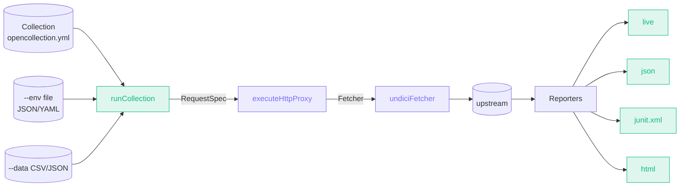

import { Badge } from '@astrojs/starlight/components';

<Badge text="Accepted · 2026-05-09" variant="success" />

## Context

Postman has `newman`. Bruno has `bru run`. Hoppscotch has `hoppcli`. These are the wedges that drive team adoption — without CI integration, an API client is a single-developer toy. The file-collection schema (Git-native YAML files) is the natural input for a CLI; the [shared protocol layer](/architecture/adrs/0001-shared-protocol-layer/) is the natural runtime backend. The CLI is the third consumer of `executeHttpProxy` after the Worker and Electron.

## Decision

Ship `@restura/cli` as a separate npm package in the `cli/` directory. Single `restura` binary with one subcommand for v0.1: `restura run <collection-dir>`.

Architecture mirrors the renderer's runtime stack:

- `loadCollection(dir)` — walks `_collection.yaml` + `*.{http,grpc,sse,mcp}.yaml` using the existing `file-collection-schema` from `src/lib/shared/`.
- `loadEnv(file, options)` — JSON or YAML env file with `${VAR}` env-var expansion for secrets.
- `undiciFetcher` — `Fetcher` interface implementation using `undici.request`. The CLI is the third backend (Worker uses `globalThis.fetch`, Electron uses `undici` via `http-handler.ts`, CLI uses `undici` directly).
- `runCollection(dir, options, reporter)` — orchestrator: per-request, build `RequestSpec`, call `executeHttpProxy(spec, undiciFetcher, options)`, tally results.
- 4 reporters (`live` default + `json`, `junit`, `html`) implementing a small `Reporter` interface.

For v0.1: HTTP requests only. gRPC / SSE / MCP request types yield "unsupported" results with a clear message. Pre/post test scripts are deferred — pass/fail is HTTP 2xx for now.

Build via `tsup` (single 40 KB esm bundle in `dist/index.js`). `tsc` was the initial choice for simplicity but doesn't rewrite TypeScript path aliases (`@/*`, `@shared/*`), so the emitted binary failed at runtime with `ERR_MODULE_NOT_FOUND`. tsup bundles all imports, resolving aliases at build time.

## Consequences

**Positive**

- Teams can `npm install -g @restura/cli` and integrate API tests into CI in minutes — JUnit output plugs into every CI system.
- The CLI reuses 90% of the existing shared protocol layer. Adding it surfaced no design changes — `executeHttpProxy` already accepted a `Fetcher`, and `undici` was already a Plan 4 dep.
- Single 40 KB bundled binary — no Electron, no Monaco, no React in the install footprint.
- File-collection schema is the contract: the same YAML files run in the desktop app, the web app, and CI.

**Negative**

- Test scripts deferred. `pm.test()` assertions in `*.http.yaml`'s `testScript` field are ignored in v0.1; the runner only checks HTTP status. Adding script execution requires bundling QuickJS-emscripten into the CLI (~2 MB extra). Tracked as a follow-up.
- Bundled deps (`commander`, `js-yaml`, `undici`, `zod`, `uuid`) are duplicated in the CLI bundle and the renderer. For a CLI shipped via `npm install -g`, this is acceptable — `npm install` deduplicates only within a project.
- gRPC / SSE / MCP CLI execution not wired. Server-streaming output in a CLI also raises UX questions (write each event to stdout? buffer to JSON?). Deferred until a real user hits this.

## Alternatives considered

- **Bundle the CLI into the existing renderer build.** Rejected — users want `npm install -g` for CI without pulling Electron, Monaco, React, jsdom. A separate package is the only way.
- **Generate code from `*.yaml` to a Node test file (Jest / Mocha).** Rejected — adds an extra build step, requires teams to learn another runner's reporting format. JUnit XML output is the lingua franca; the CLI is the runner.
- **Use Postman's collection format instead of Restura's YAML.** Rejected — the file-collection schema is already first-class; importing Postman is a one-time conversion handled in the renderer.
- **Build with `tsc` instead of `tsup`.** Initially chosen for minimal build deps; rejected after smoke-testing the binary failed because `tsc` doesn't rewrite path aliases. `tsup` adds one devDependency and produces a working single-file bundle.

## References

- Source: [`docs/adr/0005-cli-runner.md`](https://github.com/dipjyotimetia/restura/blob/main/docs/adr/0005-cli-runner.md)
- User guide: [CLI — @restura/cli](/reference/cli/).
- Related: [ADR 0001](/architecture/adrs/0001-shared-protocol-layer/), [ADR 0003](/architecture/adrs/0003-streaming-and-http2/) (introduces undici).
