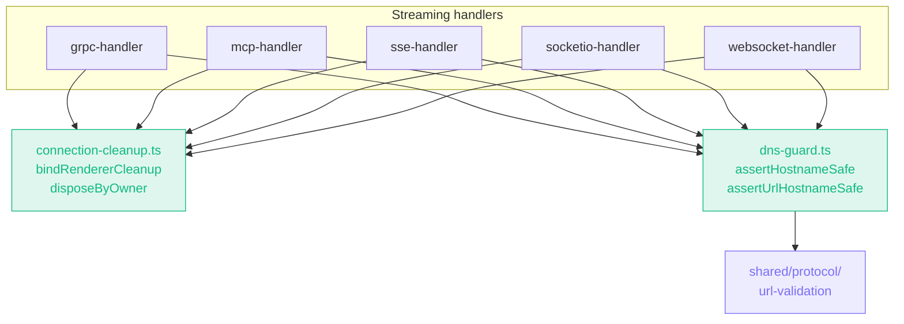

import { Badge, Aside } from '@astrojs/starlight/components';

<Badge text="Accepted · 2025-12-03" variant="success" />

## Context

Two related gaps surfaced in the Electron streaming handlers (gRPC, MCP, SSE, WebSocket, Socket.IO):

1. **Renderer-destroy listener stacking.** Every long-lived-transport handler tracked active connections in a `Map<connectionId, { webContentsId, ... }>` and registered a `webContents.once('destroyed', cleanup)` listener on each new connection. From the same renderer this stacked one fresh listener per reconnect. Node warned at ten listeners (`MaxListenersExceededWarning`); the worse runtime cost was N teardowns firing on close, each walking the full connection map. The pattern was duplicated in five handlers with subtle drift.

2. **DNS-resolved SSRF coverage gap.** `shared/protocol/url-validation` rejects URL strings that point at private literals, localhost, link-local, cloud-metadata, etc. But several Electron transports (`fetch`, `ws`, `socket.io-client`) don't accept a connector-level `lookup` hook. A hostname like `internal-target.attacker.example` passes the string check; only the DNS resolver knows it resolves to `10.0.0.1`. The HTTP/gRPC paths handled this via custom undici dispatchers; WS, Socket.IO, SSE, and MCP didn't, leaving private targets reachable in practice on those transports.

## Decision

Extract both concerns into dedicated, narrowly-scoped modules under `electron/main/` and refactor the streaming handlers to use them.

### Module 1 — `electron/main/connection-cleanup.ts`

- `bindRendererCleanup(handlerKey, webContents, teardown)`: idempotently registers a single `destroyed` listener per `(handlerKey, webContents.id)` pair. The handler's existing `activeConnections` Map serves as the `handlerKey` (an object identity), so dedupe is per-handler. If `webContents` is already destroyed, calls `teardown` synchronously and returns.
- `disposeByOwner(map, deadId, dispose)`: walks a connection map, invokes `dispose(entry)` on every entry whose `webContentsId === deadId`, swallows per-entry errors so cleanup is best-effort, and deletes the entry.

The dedupe set is held in a module-level `WeakMap<object, Set<number>>` so collected `webContents` IDs are removed automatically.

### Module 2 — `electron/main/dns-guard.ts`

- `assertHostnameSafe(hostname, options)`: resolves `hostname` via `dns.lookup(..., { all: true })`, then calls `assertResolvedAddressAllowed(hostname, address, ...)` from `shared/protocol/url-validation` against every record. If `hostname` is already an IP literal, the resolve step is skipped and the literal is checked directly. Throws on any rejection.
- `assertUrlHostnameSafe(url, options)`: applies the URL-string policy (`validateURL`: scheme allow-list, length, blocked names, literal-IP rules) and then runs the DNS check on the URL's hostname. The default scheme allow-list is `http`/`https`; the WS handler passes `ws`/`wss`, Socket.IO passes both pairs.

### Native-binding transports

`@grpc/grpc-js` and `@platformatic/kafka` resolve DNS inside their C++ bindings and don't expose a Node-level `lookup` callback the way `undici` and the Node `http`/`https` agents do. We mitigate by calling `assertUrlHostnameSafe` immediately before constructing the client. gRPC failures are surfaced as `INVALID_ARGUMENT` (code 3) so the renderer can distinguish URL-policy rejections from gRPC-server failures.

<Aside type="caution" title="Residual rebind window">
  The pre-flight resolves once; if the DNS record is swapped with TTL=0 between the pre-flight and
  the C++ binding's own internal resolve, the connect lands on the post-swap address. The 2026-05-27
  update (below) closes this for ws / sse / grpc.
</Aside>

## Consequences

**Positive**

- Listener-stacking eliminated. A renderer that reconnects N times during its lifetime now has exactly **one** `destroyed` listener for that handler — not N.
- DNS-resolved SSRF coverage now matches the URL-string policy across every transport. A hostname that resolves to a blocked address fails before the connect happens.
- Cleanup is no longer duplicated. The five handlers share one path for "renderer went away, dispose everything it owned."
- Adding a new streaming handler is now a single pattern to follow, not five inconsistent ones to copy from.

**Negative**

- **Pre-flight only.** True DNS-rebind (TTL=0 swap between the pre-flight resolve and the actual connect) is not mitigated by the initial decision. The pre-flight check raises the bar materially against unsophisticated attackers; the rebind window is small and requires the attacker to control DNS for the user's resolver.
- One extra DNS lookup per connection. For the streaming transports the cost is negligible relative to the connect itself.
- `dns-guard.ts` will reject any hostname that fails to resolve, including transient DNS failures. The previous code path would have surfaced this later as a connect error.

## Alternatives considered

- **Use a custom undici dispatcher across all transports.** Rejected for this round — `ws`, `socket.io-client`, and `mcp`'s SSE transport don't share a dispatcher interface. Per-transport dispatchers are the right end-state but require five separate implementations. Pre-flight `dns.lookup` is one module covering all five.
- **Keep cleanup inline in each handler.** Rejected — the dedup logic is non-obvious (every reviewer who saw it asked "why a WeakMap?"). Extracting it is the only way to share intent.
- **`dns.resolve4` / `dns.resolve6` instead of `dns.lookup`.** Rejected — `lookup` respects the OS hosts file and resolver behavior; users with `/etc/hosts` overrides for development would have been broken. `lookup` with `{ all: true }` returns every record across both families.

## Update (2026-05-27): connect-time pinning for ws / sse / grpc

The "pre-flight only" residual rebind window is now **closed for WebSocket, SSE, and gRPC** — they resolve + validate once and then dial the pinned address rather than letting the transport re-resolve:

- **WebSocket** (`websocket-handler.ts`): passes `lookup: createPinnedLookup(host, ip)` (from `safe-connect.ts`) into the `ws` client options, so the handshake dials the validated IP. SNI + Host header stay on the original hostname.
- **SSE** (`sse-handler.ts`): builds its fetcher with `createPinnedFetch(host, ip)` — an undici dispatcher whose `connect.lookup` returns the validated IP.
- **gRPC** (`grpc-handler.ts`): `computeGrpcDial` rewrites the dial target to the **IP literal** while setting `grpc.default_authority` (and, for TLS, `grpc.ssl_target_name_override`) to the original hostname. grpc-js's C++ resolver therefore never gets the hostname to re-resolve. This is the IP-literal-target technique the original ADR didn't consider — far lighter than a custom subchannel pool.

**Still pre-flight only:** `mcp-handler.ts`, `socketio-handler.ts` (socket.io-client exposes no `lookup` hook), `grpc-reflection-handler.ts`, and `kafka-handler.ts`. These remain accepted limitations and are the next candidates for the same treatment.

## References

- Source: [`docs/adr/0006-electron-connection-and-dns-hardening.md`](https://github.com/dipjyotimetia/restura/blob/main/docs/adr/0006-electron-connection-and-dns-hardening.md)
- Related: [ADR 0001](/architecture/adrs/0001-shared-protocol-layer/), [ADR 0004](/architecture/adrs/0004-security-hardening/).
- Architecture: [Security model](/architecture/security/).
