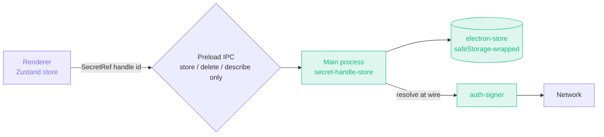

import { Badge, Aside } from '@astrojs/starlight/components';

<Badge text="Foundation accepted · incremental migration" variant="note" />

## Context

Every secret-bearing field in `AuthConfig` is a `string` today — `basic.password`, `bearer.token`, `apiKey.value`, `aws-signature.secretKey`, `oauth2.{accessToken, refreshToken, clientSecret}`, `oauth1.{consumerSecret, accessTokenSecret}`, `ntlm.password`, `wsse.password`, `digest.password`. The plaintext sits in:

- the renderer's Zustand store (and its Dexie / electron-store persistence)
- exported collections (Postman, Insomnia, OpenCollection, Bruno)
- error reports and crash logs that pretty-print request specs
- the agent-readable surface introduced by the Restura-as-MCP-server feature

The MCP server makes the cost concrete. Without a fix, an agent driving Restura could `get_environment` and read the user's plaintext AWS secret access key. Even today, before MCP, the export and log surfaces are not great.

## Decision

Introduce `SecretRef`, a discriminated union over secret values:

```ts
type SecretRef =
  | { kind: 'inline'; value: string }
  | { kind: 'handle'; id: string; label?: string };

type SecretValue = string | SecretRef;
```

- **Inline** mirrors today's behaviour. Web users have no OS keychain, so they stay on inline-only.
- **Handle** is desktop-only. The renderer stores only the `id` and an optional human-readable label. The plaintext lives in the main process's secret-handle store (`electron/main/secret-handle-store.ts`), encrypted by `electron-store` with a key wrapped by `safeStorage` (OS keychain).



The renderer **never** reads plaintext for a handle — that's the entire point. Resolution is a **main-process-only** operation, invoked just before the auth-signer runs. The preload bridge deliberately exposes only `store`, `delete`, and `describe` — never `resolve`.

## Foundation (landed)

- `src/lib/shared/secretRef.ts` — types, predicates, sync helpers (`unwrapSecret`, `describeSecret`, `redactSecret`, constructors, `assertSecretValue`)
- `electron/main/secret-handle-store.ts` — UUID-keyed encrypted store, IPC handlers (`secret:store`, `secret:delete`, `secret:describe`), main-process-only `resolveSecretHandle` and `unwrapSecretValueMain`
- `electron/main/preload.ts` — `electronAPI.secrets.{store, delete, describe}` exposed to the renderer (no `resolve`)
- `electron/main/main.ts` — `registerSecretHandleIPC()` wired into the startup sequence

## Per-descriptor migration (incremental)

The legacy `AuthConfig` fields stay as `string` until each is migrated. Migration steps for one field at a time:

1. Widen the type: `interface BasicAuth { username: string; password: SecretValue }`.
2. Update Zod schemas in `src/lib/shared/store-validators.ts` to accept the union.
3. Update IPC validators in `electron/main/ipc-validators.ts` to accept the union.
4. Update the shared protocol code path: callers resolve via `unwrapSecretValueMain()` (main) or `unwrapSecret()` (renderer-side, returns placeholder for handles).
5. Update the auth-input UI to allow the user to "Store securely" (creates a handle) vs "Inline".
6. Add a store migration in the relevant Zustand `persist` config that bumps the schema version and re-wraps existing strings as `{ kind: 'inline', value }`. **No data loss** — inline keeps current behaviour.
7. Add the field path to the log-redaction denylist.
8. Update exporters to call `redactSecret()` for handles.

### Migration order

1. `aws-signature.secretKey` (highest blast radius — agents driving Restura against AWS prod is the worst scenario)
2. `oauth2.{accessToken, refreshToken, clientSecret}`
3. `oauth1.{consumerSecret, accessTokenSecret}`
4. `bearer.token`
5. `basic.password`, `digest.password`, `ntlm.password`, `wsse.password`, `api-key.value`

Each migration is a small, focused PR that touches 5–10 files. The foundation guarantees the migration is purely mechanical.

## MCP-server interim policy

Until the per-descriptor migration is complete, the MCP server's `get_environment` / `list_collections` / `execute_request` tools redact secret fields at the tool-output boundary using `redactSecret()` and a well-known field-name list. An agent sees the structure of the auth descriptor (so it knows what to ask the user for) but never the plaintext.

## Threat model

| Threat | Mitigation |
|---|---|
| Renderer XSS via malicious response viewer reads from Zustand | Handles return placeholder; only inline values leak |
| Collection export contains plaintext | `redactSecret()` before serialisation |
| MCP server agent reads `get_environment` plaintext | Per-field redaction at MCP boundary |
| Log file / crash report pretty-prints auth descriptor | Log-redaction denylist filters by field path |
| Filesystem dump (electron-store at rest) | safeStorage-wrapped key; cannot decrypt without OS keychain unlock |
| Compromised renderer asks `secret:resolve` IPC | No such IPC channel — main-process only |
| Loss of OS keychain | Loud warning at startup; encryption falls back to 0o600 plaintext key file |

## What this does NOT solve

- **Compromised main process.** If the attacker can run code in main, they can call `resolveSecretHandle()` directly and read plaintext. That's the same trust boundary as everything else in main (file IO, IPC).
- **Network-layer secret exposure.** SSRF protection and TLS pinning are orthogonal concerns and live elsewhere.
- **Long-term storage rotation.** Handles do not auto-expire. A follow-up could add TTL + rotation prompts.

## Open questions

- Should the Postman / Insomnia / Bruno importers offer to convert imported inline secrets into handles automatically? Probably yes, with an opt-in checkbox.
- Should there be a single "Secrets" panel in Settings that lists every handle, with a delete button? Probably yes.

## Related

- Source: [`docs/adr/0007-secret-ref-pattern.md`](https://github.com/dipjyotimetia/restura/blob/main/docs/adr/0007-secret-ref-pattern.md)
- Related: [ADR 0004 — Security hardening](/architecture/adrs/0004-security-hardening/).
- Architecture: [Security model](/architecture/security/).
