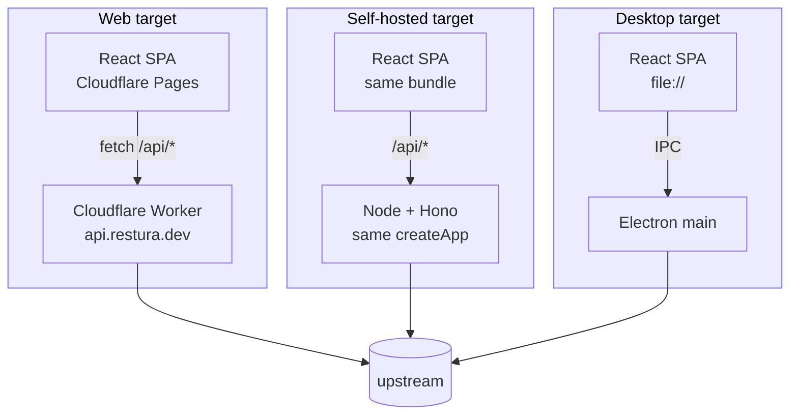
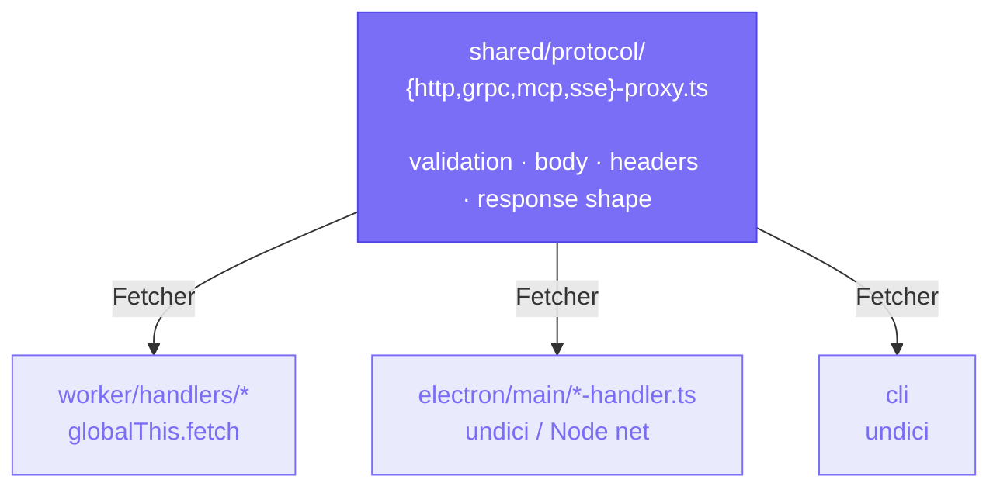

import { Card, CardGrid, Aside } from '@astrojs/starlight/components';

Restura ships from a **single React renderer** to web, desktop, and self-hosted targets. The transport layer is the only thing that differs — chosen at runtime by `isElectron()` in `src/lib/shared/platform.ts`.

## The three backends

<CardGrid>
  <Card title="Web — Cloudflare" icon="rocket">
    SPA on Cloudflare Pages → `fetch('/api/*')` → Cloudflare Worker (Hono) on `api.restura.dev` → upstream. Same-origin, no CORS friction.
  </Card>
  <Card title="Self-hosted — Node + Docker" icon="seti:docker">
    One Node process running the same Hono app that runs in the Worker. Serves both the SPA and `/api/*` on one port. Native WebSocket and CONNECT proxy adapters.
  </Card>
  <Card title="Desktop — Electron" icon="laptop">
    SPA loaded via `file://` → IPC over `window.electron` → Electron main process → Node `http`/`https`/`net`/`tls`. Native capabilities (mTLS, SOCKS, Kafka, MQTT).
  </Card>
</CardGrid>

The two HTTP backends (Cloudflare Worker and Node/Docker server) share a single Hono app via the `createApp(deps)` factory in `worker/app.ts`. Each entry supplies its own adapters for the platform-specific bits (CONNECT proxy, native WebSocket).

## Shared protocol core — the key idea

Each protocol (HTTP, gRPC, MCP, SSE, WebSocket, AI) is implemented **once** as a backend-agnostic orchestrator in `shared/protocol/`. Each backend supplies a thin `Fetcher` adapter — and that's it. Everything else — SSRF validation, header sanitisation, body construction, response shape, gRPC status mapping, SSE / NDJSON parsing — lives in `shared/protocol/` and runs identically across Worker, Node, and Electron.

See [Shared protocol layer](/architecture/shared-protocol/) for the deep dive.

## Routing

`createHashRouter` is used so the renderer works under both `https://` (Pages) and `file://` (Electron). There is no server-side routing.

## State + persistence

All global state lives in **Zustand** stores with the `persist` middleware. Stores are validated with Zod schemas in `src/lib/shared/store-validators.ts`.

- **Web** — `src/lib/shared/dexie-storage.ts` (IndexedDB via Dexie).
- **Desktop** — `src/lib/shared/secure-storage.ts` (encrypted electron-store via IPC; key wrapped by Electron `safeStorage` → OS keychain).

Secret-bearing fields use the **`SecretRef` handle pattern** — see [ADR 0007](/architecture/adrs/) — so plaintext never enters the Zustand store, the persistence layer, or exported collections.

## Capability parity is data-driven

`src/lib/shared/capabilities.ts` is the **single source of truth** for what works on web vs. desktop. It feeds:

- The "Desktop only" badges you see in the UI.
- The auto-generated [capability matrix](/reference/capability-matrix/).
- The CI gate (`npm run capabilities:check`) that fails the build if the doc drifts from the code.

<Aside title="Read more">
Full architecture writeup:
- [Shared protocol layer](/architecture/shared-protocol/)
- [Security model](/architecture/security/)
- [Design decisions (ADRs)](/architecture/adrs/)
- [`docs/ARCHITECTURE.md`](https://github.com/dipjyotimetia/restura/blob/main/docs/ARCHITECTURE.md) on GitHub — the canonical source-of-truth for contributors.
</Aside>
