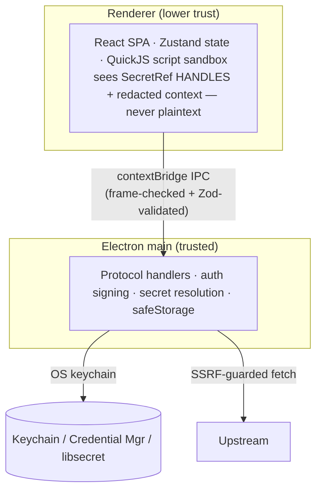

import { Aside } from '@astrojs/starlight/components';

This is the **design-level** companion to the [Security model](/architecture/security) overview. It explains the *why* — the threat model, the trust boundaries, and the design of the parts that are easy to get subtly wrong: secret storage, the OS keychain, code signing, and the secret-resolution path.

<Aside>
Decisions referenced here are recorded in ADRs [0004 — Security hardening](/architecture/adrs/), [0006 — Connection + DNS hardening](/architecture/adrs/), [0007 — SecretRef pattern](/architecture/adrs/), and [0008 — Keystore + renderer hardening](/architecture/adrs/0008-keystore-and-renderer-hardening/).
</Aside>

## Threat model

Restura sends arbitrary, user-authored requests to arbitrary endpoints. That shapes what we defend against.

**In scope:** secret exposure at rest (disk, exports, logs, MCP surface); secret exposure to a compromised/buggy renderer; SSRF via requests, shared collections, or redirects; untrusted pre-request/test scripts; and supply-chain integrity of the signed desktop app.

**Out of scope (documented, not ignored):** a fully compromised OS account (the keychain unlocks for the logged-in user); true DNS-rebind at TTL=0 for transports that can't pin the connect address; and web at-rest encryption by default (no OS keychain in a browser).

## Trust boundaries

The renderer is the **lower-trust** side of the IPC boundary. Everything that touches a plaintext secret — resolution and wire-signing — happens in the main process.

## Defense in depth

| Layer | Mechanism | Source |
| --- | --- | --- |
| Process isolation | `contextIsolation`, `sandbox`, `nodeIntegration:false` | `window-manager.ts` |
| IPC boundary | frame allow-list (every handler) + Zod validation + per-`webContents` rate limit | `ipc-validators.ts` |
| Renderer permissions | deny-by-default; only `clipboard-sanitized-write` granted | `permission-policy.ts` |
| Content policy | production CSP, `frame-ancestors 'none'` | `main.ts` |
| Secret isolation | `SecretRef` handles; no `secret:resolve` in preload | `secret-handle-store.ts` |
| At-rest encryption | electron-store + 256-bit key wrapped by `safeStorage` | `encrypted-key.ts` |
| SSRF / DNS | shared URL validation + pinned/pre-flight DNS guard | `url-validation.ts`, `dns-guard.ts` |
| Wire-level auth | SigV4 / OAuth1 / WSSE signed in main | `auth-signer.ts` |
| Script sandbox | QuickJS WASM, memory + time caps | `scriptExecutor.ts` |
| Supply chain | Developer-ID signing + notarisation; CI guard | `electron-builder.json`, `release.yml` |

The SSRF, sandbox, redaction, and worker-auth layers are covered in the [Security model](/architecture/security) page; below focuses on secret storage and supply chain, where most of the subtlety lives.

## Secret storage & the OS keychain

### Two-tier key model

Restura never hands a user secret to electron-store directly:

1. A per-store **256-bit data key** (`crypto.randomBytes(32)`) encrypts the store contents.
2. That data key is **wrapped by the OS keychain** via `safeStorage` and persisted as a small blob in `userData`.

All of it lives in `encrypted-key.ts`, so the policy — *prefer keychain, fall back loudly* — is identical across the three stores (credential, `SecretRef` handles, `pm.vault`). They're kept separate so a user-chosen vault key can't collide with an internal handle UUID, and intentionally **not** merged.

<Aside type="caution" title="One keychain item, not three">
On macOS, `safeStorage` uses a **single** keychain item per app (`restura Safe Storage`) for all three key files, and caches the derived key in memory after the first read per process. All three stores therefore cost **one** keychain access per launch. "N stores = N prompts" is a myth — and merging stores is never the fix for repeated prompts.
</Aside>

### SecretRef handle pattern (ADR 0007)

Auth fields store a handle (`{ kind: 'handle', id, label? }`) in renderer state — never plaintext. The plaintext lives only in the main-process handle store and is resolved at the last moment before wire-signing. The key invariant: **`secret:resolve` is not exposed through the preload bridge**, enforced by a source-scanning test.

### Key derivation: async, rotation-aware

Per Electron's [`safeStorage` guidance](https://www.electronjs.org/docs/latest/api/safe-storage), Restura derives keys via the non-blocking async API (`getOrCreateEncryptedKeyAsync`):

- **`decryptStringAsync`** is non-blocking and absorbs a momentarily-locked keychain instead of forcing a degraded path.
- It returns **`shouldReEncrypt`**: when the OS rotates its storage key, the data key is transparently re-wrapped under the new one. A failed re-wrap is non-fatal — the decrypt already succeeded.
- Keys are **pre-warmed once** at `app.whenReady()` (in MCP mode too), so the single keychain access happens predictably up front; the sync accessors then return the cached store and remain a self-init fallback.

### Failure & recovery policy

| Condition | Behaviour | Rationale |
| --- | --- | --- |
| Available, decrypt OK | use key; re-wrap if `shouldReEncrypt` | normal path |
| Available, decrypt **throws** | regenerate key (old records dropped), logged **loudly** | master key replaced/lost — self-heal keeps the app usable, loudly |
| Keychain **unavailable** | `0o600` plaintext key + persistent UI banner | Linux without libsecret; documented, never silent |

A genuinely lost master key self-heals (so the "delete the keychain item and relaunch" recovery works); the common *transient* unavailability is absorbed by the async path rather than destroying recoverable data.

## macOS keychain prompts — by design vs. misconfiguration

Repeated keychain prompts are almost never a store-count issue — they're a **code-signing / ACL** symptom:

- A **Developer-ID-signed + notarised** app in `/Applications` is **silent** after one "Always Allow".
- An **unsigned / ad-hoc** build (e.g. local `electron:dev`) has no stable identity → re-prompts every launch.
- A **quarantined** app run from a DMG is *translocated* to a randomized path → ACL never matches → re-prompts.

On a developer machine the keychain item is often first created by a dev build, so the later release sees an identity mismatch. Fix: grant "Always Allow" once to the signed app; if it persists, delete the stale `restura Safe Storage` item and relaunch (resets the encrypted stores).

## Supply-chain integrity

The ACL guarantee is only as good as the signature:

- **Hardened runtime** + **notarisation** with minimal entitlements (no app-sandbox — it would break a tool that makes arbitrary requests and reads user-selected certs/protos).
- Electron **fuses**: `runAsNode:false`, cookie encryption, ASAR integrity, `onlyLoadAppFromAsar`.
- Signed GitHub-release updates with `allowDowngrade:false`.

Signing in CI is *silent-optional* (absent secrets → unsigned), so a guard in `release.yml` **fails the macOS release** when `CSC_LINK` / `APPLE_ID` are missing — an unsigned DMG (the one scenario that gives end users unfixable repeat-prompts) can never ship unnoticed.

<Aside title="Read the source">
- [`docs/SECURITY_DESIGN.md`](https://github.com/dipjyotimetia/restura/blob/main/docs/SECURITY_DESIGN.md) — this document
- [`docs/security.md`](https://github.com/dipjyotimetia/restura/blob/main/docs/security.md) — storage-encryption policy + SSRF/DNS tiers
- [Security model](/architecture/security) — platform-by-platform overview
- [`SECURITY.md`](https://github.com/dipjyotimetia/restura/blob/main/SECURITY.md) — vulnerability reporting
</Aside>
