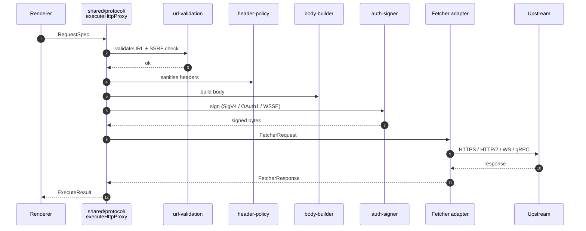

import { Aside, FileTree } from '@astrojs/starlight/components';

The shared protocol layer is the most important piece of Restura's architecture. It's the reason new protocols can be added in ~30 lines per backend instead of three full implementations.

## Request flow

A single request, end to end, goes through these stages — every stage except the transport adapter is shared code:

## The shape

Every protocol implementation in `shared/protocol/` exposes a `execute<Name>Proxy(spec, fetcher, options)` function. The `Fetcher` interface is the only thing each backend has to supply — everything else (SSRF guard, header policy, body construction, parsing) is shared.

<FileTree>
- shared/protocol/
  - types.ts                  `RequestSpec`, `Fetcher`, `ExecuteResult` (discriminated union)
  - url-validation.ts         SSRF guard — single source of truth
  - header-policy.ts          Hop-by-hop deny lists, header sanitisers
  - body-builder.ts           JSON, text, form-urlencoded, form-data, binary
  - http-proxy.ts
  - grpc-proxy.ts
  - mcp-proxy.ts
  - sse-parser.ts
  - ndjson-parser.ts
  - websocket-proxy.ts
  - auth-signer.ts            Wire-level auth signing
  - oauth1-signer.ts
  - wsse-header.ts
  - secret-value-schema.ts    `SecretRef` schema
  - crypto-utils.ts
  - ai/                       AI orchestrator
    - ai-proxy.ts
    - provider-routes.ts
    - providers/openai.ts, anthropic.ts, openrouter.ts
    - redaction.ts
</FileTree>

## The SSRF guard — one definition

`shared/protocol/url-validation.ts` is the single source of truth for what counts as a forbidden upstream:

- RFC 1918 (private networks).
- RFC 6598 (CGNAT range `100.64.0.0/10`).
- Link-local `169.254/16` — includes the cloud-metadata endpoint.
- Loopback (`127.0.0.0/8`, `::1`).
- IPv6 unique-local (`fc00::/7`).
- IPv4-mapped IPv6 (`::ffff:0:0/96`).
- The cloud-metadata addresses (`169.254.169.254`, GCE/AWS variants).

This single module is called by the Worker, the Node server, and the Electron main process. Before the refactor that introduced the shared layer, the guard had **drifted** between backends — adding it once and reusing everywhere is the whole point.

## Auth signed at the wire

`shared/protocol/auth-signer.ts`, `oauth1-signer.ts`, and `wsse-header.ts` sign **at the wire** — meaning the signing happens in the Worker / Electron main process, not in the renderer. This is necessary because:

- AWS SigV4 signs over the exact request bytes; signing in the renderer and then proxying through the Worker would change the bytes and invalidate the signature.
- OAuth 1.0 has the same property.
- WSSE PasswordDigest depends on a nonce and timestamp the upstream verifies.

The renderer hands the auth *spec* (method, credentials, region for SigV4, etc.) to the wire layer; the wire layer signs.

## Adding a new protocol

The recipe is now:

1. Add `shared/protocol/<name>-proxy.ts` exposing `execute<Name>Proxy(spec, fetcher, options)`.
2. Add a `Fetcher` adapter in `worker/handlers/<name>.ts` (≈30 lines).
3. Add a matching adapter in `electron/main/handlers/<name>-handler.ts` (≈30 lines).
4. Add a feature module in `src/features/<name>/` with the UI.
5. Add a `capabilities.ts` entry if the feature differs between web and desktop.

SSRF guards, header sanitisers, body construction, and timeouts are all free.

## Where backend-specific code lives

Electron-only capabilities (PAC resolution, SOCKS4/5, mTLS, custom CA, pre-flight DNS guard via `dns-guard.ts`, manual redirect handling) live **inside the Electron fetcher closure** — not in `shared/protocol/`. Keep `shared/` backend-agnostic. ADR 0006 codifies this rule.

<Aside title="Deep dive">
See [`docs/ARCHITECTURE.md`](https://github.com/dipjyotimetia/restura/blob/main/docs/ARCHITECTURE.md) and [ADR 0001](/architecture/adrs/) for the full design rationale.
</Aside>

## Related

- [Architecture overview](/architecture/overview/)
- [Security model](/architecture/security/)
- [Contract tests & CI](/testing/contract-and-ci/)
