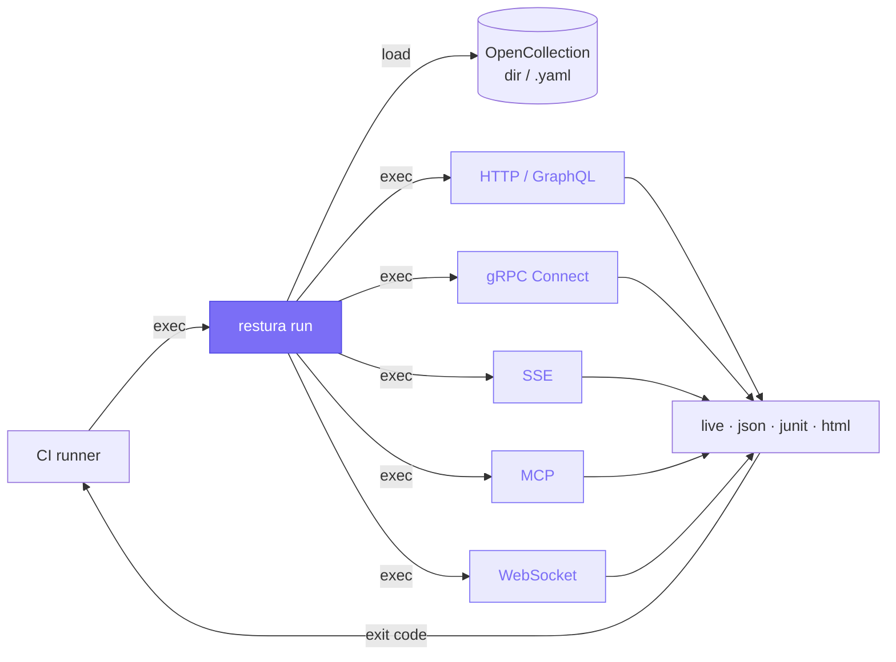

import { Aside, Tabs, TabItem } from '@astrojs/starlight/components';

`@restura/cli` runs your collections headlessly with the same protocol implementations as the desktop and web apps. Drop it into CI to assert your API, get JUnit XML for your dashboard, ship an HTML report to your team.

## How it fits



## Install

```bash
npm install -g @restura/cli
# or, no install:
npx @restura/cli run ./my-collection
```

Requires **Node.js 24+**.

## Quick start

Export a collection from the Restura app (**File → Export → OpenCollection directory**), then:

```bash
restura run ./my-collection --reporter junit --reporter-output junit=results.xml
```

Exit code is `0` when every request passed, `1` if any failed, `2` on internal errors (missing collection, bad flags).

## Supported collection formats

The loader auto-detects three layouts:

| Layout | Detected when… |
|---|---|
| **OpenCollection directory** (preferred) | the target directory contains `opencollection.yml` (or `.yaml`) |
| **OpenCollection bundled file** | the target path ends in `.yaml` / `.yml` |
| **Legacy file-collection** (deprecated) | the target directory contains `_collection.yaml` |

The legacy format prints a stderr deprecation warning the first time it's loaded.

## Supported protocols

| Protocol | Notes |
|---|---|
| **HTTP / REST** | Full support |
| **GraphQL** | Runs as HTTP with body type `graphql` |
| **gRPC** | Via **Connect protocol** (JSON-encoded, no proto compilation needed) |
| **SSE** | Captures events for `--sse-duration` ms, or until `--sse-events N` |
| **MCP** | Single JSON-RPC POST per request |
| **WebSocket** | Executor available; not yet wired into the dispatcher |

<Aside type="caution" title="gRPC wire format">
The CLI uses **Connect-over-HTTP**, not gRPC-over-HTTP/2 binary framing. If your server only speaks classic gRPC, requests come back `UNKNOWN`.
</Aside>

## Command reference

```bash
restura run <collection> [options]
```

`<collection>` accepts a directory (any supported layout) or a bundled `.yaml` / `.yml` file.

### Flags

| Flag | Default | Description |
|---|---|---|
| `--env <file>` | | JSON or YAML env file. `${VAR}` placeholders are expanded from `process.env`. |
| `--reporter <list>` | `live` | Comma-separated. Mix and match: `live`, `json`, `junit`, `html`. |
| `--output <file>` | | Shorthand for single file reporter. |
| `--reporter-output <kv...>` | | Per-reporter output: `--reporter-output junit=results.xml html=report.html`. |
| `--bail` | `false` | Stop on first failure. |
| `--timeout <ms>` | `30000` | Per-request timeout. |
| `--allow-localhost` | `false` | Permit requests to `localhost` / `127.0.0.1`. Off by default (SSRF guard). |
| `--folder <path>` | | Only run requests under this folder path (slash-joined). |
| `--include <pattern...>` | | Substring or glob (e.g. `users/*`). Repeatable. |
| `--exclude <pattern...>` | | Same syntax as `--include`. Applied after. |
| `--data <file>` | | CSV (with header row) or JSON array. Runs the collection once per row. |
| `--max-iterations <n>` | | Cap iterations when a `--data` file is large. |
| `--retry <n>` | `0` | Retry attempts per failing request. |
| `--retry-on <list>` | `network,5xx` | Triggers: `network`, `5xx`, `4xx`, or specific status codes (`429,503`). |
| `--sse-duration <ms>` | `5000` | How long to keep SSE streams open. |
| `--sse-events <n>` | | Stop SSE early after N events. |
| `--ws-duration <ms>` | `5000` | How long to keep WebSocket connections open. |
| `--ws-messages <n>` | | Stop WebSocket early after N messages. |

## Scripts and assertions

Pre-request and test scripts run in a sandboxed QuickJS WASM VM — no DOM, no filesystem, no network escape; 10 MB memory cap, 5 s execution timeout. See [Scripts](/guides/scripts/) for the full Postman API surface.

```yaml
# request.http.yaml
name: Get user
method: GET
url: "{{API_BASE}}/users/1"
testScript: |
  pm.test("status is 200", () => pm.response.to.have.status(200));
  pm.test("response has name", () => {
    pm.expect(pm.response.json()).to.have.property("name");
  });
```

When a test script runs and defines any `pm.test(...)` assertion, those drive pass/fail. Otherwise pass/fail falls back to the transport outcome (HTTP 2xx, gRPC OK, etc.).

Variables set inside a script (`pm.environment.set('K', 'v')`) propagate to subsequent requests in the same run.

## Variables

Three layered sources, in order of precedence (later wins):

1. `--env` file
2. Collection variables (declared in `opencollection.yml` or `_collection.yaml`)
3. Iteration row (when `--data` is set)

Substitutions use `{{NAME}}`. Unknown vars are left in place so the upstream sees them and you notice the gap.

### Dynamic helpers

Postman-compatible `{{$random*}}` / `{{$timestamp}}` helpers are expanded after user var substitution:

| Helper | Example |
|---|---|
| `{{$randomUUID}}` | `f4d2e3...` |
| `{{$timestamp}}` | `1700000000000` |
| `{{$isoTimestamp}}` | `2026-05-22T13:42:00Z` |
| `{{$randomEmail}}` | `alice.42@example.com` |
| `{{$randomFirstName}}` | `Olivia` |
| `{{$randomIP}}` | `192.0.2.4` |

Full list in [`src/lib/shared/dynamicVariables.ts`](https://github.com/dipjyotimetia/restura/blob/main/src/lib/shared/dynamicVariables.ts).

## Data-driven runs

```bash
restura run ./users-api --data ./users.csv --reporter junit --reporter-output junit=junit.xml
```

```csv
# users.csv
username,role
alice,admin
bob,viewer
charlie,editor
```

Each row exposes `username` and `role` as variables, overriding any same-named env or collection variable for that iteration only. Reporter output groups results by iteration index.

## Reporters

<Tabs>
<TabItem label="live">
Coloured progress to stdout. Default. Best for local runs.
</TabItem>
<TabItem label="json">
Full `RunResult` dumped as JSON. Path required (`--output` or `--reporter-output json=...`). Pipe into anything.
</TabItem>
<TabItem label="junit">
JUnit XML for CI dashboards (GitLab, Azure DevOps, Jenkins, GitHub Actions test reporters). One `<testcase>` per request.
</TabItem>
<TabItem label="html">
Self-contained HTML page with embedded data + summary table. Great for sharing failures.
</TabItem>
</Tabs>

Combine with a comma: `--reporter live,junit --reporter-output junit=results.xml`.

## Exit codes

| Code | Meaning |
|---|---|
| `0` | Every request passed AND at least one request ran |
| `1` | One or more requests failed or errored (or no requests matched after filtering) |
| `2` | Internal error: missing collection, bad reporter name, IO failure, … |

## Example: GitHub Actions

```yaml
name: API smoke tests
on: [push, pull_request]
jobs:
  test:
    runs-on: ubuntu-latest
    steps:
      - uses: actions/checkout@v4
      - uses: actions/setup-node@v4
        with: { node-version: '24' }
      - run: npx @restura/cli run ./api-tests --env env.staging.json --reporter live,junit --reporter-output junit=results.xml
      - uses: dorny/test-reporter@v1
        if: always()
        with:
          name: API smoke tests
          path: results.xml
          reporter: java-junit
```

## Troubleshooting

| Symptom | Likely cause / fix |
|---|---|
| `No recognised collection layout` | Target needs `opencollection.yml` / `.yaml` or legacy `_collection.yaml`. Re-export from the Restura app. |
| `Invalid URL` | URL after `{{var}}` resolution isn't a valid absolute URL. Check `--env` is loaded and names match. |
| `Localhost URLs are not allowed` | Add `--allow-localhost` for local upstreams. Off by default to prevent SSRF in shared CI. |
| gRPC requests return `UNKNOWN` | Upstream doesn't speak Connect protocol. Restura's CLI uses Connect-over-HTTP, not gRPC-over-HTTP/2 binary. |
| `a secret handle ref is unresolvable in CLI` | Your auth uses a desktop-only secret handle. Re-export with inline values for CI use. |

## Development

```bash
# from cli/
npm install
npm test                   # vitest
npm run type-check         # tsc --noEmit
npm run build              # tsup → dist/
```

The CLI imports from the parent project at compile-time via path aliases (`@/`, `@shared/`); `cli/tsconfig.json` controls which parent modules participate in type-checking.

<Aside title="Canonical source">
This page mirrors [`cli/README.md`](https://github.com/dipjyotimetia/restura/blob/main/cli/README.md). The README is the source of truth for flag changes.
</Aside>

## Related

- [Scripts](/guides/scripts/) — the Postman `pm.*` API.
- [Workflows](/guides/workflows/) — request chaining (also runs in CLI).
- [OpenCollection](/reference/opencollection/) — the collection format.
- [ADR 0005 — CLI runner](/architecture/adrs/0005-cli-runner/).
