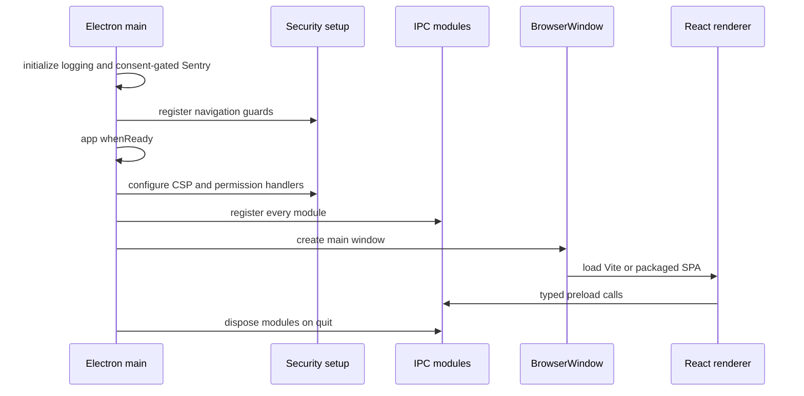

# Electron IPC and lifecycle

Electron is Restura's native runtime. `electron/main/main.ts` owns startup, security setup, IPC registration, windows, tray/updater lifecycle, and shutdown. The renderer gets only the typed `window.electron` bridge assembled in `electron/main/preload.ts`; it does not import or execute Node/Electron handlers directly. This is the desktop counterpart of the [Worker and self-hosted Node API](worker-and-node-api.md).

## Public bridge and ownership

The preload entry composes three restricted modules and checks them with `satisfies ElectronAPI` before exposing them through `contextBridge`:

| Bridge module | Main consumer domains | Contract owner |
| --- | --- | --- |
| `preload/protocol-api.ts` | HTTP, gRPC, WebSocket, Socket.IO, SSE, MCP, Kafka, MQTT requests and stream events | `electron/types/api/protocols.ts` |
| `preload/platform-api.ts` | Window/platform, storage, settings, notifications and native facilities | `electron/types/api/platform.ts` |
| `preload/integration-api.ts` | Files, Git, collections, secrets, capture, AI/AI Lab and integrations | `electron/types/api/integrations.ts` |

Channel names live in `electron/shared/channels.ts`: `IPC` names request/response `invoke` channels and fire-and-forget `send` channels; `EVENT` names static main-to-renderer pushes; `EVENT_PREFIX` plus `CHANNEL_PREFIXES` delimit per-connection event namespaces used by the preload event bridge. To add a public desktop API, change the handler implementation and channel registry, define its renderer-facing type, add the typed preload method, then register it in main. Do not expose `ipcRenderer` or generic channel invocation.

`electron/main/__tests__/ipc-surface.test.ts` is the structural parity guard: it checks registry uniqueness and catches duplicate, preload-only, main-only, raw-literal, and undocumented event-channel wiring. Focused handler tests exercise the corresponding validation/event bridge; run this parity suite whenever a channel or preload module changes.

Every invoke/listener handler should use the helpers in `electron/main/ipc/validators/boundary.ts`. They first require a top-level trusted renderer frame—packaged `file:` ending in `/web/index.html`, or the development Vite origin on port `5173`—then parse input with a Zod schema. Validation logs issue metadata and input type but never logs the rejected payload, because it may contain credentials, request bodies, private keys, or files.

## Startup and shutdown


_Desktop mode registers security controls before window creation, exposes a narrow preload contract, and tears down long-lived native resources from the same registry that registered them._

Before `app.whenReady()`, main optionally redirects `userData` for isolated tests, decides whether `--mcp-server` headless mode is active, initializes logging and consent-gated Sentry, requests the single-instance lock, registers deep links, and installs navigation/security listeners. In normal mode, readiness configures CSP and the default-deny permission handlers, registers IPC, creates the first window, then wires updater and tray behavior.

`IPC_MODULES` is the lifecycle invariant: a module's `register` and optional `dispose` live in one ordered list. Stream-capable protocols, Kafka/MQTT, file watchers, vault/secret stores, capture bridge, mock server, and AI surfaces register through it. Normal quit prevents default exit, waits for all registered disposals or a three-second backstop, destroys the tray, then exits. Add cleanup next to registration; do not create a second teardown list.

## Security boundaries

- Production CSP is installed by `setupContentSecurityPolicy`; `vite.config.mts` injects the matching meta CSP into Electron production HTML because the header is not reliable for `file:` main frames across Electron versions. Keep both policies synchronized.
- Permission handlers permit only `clipboard-sanitized-write`; native filesystem, networking, notifications, and secrets use validated IPC instead.
- Navigation permits only Vite's local origin in development and blocks all production navigations; redirects and webviews are also blocked.
- Native outbound policy and secret resolution live in `electron/main/security/`. The [persistence and security page](persistence-and-security.md) is canonical for policy acknowledgment, keychain storage, secret handles, and external profiles.
- DNS-sensitive native handlers must keep connections pinned after validation. `tests/security/socketio-dns-pinning.test.ts` proves Socket.IO opens no socket after SSRF rejection and uses an IP-pinned HTTP(S) agent after successful resolution.

## Headless MCP server mode

### Auto-updater lifecycle

`setupAutoUpdater(getMainWindow, isDev)` is normal-mode-only. It is disabled in development or when `RESTURA_DISABLE_AUTO_UPDATE=true`; otherwise it registers lifecycle listeners, checks shortly after launch, and polls every six hours. `broadcast` sends status to every live window, while lazy `getMainWindow` targeting avoids a stale initial-window reference for progress bars and notifications. Each download receives a cancellation token and retained `lastUpdateInfo` lets the UI return to available after cancellation. User configuration sets auto-download and maps beta to `allowPrerelease`/the `beta` channel; stable clears the channel and always keeps `allowDowngrade=false`. Status moves through checking, available, downloading, validating/downloaded, installing, or a phase-safe error. `electron/main/lifecycle/__tests__/auto-updater.test.ts` covers configuration and update-channel behavior.

When launched with `restura --mcp-server`, main takes a separate `whenReady` branch. It does not create a window, tray, updater, or ordinary IPC module set. `startStdioMcpServer(() => loadMcpDispatchContext())` owns JSON-RPC over stdin/stdout; logger setup suppresses stdout so it cannot corrupt the protocol stream. On quit, it stops the MCP server and waits up to three seconds to preserve a clean EOF for the parent process. This mode reads consent-limited MCP dispatch context at tool-call time, rather than exposing all desktop state.

## Critical coverage and change validation

The root suite has broad thresholds, while `vitest.electron-critical.config.ts` adds per-file floors for high-risk paths: HTTP request handling, response streaming, secure connections, IPC boundary validation, execution policy, and secret-handle storage. It was introduced with the recent robustness extraction; see [Recent history and change rationale](../operations/recent-history-and-change-rationale.md).

Run the smallest relevant test first, then the dedicated critical gate:

```bash
vitest run electron/main/__tests__/http-handler.test.ts
vitest run tests/security/socketio-dns-pinning.test.ts
npm run test:electron:critical-coverage
npm run type-check:all
```

Use Electron e2e only when the behavior requires a packaged renderer, native broker, or real desktop lifecycle: `npm run test:e2e:electron:build && npm run test:e2e:electron`.
