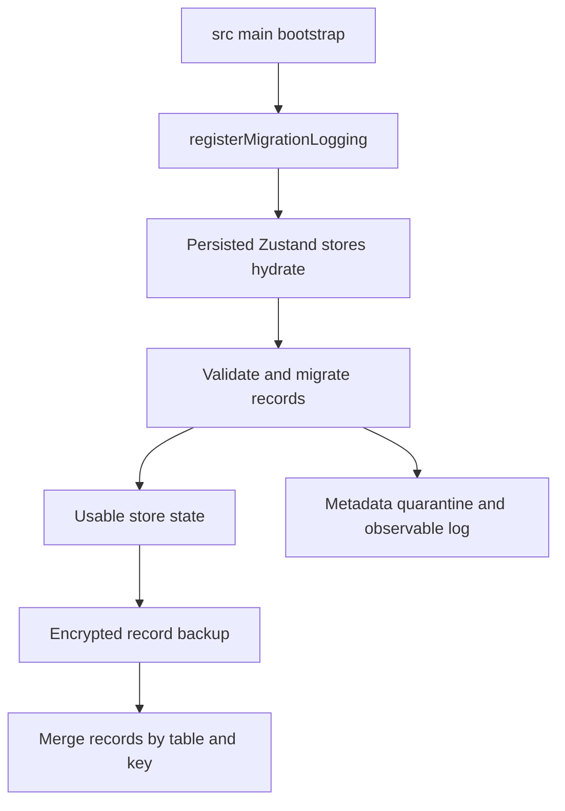

# Persistence and execution security

Restura is offline-first. `src/lib/shared/database.ts` defines `ResturaDB`, a Dexie database whose user records use an `encryptedData` field. That field is truly encrypted only when the selected key provider is encrypted; this distinction is deliberate and must remain visible to users and maintainers.

## Data ownership and lifecycle

`ResturaDB` owns collections, environments, history, settings, cookies, OWS workflows, file-collection metadata, request tabs, connection registries, console state, GraphQL schemas, proto files, AI chat/Lab/eval/arena state, globals, and collection-run history. Versioned schema updates reach v14. The internal `metadata` table is excluded from normal export/stat enumeration because it can contain application state and migration quarantine rows.

`src/main.tsx` registers migration logging before asynchronous store hydration; moving it later loses useful migration outcomes. `exportAllData` derives user tables from live Dexie tables, preventing new-table drift; backups contain stored records and importing merges by primary key.

## Key providers

`src/lib/shared/keyProvider.ts` selects the provider:

- Electron uses `ElectronSafeStorageKeyProvider`, persisting the data key through Electron `safeStorage` and OS secure storage.
- Web defaults to `PlaintextKeyProvider`: IndexedDB holds JSON under browser same-origin protection. This replaced unrecoverable ephemeral encryption.
- `WebSessionPassphraseProvider` is available for an explicitly supplied, in-memory session passphrase derived with PBKDF2. Losing that passphrase prevents recovery of encrypted data.

Do not claim that web data is encrypted by default. The recovery/security tradeoff is part of the product boundary.

## Sensitive storage routing

`src/lib/shared/secure-storage.ts` is a narrower Electron bridge for individual sensitive settings. Keys matching `auth`, `token`, `password`, `passphrase`, `apiKey`, `secret`, or `credential` are cached in memory and persisted through the encrypted Electron store, never retained in `localStorage`. On a first synchronous `get` cache miss it can return `null` while it starts asynchronous hydration; consumers that require the value immediately after restart must use `getAsync`. A one-time migration moves a stale plaintext value into the encrypted store and purges local storage. `set` and `remove` both purge plaintext, so a deleted secret cannot be resurrected by a later migration.

## Secrets and execution policy

Protocol secret values can be opaque references. `shared/secrets/external-secret-resolver.ts` creates a fail-closed resolver: it dispatches only to a provider matching the reference, treats missing/empty values as errors, observes cancellation, and maps raw provider failures to stable renderer-safe `ExternalSecretError` codes. Trusted desktop/CLI adapters resolve values; console/export paths redact them.

Desktop outbound work additionally waits for `electron/main/security/execution-policy.ts`. The renderer hydrates settings and calls its sync initializer; main validates a strict policy snapshot with `ExecutionPolicySchema`, then marks it acknowledged. Validation covers network scope, enabled-proxy type/host consistency, timeout, TLS/cipher choices, CA certificates, and format-specific client certificates: PFX requires `pfx`; PEM requires both certificate and key. `safeDefaultPolicy` permits localhost but not private IPs, enables TLS verification, and has no enabled proxy. `assertExecutionPolicyReady()` fails closed until acknowledgment. `setExecutionPolicy` parses before assignment, so rejected IPC cannot partially modify the snapshot, and `getExecutionPolicy` returns a parsed copy so consumers cannot mutate global policy.

## Change guidance and validation

Adding persisted state means selecting an owner table/store, adding a migration/version when needed, ensuring export/import/stats semantics, validating rehydration, and exposing migration loss/quarantine rather than silently discarding data. Adding a secret provider means update the reference schema, trusted provider wiring, safe errors, and redaction tests. Extending desktop transport settings requires schema validation, sync/acknowledgment, a main-process consumer, and fail-closed tests.

Run focused database/key-provider/store or Electron policy tests, then `npm run type-check:all`. For evidence-bearing changes also run the console and collection-run tests listed in [Console evidence and safety](../features/console-evidence.md).
