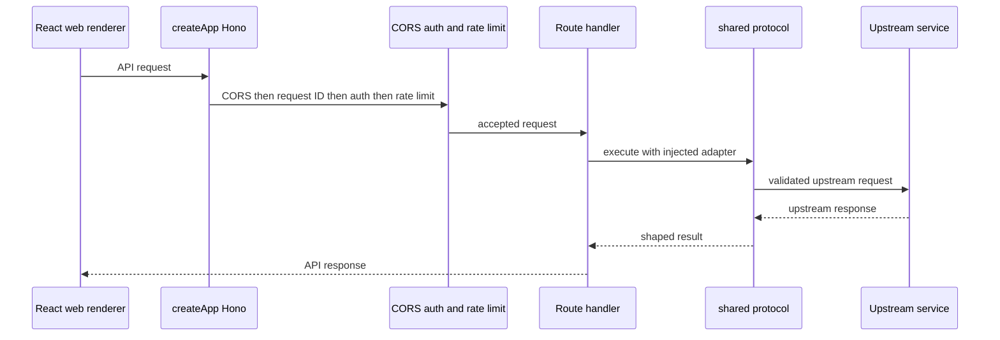

# Worker and self-hosted Node API

`worker/app.ts` owns Restura's web-backend public surface. Its `createApp(deps, baseApp?)` factory is intentionally shared by the Cloudflare entry (`worker/index.ts`) and the self-hosted Node entry (`worker/node-entry.ts`): route policy and protocol handling stay identical, while only TCP proxying, native WebSocket termination, and DNS checks are injected through `AppDeps` from `worker/adapters.ts`.

This is the backend for the renderer's web and self-hosted request paths described in [Architecture overview](overview.md). It is **not** used by Electron, whose main process exposes equivalent capabilities through IPC; see [Electron IPC and lifecycle](electron-ipc-and-lifecycle.md).

## Public contract and policy order

| Route | Owner | Purpose | Authentication note |
| --- | --- | --- | --- |
| `GET /health`, `GET /ready` | `createApp` | Unauthenticated liveness/readiness JSON with build version | Deliberately outside `/api/*`; no CORS, auth, or rate-limit middleware. |
| `POST /api/proxy` | `handlers/proxy.ts` | HTTP execution through the shared protocol core | Requires proxy authority except local development bypass. |
| `POST /api/import/fetch` | `handlers/remote-import.ts` | Fetch a remote import URL subject to hostname safety policy | Same protected API boundary. |
| `POST /api/grpc`, `POST /api/grpc/reflection` | `handlers/grpc.ts`, `handlers/grpc-reflection.ts` | gRPC execution and reflection | Same protected API boundary. |
| `POST /api/mcp` | `handlers/mcp.ts` | MCP request forwarding | Same protected API boundary. |
| `GET /api/feature-flags` | `handlers/feature-flags.ts` | Read-only kill-switch configuration | Public with respect to proxy credentials, but still CORS/rate-limited. |
| `POST /api/telemetry/error` | `handlers/telemetry.ts` | Bounded web error-report sink | Public with respect to proxy credentials, but still CORS/rate-limited. |
| `POST /api/ws-ticket`, `GET /api/ws` | `handlers/ws-ticket.ts`, injected WebSocket handler | Worker WebSocket ticket/upgrade surface | Same protected API boundary. The renderer currently does not wire this relay for browser WebSocket connections; the capability source records that limitation. |


_Only API routes traverse the ordered CORS, request-ID, authentication, and rate-limit boundary; health probes bypass it by design._

Middleware registration order in `createApp` is CORS, `requestIdMiddleware`, `proxyAuthMiddleware`, then `rateLimitMiddleware`. Preserve that ordering: the two public endpoints are still identifiable and rate-limited, while a rejected protected request must not reach a handler.

### Auth and CORS invariants

`proxyAuthMiddleware` accepts a matching `X-Restura-Proxy-Token` or Bearer token when `WORKER_PROXY_TOKEN` is configured; absent or mismatched credentials return `401`. Only when no proxy token is configured can `REQUIRE_CF_ACCESS=true` accept `Cf-Access-Authenticated-User-Email`; its absence returns `401`. If neither token nor Access policy applies, protected routes return `503`, rather than becoming open proxies. Local bypass is narrower than `ENVIRONMENT=development`: it depends on `isLocalDevBypass` and is intended for Miniflare or explicit `DEV_BYPASS_AUTH=true`.

`resolveCorsOrigin` is closed by default. `ALLOWED_ORIGIN` is a comma-separated allowlist whose `*` matches one hostname label. Without it, only the local Vite origins are accepted during an actual local bypass; production does not echo arbitrary origins. `worker/__tests__/index.test.ts` protects both regressions: a preview/development-looking deployment must still require a token without the bypass conditions, and production without `ALLOWED_ORIGIN` must not reflect an attacker origin.

### Rate-limiter modes

`rateLimitMiddleware` uses `RATE_LIMITER=map` by default, backed by the legacy per-isolate Map limiter. `binding` enforces through `RATE_LIMITER_BINDING` when a Cloudflare binding exists. `binding-shadow` evaluates the binding in shadow mode but continues to enforce the isolate limiter, allowing production comparison before a cutover. A requested binding mode without its binding logs once and falls back to the isolate limiter. Node refuses both binding modes at startup because it cannot supply the binding. These rules apply after auth to both protected APIs and the two bounded public API paths.

## Runtime adapters and data flow

`AppDeps` keeps target-specific behavior out of route policy:

- Cloudflare `worker/index.ts` creates the app with its TCP CONNECT and `WebSocketPair` implementations.
- Node supplies `createHttpsViaConnectProxy`, `createHttpViaProxy`, `assertNodeHostnameSafe`, and `createNodeWebsocketHandler` in `worker/node-entry.ts`.
- Handlers delegate protocol-neutral construction, header policy, URL validation, signing, redirects, and response shaping to `shared/protocol/`. A new web backend feature belongs in that core only when it can remain runtime-neutral; otherwise it is an adapter concern.

The self-hosted entry creates one Hono instance before calling `createNodeWebSocket({ app })`, then passes that **same** instance to `createApp`. Its environment middleware uses `Object.assign(c.env, additions)`, not replacement: `@hono/node-ws` associates upgrade state with that object reference. Replacing it breaks upgrades.

## Node server lifecycle

`worker/node-entry.ts` is bundled by `npm run build:server` as `dist/server/index.mjs`; Docker builds pair it with the SPA at `dist/web`. It:

1. derives `STATIC_ROOT`, `PORT` (default `3000`), and `HOST` (default `0.0.0.0`);
2. installs Undici's `EnvHttpProxyAgent` only when conventional HTTP(S) proxy environment variables exist;
3. snapshots `ENVIRONMENT` and `ALLOW_PRIVATE_IPS` into Node DNS-guard adapters at startup;
4. refuses `RATE_LIMITER=binding` and `binding-shadow`, because those modes require Cloudflare bindings;
5. mounts an API-only JSON 404 before static middleware, so an `/api/*` typo cannot silently return the SPA shell;
6. serves static files, then `index.html` for non-API routes; and
7. on `SIGINT` or `SIGTERM`, closes the server and forces exit after ten seconds if draining hangs.

The server remains stateless: browser persistence is still owned by IndexedDB. Operator setup, reverse proxy requirements, and health-probe usage belong in `docs/SELF_HOSTING.md` and [Operations](../operations/overview.md).

## `/api/proxy` execution boundary

`handlers/proxy.ts` parses every JSON body through `ProxyRequestBodySchema` before making a fetcher. It then selects `executeHttpProxyStreaming` or `executeHttpProxy` from `shared/protocol/http-proxy.ts`, supplying the same SSRF options and target-specific fetcher. Buffered success preserves the renderer contract `{ status, statusText, headers, data, size, bodyEncoding? }`; failures are the shared normalized error payload. Streaming success forwards sanitized headers/status and pipes the upstream body through Hono.

The streaming decision is exact: `streamingMode: true` is an unconditional schema-validated path; otherwise the handler tokenizes comma-separated `Accept` entries, strips parameters, lowercases, and exact-matches only `text/event-stream`, `application/x-ndjson`, `application/jsonl`, or `application/grpc-web`. Do not replace it with substring matching: `text/event-stream-evil` would otherwise bypass buffered response-size limits.

For direct upstreams, the Node fetcher calls its injected DNS hostname guard before `fetch`; both the guard and shared executor receive local-bypass and `ALLOW_PRIVATE_IPS` choices. Explicit upstream proxies are separately syntax- and URL-validated, including the same private-IP/local rules, and use the injected CONNECT or HTTP proxy adapter. Cloudflare supplies socket adapters; Node supplies `node:net`/`node:tls` adapters and DNS validation. The Worker rejects secret handles and per-request TLS cipher order, minimum TLS version, or cipher-suite controls with a desktop-only `400`, rather than silently dropping them.

`worker/handlers/__tests__/proxy.test.ts` covers parsing, policy, and handler behavior. `tests/contract/http-proxy.contract.test.ts` compares normalized results across native-fetch and Undici fetchers. It deliberately does **not** promise identical upstream `statusText`, which runtimes can synthesize differently; change the shared normalized contract rather than asserting that implementation detail.

## Change recipe and focused validation

For a new web API route, add the handler and route in `createApp`, decide whether it is a protected proxy operation or an explicitly bounded public endpoint, retain the middleware order, and provide Cloudflare and Node-compatible dependencies through `AppDeps` if needed. Add a route-level Worker test and follow the request downstream into `shared/protocol/` or the relevant handler test.

Use narrow checks first:

```bash
vitest run worker/__tests__/index.test.ts
vitest run worker/__tests__
npm run type-check:all
```

For self-hosting changes, build and start the Node target, then probe `/health`; use `npm run build:docker` followed by `npm run start`. Run `npm run test:contract` when a shared HTTP execution behavior changes.
