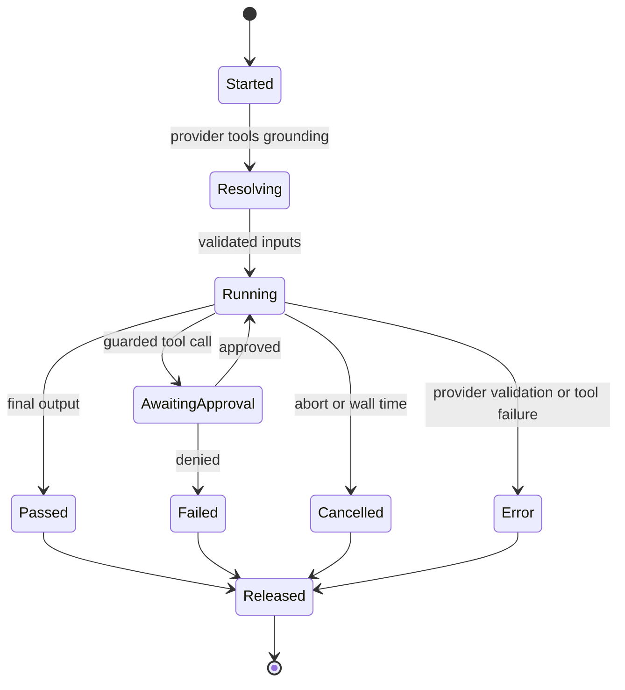

# Agent Lab

Agent Lab is the desktop-oriented workbench for defining agents, running bounded tool-using tasks, and retaining evaluation/arena results. It is distinct from ordinary AI chat and from the MCP client/server surfaces.

## Ownership

| Layer | Responsibility |
| --- | --- |
| `shared/agent-lab/` | schemas, providers, grounding, tool policy/resolution, runner, suite evaluation, bundle and telemetry contracts |
| `src/features/ai-lab/` | workbench UI, persisted state, run engine, progress and cancellation presentation |
| Electron | `ai-handler.ts`, `ai-lab-handler.ts` trusted credentials/providers and IPC |
| CLI | `agent` command and agent runtime components |

`ResturaDB` persists AI Lab definitions in `aiLab`, evaluation history in `evalRuns`, and pairwise arena history in `arenaRuns`; see [Persistence and security](../architecture/persistence-and-security.md).

## Run lifecycle and policy

`shared/agent-lab/runner.ts` exposes `AgentRunner`. It locates the suite task and agent, creates an ordered trace, resolves tools and grounding, selects a provider/credential in a trusted adapter, and loops subject to model capability and agent limits. Tool schemas are compiled and tool calls are policy-evaluated; an adapter can require explicit approval. A supplied abort signal and a wall-time timer cancel the same run. Resolved tools may carry `dispose()`: sessions such as MCP resources must be released on success, error, timeout, and cancellation.

Trace events carry monotonically appended sequence positions; do not reorder events or emit unvalidated event shapes. Provider error handling and telemetry must not leak credentials or raw provider response secrets.

## Evaluation, artifacts, and telemetry

Suites define agents, tasks, grounding selections and policy profiles. `evaluation.ts` and `suite-runner.ts` aggregate trials; arena data compares model pairs. `bundle.ts` owns portable import/export shapes. In headless CLI preflight, only admitted headless provider adapters are allowed; suite-level base-URL overrides, desktop secret handles, and judge graders are rejected. Runtime manifests constrain saved-request and MCP tool sources, including MCP allowed-tool subsets. Approval policy decides whether a guarded call needs approval; platform adapters still enforce source allowlists, SSRF, credentials, and execution policy. Unattended CI may auto-approve only read-only permissions. Telemetry configuration is explicit under `telemetry-config.ts`; respect user consent and redact trace/diagnostic content before exporting or transmitting.

## Change guidance

Adding a provider needs a shared provider adapter and capability contract, a trusted credential path, renderer configuration, tests for failure and cancellation, and no direct renderer secret resolution. Adding a tool source requires tool resolution, policy classification/approval behavior, disposal semantics, schema validation, and a representative run test. Update Electron and CLI bridges only when the capability is advertised there.

Run `shared/agent-lab/__tests__/runner.test.ts` plus provider/evaluation tests, then relevant `src/features/ai-lab/lib/__tests__/`, Electron handler tests, CLI tests, and `npm run type-check:all`.
