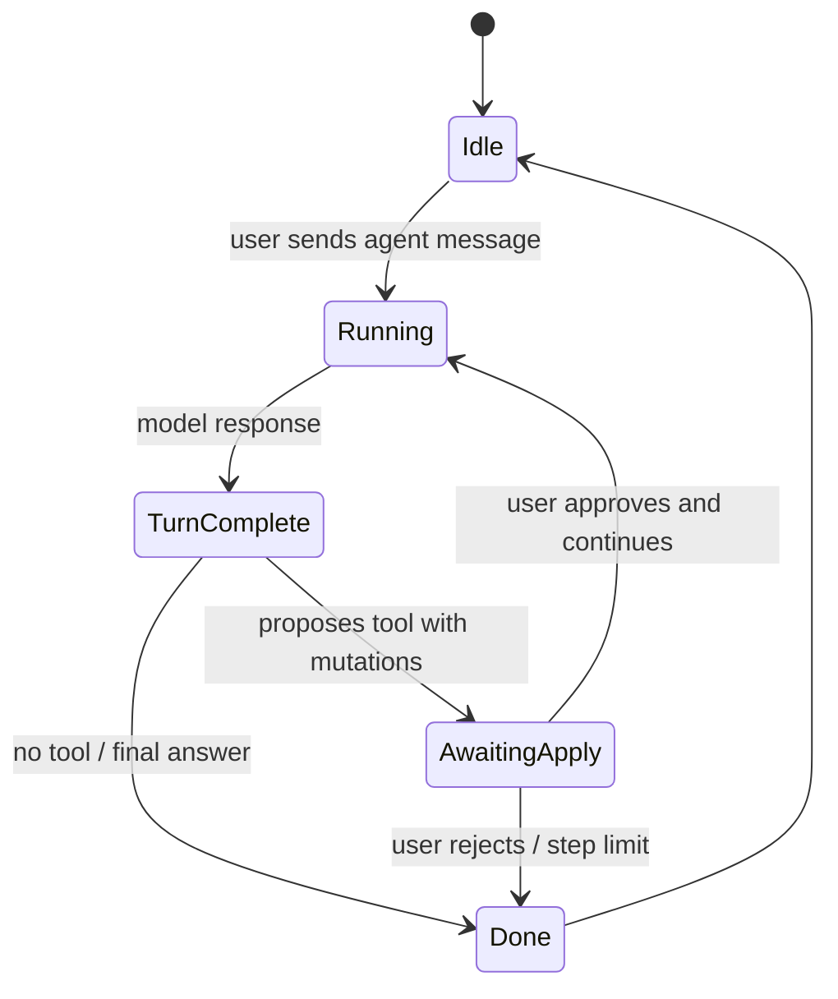
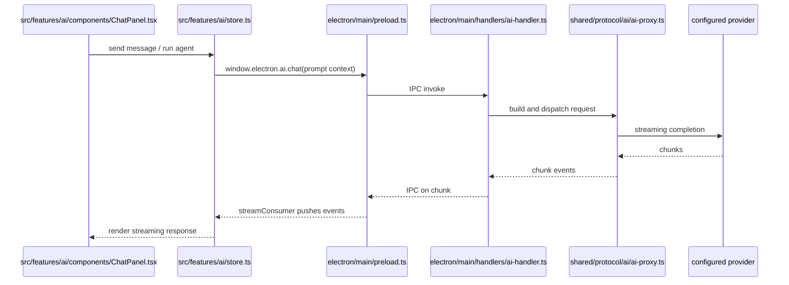
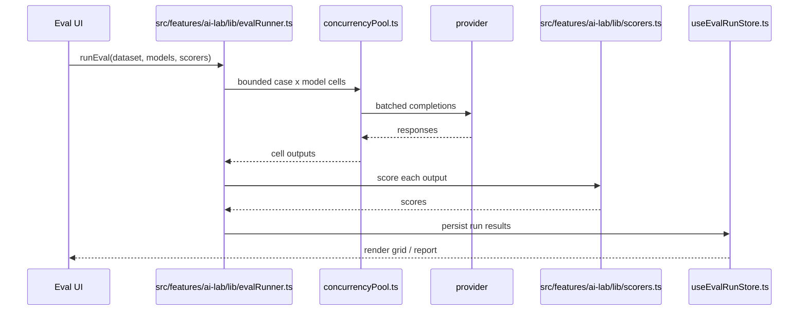

# AI and MCP

This page covers the AI chat assistant, the AI Lab evaluation workbench, Restura-as-MCP-server, and the MCP client used to call external MCP servers from the request builder.

---

## AI chat assistant (`src/features/ai/`)

A chat assistant that reads the active request and response as context. It is currently Electron-only.

### Store and state

- `src/features/ai/store.ts` (Zustand, persisted) — conversations, provider configs (OpenAI, Anthropic, OpenRouter, OpenAI-compatible), redaction mode, queued inline actions, and active agent session.

### Prompt and context

- `src/features/ai/lib/promptBuilder.ts` — builds the message list, including a `<CONTEXT>` block with active request, response, and environment.
- `src/features/ai/lib/contextSnapshot.ts` — captures tabs/context at send time.
- Redaction is applied by default; `rawMode` disables it. `src/features/ai/lib/redaction.ts` strips headers, body values, and env secrets from the context.

### Streaming and tools

- `src/features/ai/lib/streamConsumer.ts` — converts Electron IPC chunk/end events into an async iterable. Subscribe **before** invoking `ai.chat()` or early events are lost.
- `src/features/ai/agent/tools.ts` — proposed tools: `create_http_request`, `update_http_request`, `set_test_script`, `enrich_docs`. `runAgentTool` mutates stores only after user approval.
- `src/features/ai/agent/agentSession.ts` — state machine: `running` → turn complete → `awaiting-apply` or `done`. Hard cap `AGENT_MAX_STEPS = 8`.

_The agent loop hard-caps steps at `AGENT_MAX_STEPS = 8`; proposed store mutations are gated on explicit user approval._

- `src/features/ai/lib/inlineActions.ts` — one-shot "Fix request / Generate tests / Enrich docs" prompts, forcing tools on for that send.

### UI

- `src/features/ai/components/ChatPanel.tsx` — streaming, tool-proposal cards, apply/lock logic, agent-mode loop orchestration.

The AI chat path in the main process is `electron/main/handlers/ai-handler.ts` → `shared/protocol/ai/ai-proxy.ts`. There is **no `/api/ai` Worker route**; web does not support the inline chat.

_AI chat is Electron-only because it relies on the configured provider key or secret handle resolved in the main process; there is no Worker proxy path for it._

---

## AI Lab (`src/features/ai-lab/`)

An Electron-only LLM evaluation workbench accessible as `/ai-lab` route. It uses `window.electron.aiLab` via `src/features/ai-lab/lib/llmClient.ts`.

### Core concepts

- **Prompts** — templates with variable slots.
- **Datasets / cases** — hand-written, OpenAPI-generated (`openapiTestGen.ts`), adversarial/red-team (`redteamGen.ts`), imported from request history/collections, or CSV/JSONL. Cases support multi-turn conversations.
- **Eval runs** — sweep `(case × model)` cells with bounded concurrency.
- **Scorers** — exact/contains/regex, JSON-valid/schema, latency, cost, `script` (QuickJS), `tool-call`, `judge` (LLM-as-judge with self-consistency + anchors + gates), and `pairwise` (preference via `runPairwiseJudge`, position-bias swap).
- **Arena** — round-robin pairwise model-vs-model judging with Elo leaderboard and win-rate matrix (`Arena.tsx`, `lib/elo.ts`, `lib/arenaRunner.ts`, `store/useArenaStore.ts`).
- **Agent suites** — versioned multi-step agent definitions with model capabilities, tool sources, hard budgets, repeated trials, typed traces, trajectory/outcome graders, reliability statistics, and portable JSON import/export.

### Key modules

- `src/features/ai-lab/lib/evalRunner.ts` — bounded-concurrency sweep, scoring, `http-exec` target support.
- `src/features/ai-lab/lib/llmClient.ts` — non-streaming completions + playground streaming.
- `src/features/ai-lab/lib/scorers.ts` — all scorer implementations.
- `src/features/ai-lab/lib/concurrencyPool.ts` — parallel cell pool.
- `shared/protocol/ai/judge.ts` — LLM-as-judge engine (shared with the AI assistant; see ADR 0020's "Judge hardening" section).
- `src/features/ai-lab/lib/openapiTestGen.ts` / `redteamGen.ts` — dataset generation.
- `src/features/ai-lab/lib/arenaRunner.ts` / `lib/elo.ts` — arena logic.
- Stores: `src/features/ai-lab/store/useAiLabStore.ts`, `useEvalRunStore.ts`, `useArenaStore.ts`.
- Main process handler: `electron/main/handlers/ai-lab-handler.ts` (kept separate from `ai-handler.ts`).
- Agent core: `shared/agent-lab/` (suite schema, provider registry, runner, MCP/sandbox contracts, graders, OTLP/OpenInference export).

### Eval run lifecycle

_Eval runs sweep `case × model` cells with bounded concurrency; scoring happens after all completions return, then results are persisted to the eval-run store._
- Desktop agent bridge: `src/features/ai-lab/lib/agentRuntime.ts`; saved HTTP request tools use `agentTools.ts` and the normal request executor.
- Headless CI: `restura agent eval <suite.json> --output report.json`.

### Agent telemetry

Opt-in telemetry for agent runs is exported as OTLP/OpenInference traces. The desktop settings UI (`src/features/ai-lab/components/AgentTelemetrySettings.tsx`) toggles the exporter; the runtime path is `shared/agent-lab/telemetry.ts` with a desktop lifecycle helper in `electron/main/lifecycle/agent-telemetry.ts`. Headless CI uses `cli/src/runner/agentTelemetry.ts`. No secrets, PII, or raw request/response bodies are exported; spans and attributes are bounded and redacted before leaving the process.

### Agent safety and current support

Agent suites never persist inline credentials. Desktop model calls retain the existing keychain-backed IPC path. The runner fails closed on unavailable providers/tools and sensitive tool calls without approval, and enforces step/time/tool/token/cost/output limits. Saved Restura HTTP requests are wired as desktop tools; non-read methods require per-call approval. The shared MCP allowlist adapter and pluggable sandbox registry are implemented, but the capability matrix marks MCP connection resolution and concrete sandbox providers unsupported until those adapters are registered end to end.

Eval and agent runs each have a module-scoped lifecycle: a run remains visible and cancellable across tab changes, another run on the same surface is rejected, and cancellation wins over late provider success. The two surfaces are independent, so an eval and agent suite may run concurrently. Their signals reach model completions, judge calibration and voting, and saved-request tools through validated, sender-owned Electron operation IDs. `maxTokens` is a run-wide input-plus-output limit; required usage and cost data fail closed when missing or unknown.

Per-model capabilities are conservative and tied to provider discovery evidence. Advanced overrides require an explicit user assertion, are labelled as such, and can be reset; unknown pricing is never presented as free. Task references feed reference-aware graders. Judge panels enforce distinct models, quorum, agreement, optional calibration, output-token bounds, and optional cost bounds.

Desktop agent reports are sanitized before persistence or export, with sensitive-key/header/query and recognized secret-shaped body-value redaction, explicit truncation, a 2 MiB per-report limit, and retention of at most the newest 20 reports / 20 MiB total. Opaque sensitive data in model or tool output may not be recognized, so exports still require appropriate access controls. Persistence is awaited; if it fails, the sanitized live report remains viewable/exportable and can be retried. Persisted reports are schema-validated during hydration and migration; invalid entries are quarantined independently so they cannot reset unrelated workbench state.

The headless OpenAI Responses adapter uses stateless encrypted reasoning and function-call replay with `store: false`; server-side `previous_response_id` continuation is disabled. `restura agent eval` accepts OpenAI Responses and Anthropic Messages suites with environment credentials. It refuses base-URL overrides, desktop secret handles, judge graders, and sandbox providers; controlled live HTTP and MCP tools require an explicit runtime manifest and remain read-only with allowlists.

### `http-exec` eval target

ADR 0023 introduced an eval target that parses an HTTP/GraphQL request from model output (`lib/requestExtractor.ts`), executes it through the real HTTP executor (`src/features/http/lib/requestExecutor.ts` via `lib/execCell.ts`), and scores the upstream response.

### Localhost carve-out

AI Lab allows `allowLocalhost` only for local runtimes (Ollama, OpenAI-compatible). Cloud providers enforce the standard URL guard.

---

## Restura as MCP server (`src/features/mcp-server/`)

Restura can expose its own collections, environments, and history as tools to an external MCP client.

- `shared/mcp-server/dispatch.ts` — read-only tools: `list_collections`, `list_requests`, `get_history`, `get_environment`, `list_environments`.
- `shared/mcp-server/consent.ts` — per-resource consent levels (`hidden/read-only/full` for collections; `hidden/read-only` for environments/history). Defaults are hidden.
- `shared/mcp-server/redaction.ts` — strips secret environment variables and redacts request/response bodies recursively before exposing them to MCP clients.
- `execute_request` is declared but disabled in v1.
- Electron handler: `electron/main/handlers/mcp-server-handler.ts`.

---

## MCP client (`src/features/mcp/`)

Restura can call external MCP servers from the MCP request builder.

- `src/features/mcp/protocol.ts` — protocol module; `runJsonRpc` with optional `McpClientPool`.
- `src/features/mcp/lib/mcpClient.ts` — Electron path uses `window.electron.mcp.*`; web path posts to `/api/mcp`. Supports `streamable-http` and `http-sse`; web is limited to `streamable-http`. Tracks `Mcp-Session-Id`.
- `src/features/mcp/lib/McpClientPool.ts` — caches the client-init promise keyed by `cacheKey` to avoid duplicate handshakes for equivalent requests.
- UI: `McpRequestBuilder.tsx` (explorer/builder), `McpResultPanel.tsx`.

---

## Source map

| Area                         | Key files                                                                                                                                                           |
| ---------------------------- | ------------------------------------------------------------------------------------------------------------------------------------------------------------------- |
| AI store                     | `src/features/ai/store.ts`                                                                                                                                          |
| AI prompt / context          | `src/features/ai/lib/promptBuilder.ts`, `src/features/ai/lib/contextSnapshot.ts`                                                                                    |
| AI stream                    | `src/features/ai/lib/streamConsumer.ts`, `electron/main/handlers/ai-handler.ts`, `shared/protocol/ai/ai-proxy.ts`                                                   |
| AI agent                     | `src/features/ai/agent/tools.ts`, `src/features/ai/agent/agentSession.ts`, `src/features/ai/lib/inlineActions.ts`                                                   |
| AI Lab eval                  | `src/features/ai-lab/lib/evalRunner.ts`, `src/features/ai-lab/lib/scorers.ts`, `src/features/ai-lab/lib/concurrencyPool.ts`                                         |
| AI Lab playground / datasets | `src/features/ai-lab/lib/llmClient.ts`, `src/features/ai-lab/lib/openapiTestGen.ts`, `src/features/ai-lab/lib/redteamGen.ts`                                        |
| AI Lab arena                 | `src/features/ai-lab/lib/arenaRunner.ts`, `src/features/ai-lab/lib/elo.ts`, `src/features/ai-lab/store/useArenaStore.ts`                                            |
| AI Lab agents                | `shared/agent-lab/`, `src/features/ai-lab/lib/agentRuntime.ts`, `src/features/ai-lab/lib/agentTools.ts`, `cli/src/commands/agent.ts`                                |
| Agent telemetry              | `shared/agent-lab/telemetry.ts`, `electron/main/lifecycle/agent-telemetry.ts`, `cli/src/runner/agentTelemetry.ts`, `src/features/ai-lab/components/AgentTelemetrySettings.tsx` |
| MCP server                   | `shared/mcp-server/dispatch.ts`, `shared/mcp-server/consent.ts`, `shared/mcp-server/redaction.ts`, `electron/main/handlers/mcp-server-handler.ts`                   |
| MCP client                   | `src/features/mcp/protocol.ts`, `src/features/mcp/lib/mcpClient.ts`, `src/features/mcp/lib/McpClientPool.ts`                                                        |

---

## Change guidance

- AI chat does not exist on web; do not add web-only expectations.
- AI Lab is a full-screen route at `/ai-lab`; lazy-loaded in `src/App.tsx`.
- Keep `ai-handler.ts` and `ai-lab-handler.ts` separate.
- MCP server consent changes belong in `consent.ts`; redaction changes in `redaction.ts`.
- Test dataset/import-from-history flows after changing redaction.
