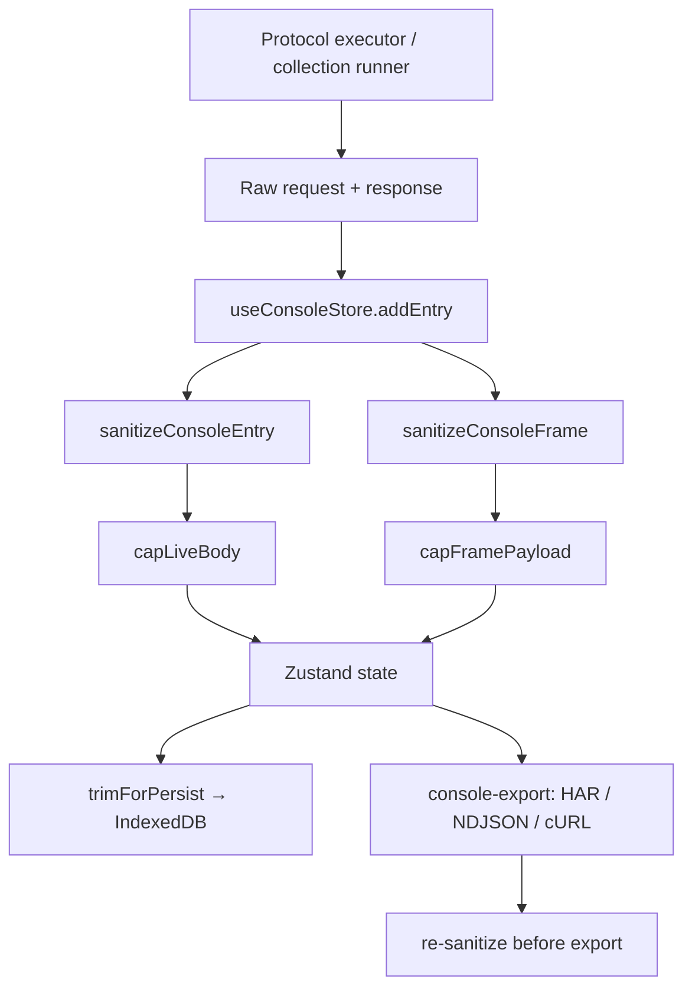
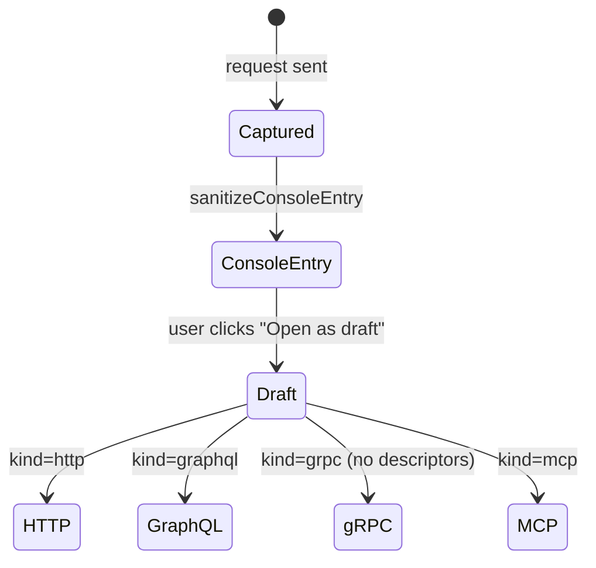
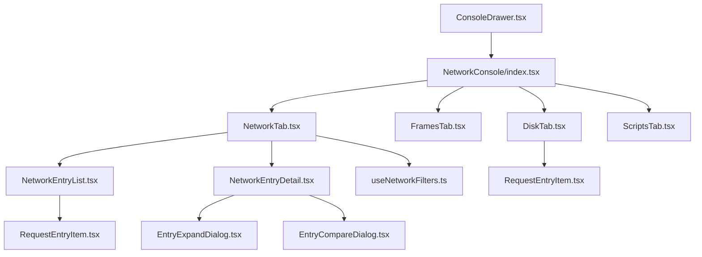

# Network Console & evidence safety

The Network Console is a DevTools-style panel that captures every request/response, connection frame, script log, and test outcome as long-lived evidence. Every captured record crosses a one-way trust boundary that redacts credentials and produces safe, non-executing native drafts. Nothing in the console is ever replayable with its original credentials.

The console is surfaced through `src/components/shared/ConsoleDrawer.tsx` as a collapsible bottom-drawer panel, always accessible from any tab, and is implemented as a Zustand store (`useConsoleStore`) with selective IndexedDB persistence.

---

## Console data model

### ConsoleEntry (`useConsoleStore.ts`)

A `ConsoleEntry` is created for every one-shot request/response (HTTP, GraphQL, gRPC unary, MCP). It carries:

- **Request**: method, URL (`resolvedUrl` with variables substituted), sent headers, body.
- **Response**: status, headers, body, timing.
- **Protocol**: `http`, `graphql`, `grpc`, `mcp`.
- **Provenance**: optional `runId`, `runLabel`, `iteration` (collection-run), `source.connectionId`.
- **Lifecycle metadata**: `pinned`, `bodyTruncated`, `requestSize`.
- **Optional extras**: `scriptLogs[]`, `tests[]`, `nativeDraft`.

### ConsoleFrame (`useConsoleStore.ts`)

Frames capture streaming protocol traffic: WebSocket, SSE, Kafka, MQTT, Socket.IO, and gRPC streaming. Each frame carries:

- Direction (`in` / `out` / `system`)
- `connectionId` for multi-connection co-existence
- Protocol-specific `label` (event name, topic, subprotocol tag)
- Sanitized `payload` text with byte count

### ConsoleNativeDraft

A credential-free, safe-to-share editor draft in protocol-specific shape (`http`, `graphql`, `grpc`, `mcp`). The canonical shape is validated by `ConsoleNativeDraftSchema` in `src/lib/shared/console-store-schemas.ts`. The `credentialsOmitted: true` flag is a structural guarantee, not a promise. Drafts use the resolved wire URL, never the credential-bearing template.

---

## Trust boundary: one-way sanitization

The console is a write-only evidence sink. Every entry hits `sanitizeConsoleEntry` inside `useConsoleStore.addEntry` before it reaches state or persistence. The equivalent applies to frames via `sanitizeConsoleFrame`.

_Every entry crosses `sanitizeConsoleEntry` before state; a second sanitization pass runs before any export for defense-in-depth._

### What is redacted (`console-sanitization.ts`)

- **Headers**: `Cookie`, `Set-Cookie`, all credential-bearing headers from `CREDENTIAL_HEADER_NAMES`, secret field names, and denylist-matched names. Replaced with `[REDACTED]`.
- **URLs**: `userinfo` (`user:pass@host`) and credential-shaped query parameters (`token`, `secret`, `signature`, `password`, AWS SigV4/Google Cloud signature params). Replaced with `[REDACTED]`.
- **Bodies**: JSON body values at secret field keys → recursively redacted. Raw text bodies matched against token patterns (JWT, bearer, API keys, AWS credentials). Diagnostic text (session cookies in `key=value` format) also matched.
- **Native drafts**: URLs, headers, bodies, metadata, queries, variables, and messages each go through the same credential-specific sanitizers (`sanitizeConsoleUrl`, `sanitizeConsoleHeaders`, `sanitizeConsoleText`).

### What is NOT redacted

- Method, status code, timing, response size
- Non-credential headers (content-type, cache-control, etc.)
- Non-secret request/response body content
- Console-native draft (it is structurally credential-free by construction at capture time)

---

## Safe native drafts

Protocol-specific `ConsoleNativeDraft` objects allow the user to **Open as a draft** from a console entry. The draft opens in the appropriate protocol editor with:

- The resolved wire URL (never a `{{var}}` template)
- All headers, minus credential-bearing ones
- Body preserved as-is (content, not credentials)
- `credentialsOmitted: true` flag

_Only HTTP and GraphQL native drafts open in the editor tab system. gRPC drafts open without descriptors (discovery/upload still required before send). Console-draft tabs are unsaved credentials-stripped evidence._

The `CONSOLE_PROTOCOL_ACTIONS` table determines which console actions are available per protocol:
- HTTP, GraphQL: native draft, code copy, HTTP export
- gRPC, MCP: native draft only
- SSE, WebSocket, Socket.IO, Kafka, MQTT: no native draft (streaming protocols)

---

## Resource caps

| Cap | Value | Location |
|-----|-------|----------|
| Max live entries | 100 | `MAX_ENTRIES` |
| Persisted entries | 50 | `PERSIST_ENTRY_LIMIT` |
| Max live frames | 500 | `MAX_FRAMES` |
| Live body cap | 5 MiB | `LIVE_BODY_LIMIT` |
| Persisted body cap | 64 KiB | `PERSIST_BODY_LIMIT` |
| Persisted log message cap | 4 KiB | `PERSIST_LOG_MESSAGE_LIMIT` |
| Frame payload cap | 64 KiB | `FRAME_PAYLOAD_LIMIT` |

Frames are **never persisted** — a busy WebSocket can push 100+ msgs/sec, and flushing each through IndexedDB encrypt-and-write would thrash the main thread. Frames are session-only debugging evidence.

Pinned entries survive both the max-entry cap and the preserve-on-send toggle. When preserve-on-send is off, only pinned entries are retained after the next send.

---

## Exports

The console exports three formats via `src/lib/shared/console-export.ts`, each with its own re-sanitization pass:

| Format | Entry point | Notes |
|--------|-----------|-------|
| HAR 1.2 | `entriesToHar` | HTTP-compatible entries only; cookies stripped; query string included; credential headers excluded |
| NDJSON | `entriesToNdjson` | Complete safe evidence: entries + frames with all safe metadata fields |
| cURL batch | `entriesToCurlBatch` | HTTP-compatible entries only; oldest-first order; credential headers excluded; resolved wire URL used |

All exports go through `buildExportFile` which returns a `ConsoleExportFile` with filename, MIME type, and excluded-entry count.

---

## Filter DSL (`console-filter.ts`)

The free-text filter box in the Network tab supports a DevTools-style expression syntax:

- **Plain text**: substring match across URL, method, status, headers, body
- **`key:value`**: scoped match — `status:200`, `status:2xx`, `method:POST`, `url:/users`, `host:api.example.com`, `protocol:graphql`, `run:smoke`
- **`key:~regex`**: regex on `url` or `body`
- **`has:body`**, `has:cookie`, `has:test`, `has:script`
- **Negation**: prefix with `-` (e.g., `-status:200`)
- Multiple tokens AND together

Bad input narrows results but never throws — a malformed regex falls back to literal match.

---

## Collection-run response evidence

The collection runner produces `ResponseEvidence` records (defined in `shared/collection-run/evidence.ts`) which are a **separate** evidence system from the console:

- **Retention modes**: `metadata` (no body), `failures` (body only for non-2xx), `all`
- **Safe headers only**: a narrow allowlist (`content-type`, `content-length`, `cache-control`, `date`, `etag`, `retry-after`, `www-authenticate`, correlation IDs)
- **Body bounds**: failure excerpts capped at 64 KiB, all-mode excerpts at 16 KiB
- **Quota**: per-run budget 2 MiB, total budget 20 MiB — oldest-run evidence is evicted first
- **Hash**: SHA-256 of the redacted full body for comparison across runs

The `useCollectionRunStore` (in `src/store/useCollectionRunStore.ts`) counts `evidenceBytes` and evicts oldest-run evidence first under quota pressure using the `add-evidence-configuration-defaults` migration.

Evidence is displayed in `CollectionRunDetail.tsx` with redaction and truncation indicators, and compared in `EntryCompareDialog.tsx` via hash comparisons.

---

## UI architecture

- **ConsoleDrawer**: collapsible shell with expand/collapse animation and min-height. Manages its own expanded state, preserving the console height across toggle.
- **NetworkTab**: entry list with protocol/status/run filter dropdowns, search/filter box, export menu (HAR/NDJSON/cURL), clear/preserve toggles, and the entry detail pane.
- **FramesTab**: chronological frame log with protocol/direction coloring and connection-id grouping.
- **DiskTab**: Electron-only — reads from the file-backed disk log (method + URL only, no headers/bodies).
- **ScriptsTab**: per-entry script logs and test results with pass/fail rendering.

---

## Change guidance

- **Adding a new protocol to the console**: Add the protocol to `ConsoleProtocol`, add a `ConsoleNativeDraft` variant, update `sanitizeDraft`, add a `shapeTo*Request` function, and update `CONSOLE_PROTOCOL_ACTIONS`. Add `openNativeDraft: true` only for protocols that have an editor tab.
- **Adding a credential pattern**: Add to `shared/protocol/credential-header-names.ts` (header names), `shared/protocol/secret-patterns.ts` (body token/denylist patterns), or `isConsoleCredentialHeader` / `isCredentialQueryParam` in `console-sanitization.ts`. Update the `isSecretFieldName` list in `shared/secrets/key-value-redaction.ts` for JSON field matching.
- **Changing persistence**: `trimForPersist` runs at the IndexedDB boundary; `onRehydrate` validates and re-sanitizes on load. Keep both in sync with the store shape and schema.
- **Response evidence quotas**: `RESPONSE_EVIDENCE_LIMITS` in `shared/collection-run/evidence.ts` — changing these affects eviction behavior in `useCollectionRunStore`.
- **Tests to run after console changes**: `src/store/__tests__/useConsoleStore.test.ts`, `src/lib/shared/__tests__/console-export.test.ts`, `src/features/collections/lib/__tests__/collectionRunner.test.ts` (evidence assertions).
- **Do not**: leak credential-bearing state into console entries, persist credentials in native drafts, bypass `sanitizeConsoleEntry` before `addEntry`, or persist frames to IndexedDB.