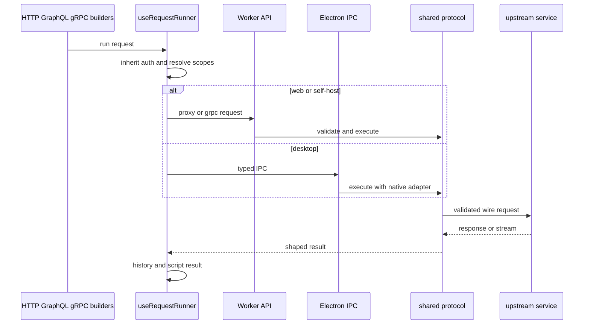

# HTTP, GraphQL, and gRPC execution

This is the canonical implementation map for one-shot request protocols. The common dispatch contract is in [Protocol features](protocols.md); the security and durable-state rules are in [Persistence and security](../architecture/persistence-and-security.md).

## Ownership and call chain

| Concern | Owner | Key symbols |
| --- | --- | --- |
| UI registration | `src/features/{http,graphql,grpc}/protocol.ts` | protocol modules registered by `registry/bootstrap.ts` |
| Common send lifecycle | `src/features/registry/useRequestRunner.ts` | `useRequestRunner().run` |
| HTTP and GraphQL execution | `src/features/http/lib/requestExecutor.ts` | `executeRequest` |
| Shared wire policy | `shared/protocol/` | HTTP proxy, body builder, signer, redirect and URL validation |
| Web/self-host route | `worker/app.ts`, `worker/handlers/{proxy,grpc,grpc-reflection}.ts` | `/api/proxy`, `/api/grpc`, `/api/grpc/reflection` |
| Desktop transport | `electron/main/handlers/{http-handler,grpc-handler,grpc-connect}.ts` | typed IPC handlers |
| CI transport | `cli/src/runner/` | undici fetcher and protocol executors |

The runner intentionally stores the raw request in history, not its send-time inherited credentials.

## HTTP and GraphQL

HTTP is the substrate. `requestExecutor.ts` runs scripts, resolves variables, builds the body, and dispatches through the platform transport. GraphQL reuses `HttpRequest`: its feature parses the GraphQL body into query, variables, and operation name, substitutes values, then delegates to HTTP. Therefore HTTP changes can affect GraphQL request behavior and console evidence.

The shared HTTP implementation accepts the supported HTTP method set, builds a validator-view and wire-view URL (`encodeUrl` affects how those are constructed), validates the target, applies header policy/builds the final body, then signs only after final body and URL selection. It follows redirects manually with redirect-policy inputs and per-hop revalidation/auth stripping. Response headers are sanitized, binary payloads are represented as Base64, and buffered responses stop at the 10 MiB limit. It maps invalid URL, signer, redirect-policy, abort/timeout, and other upstream failures to distinct shaped outcomes; platform adapters must preserve that mapping. Worker `proxy.ts` selects buffered versus streaming response handling only for exact allowed media types or an explicit streaming mode. Desktop handlers add native TLS, proxy, certificate and opaque-secret support only after the main process has acknowledged execution policy; do not put those desktop concerns in `shared/`.

**Change surface:** update the request schema/default, builder, executor, protocol module, platform transport contract, and focused test at the narrowest affected boundary. When a capability differs, update `src/lib/shared/capabilities.ts` and regenerate its matrix.

## gRPC

`src/features/grpc/protocol.ts` owns unary registry execution. The request builder owns interactive server-streaming UI and invokes its stream path directly. Descriptor sources are reflection and uploaded proto content; the Worker provides `/api/grpc/reflection`, while Electron has native `grpc-handler.ts`, `grpc-connect.ts`, credentials and reflection handlers. gRPC uses Connect-oriented execution and has different descriptor/stream state from HTTP despite sharing variable and registry context.

Keep proto descriptors transient where the protocol contract says they are transient (`RegistryRunOptions.protocolOptions` exists for that purpose). A gRPC change commonly requires renderer schema tests, shared gRPC tests, Worker handler tests, Electron handler tests, and `tests/grpc-spec-parity.test.ts`.

## Invariants and validation

- URL/SSRF, redirect, header, and auth policy live in shared protocol code; handlers must not weaken them.
- Desktop-only TLS/proxy/certificate material crosses typed IPC and is validated again in main.
- A newer send aborts the preceding request from the same runner hook.
- Streaming is not a license to bypass response/media-type policy.

Run focused tests in `shared/protocol/__tests__/`, `worker/handlers/__tests__/`, and `electron/main/__tests__/`; for cross-runtime changes run `npm run test:contract`, then `npm run type-check:all`.
