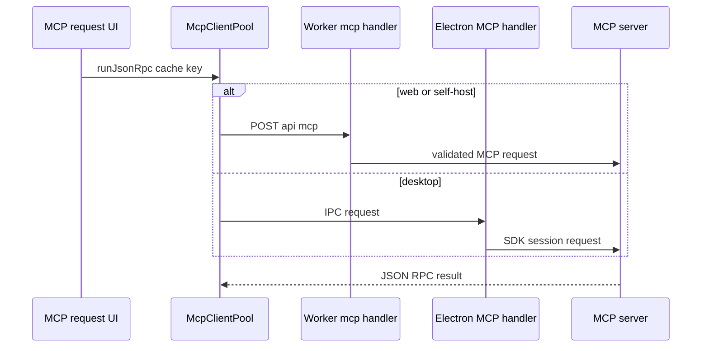

# MCP client execution

Restura acts as an MCP client for one-shot JSON-RPC calls and longer-lived sessions. This page covers the client; [AI and MCP](ai-mcp.md) covers Restura acting as an MCP server, and [Agent Lab](agent-lab.md) covers agent-authorized MCP tools.

## Call path

`src/features/mcp/protocol.ts` supplies the registry module. Its `runJsonRpc` path uses an `McpClientPool` keyed by `cacheKey`, so equivalent calls share the initialization promise instead of issuing duplicate handshakes. Renderer code selects `window.electron.mcp.*` on desktop or posts to Worker `/api/mcp` on web/self-host. The Worker route is registered by `createApp` and delegates to `worker/handlers/mcp.ts`; common JSON-RPC validation belongs in `shared/protocol/mcp-proxy.ts`. Electron owns the native SDK client and handler chain in `electron/main/handlers/mcp-handler.ts` and `mcp-sdk-client.ts`.

## Boundaries and lifecycle

The client supports `streamable-http` and `http-sse`; web is restricted to `streamable-http`. The pool/session boundary is important: cache only compatible initialization work, close native resources through desktop connection cleanup, and propagate abort/cancellation rather than leaving sessions alive.

MCP request headers, URLs, and secret values are execution inputs, not console-safe evidence. Apply shared header/URL policies and preserve opaque secret references until a trusted runtime resolves them. Never surface a provider error or resolved secret into renderer-visible diagnostics.

## Change surface and tests

A consumer-facing MCP change normally touches: `src/features/mcp/protocol.ts`, its public feature imports, shared proxy validation, Worker handler when web is supported, Electron handler/SDK client/preload when desktop is supported, capability matrix, and protocol-specific tests in `src/features/mcp/lib/__tests__/` or handler suites. Run the narrow test first, then `npm run test:contract` for shared transport behavior and `npm run type-check:all` for cross-runtime typing.
