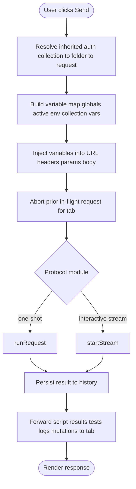
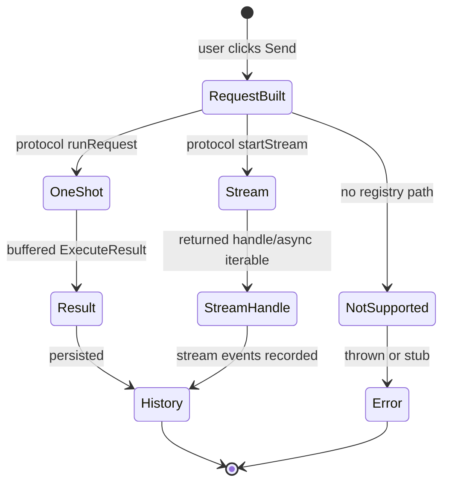
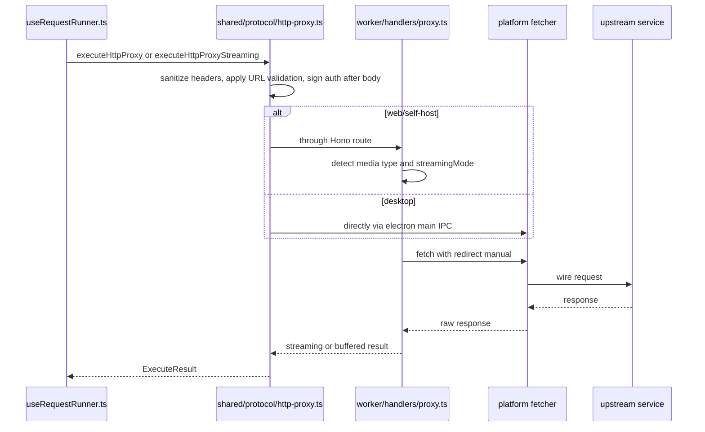

# Protocol features

This page explains how Restura turns the React renderer's protocol-specific UI state into an actual request, and what each protocol feature owns.

---

## The protocol registry

`src/features/registry/` is the central dispatch surface. At boot, `bootstrap.ts` registers every protocol module into a singleton `protocolRegistry`. The single entry point for sending a request from the UI is `useRequestRunner.ts`.

### Registry contract (`src/features/registry/types.ts`)

A protocol module implements:

```ts
interface ProtocolModule {
  id: string; // e.g. 'http'
  label: string;
  tabType: RequestMode;
  defaultRequest: () => Request;
  runRequest: (request, RunContext) => Promise<Response>;
  startStream?: (request, RunContext) => Promise<ProtocolStreamHandle>;
  Builder: Component; // request builder UI
  injectVariables?: (request, variables) => Request;
  codeGenerators?: CodeGenerator[];
}
```

`RunContext` carries the `AbortSignal`, merged variable map, an optional `onScriptResult` callback, and opaque `protocolOptions`.

### Request type system (`shared/types/request.ts`)

```ts
type RequestType = 'http' | 'grpc' | 'sse' | 'mcp';
type Request = HttpRequest | GrpcRequest | SseRequest | McpRequest;
type RequestMode = RequestType | 'graphql' | 'websocket' | 'socketio' | 'kafka' | 'mqtt';
```

Connection-based UI modes (GraphQL, WebSocket, Socket.IO, Kafka, MQTT) live as a `modeOverride` on an HTTP placeholder tab. This lets the tab system reuse request infrastructure while the interactive protocol UI owns its own state.

### Execution flow in `useRequestRunner.ts`


_The same runner path handles every protocol; each protocol module decides whether to return a one-shot result or a long-lived stream handle._

---

## Per-protocol notes

### HTTP (`src/features/http/`)

- Schema / default request: `src/features/http/protocol.ts`.
- Core executor: `src/features/http/lib/requestExecutor.ts`.
- UI: `RequestBuilder`, `ResponsePanel`, `RequestBodyEditor`, etc.
- Runs pre-request and test scripts inline via the QuickJS sandbox.
- Variable substitution happens on URL, headers, params, and body.
- HTTP is the fallback substrate for GraphQL.

### GraphQL (`src/features/graphql/`)

- Reuses the `HttpRequest` shape with a GraphQL tab mode override.
- The body is parsed into `{ query, variables, operationName }`, variables are injected, then re-stringified.
- Wire path delegates to the HTTP executor.
- Adds query builder and schema introspection UI.

### gRPC (`src/features/grpc/`)

- `protocol.ts` implements `runRequest` for unary calls.
- Streaming (server streaming) still lives in the UI components; `GrpcRequestBuilder` calls `startGrpcStream` directly.
- Desktop requires proto descriptors from server reflection or uploaded proto content; web falls back to Cloudflare Worker proxy.
- Uses Connect protocol under the hood (`@connectrpc/connect-web` / `-node`).

### SSE (`src/features/sse/`)

- `protocol.ts` throws from `runRequest`; the interactive client owns the UI.
- Provides `startStream` returning an async iterable for the interactive stream UI.

### WebSocket (`src/features/websocket/`)

- No `Request` shape in the registry; interactive client / store owns state.
- Provides `startStream` returning a handle with `.send()` for interactive use.

### Socket.IO (`src/features/socketio/`)

- Protocol module is a metadata stub; runtime lives in `useSocketIOStore` and `socketioManager`.

### Kafka / MQTT (`src/features/kafka/`, `src/features/mqtt/`)

- Desktop-only (no browser TCP).
- Protocol stubs; Electron IPC managers and topic/partition UI.
- Kafka: producer/consumer, SASL + TLS, and Confluent Schema Registry support for independently encoded keys and values. The [desktop handler](../architecture/overview.md) probes broker metadata before reporting a connection as ready.
- The Kafka producer accepts UTF-8 text, locally validated JSON text, or arbitrary bytes as canonical Base64. UI validation rejects blank or duplicate enabled header names, invalid non-negative partitions, and invalid schema IDs; the Electron wire boundary revalidates IPC payloads and rejects non-canonical Base64 rather than silently changing bytes.
- On consume, registry-framed fields decode through the configured registry; raw valid UTF-8 stays text, while raw non-UTF-8 fields return as Base64 so they can be republished without byte loss. A field cannot use both raw Base64 and a Schema Registry schema ID.
- MQTT: publish/subscribe, QoS, TLS.

### MCP client (`src/features/mcp/`)

- Protocol module: `runJsonRpc` with an optional `McpClientPool` keyed by `cacheKey`.
- Caches the client-init promise to avoid duplicate handshakes for equivalent MCP requests.
- Electron path uses `window.electron.mcp.*`; web path posts to `/api/mcp`.
- Supports `streamable-http` and `http-sse`; web limited to `streamable-http`.

---

## Streaming vs one-shot execution


_Protocol modules declare themselves as one-shot runners, stream sources, or unsupported in the registry; the shared HTTP proxy additionally chooses a buffered or streaming implementation depending on the response._

| Protocol     | UI interaction                     | Registry execution        | OWS workflow usage                              |
| ------------ | ---------------------------------- | ------------------------- | ----------------------------------------------- |
| HTTP         | One-shot                           | `runRequest`              | Bound saved HTTP request                        |
| GraphQL      | One-shot / subscription            | `runRequest`              | Bound saved query or mutation (with confirmation) |
| gRPC         | Unary in registry; streaming in UI | `runRequest`              | Not supported                                   |
| SSE          | Stream UI                          | throws                    | Not supported                                   |
| WebSocket    | Stream UI                          | throws                    | Not supported                                   |
| Socket.IO    | Stream UI                          | stub                      | Not supported                                   |
| Kafka / MQTT | Stream UI                          | stub                      | Not supported                                   |
| MCP          | JSON-RPC call + long-lived session | `runRequest`/`runJsonRpc` | Not supported                                   |

`shared/protocol/http-proxy.ts` exposes two variants:

- `executeHttpProxy` — buffers response up to `MAX_RESPONSE_SIZE`.
- `executeHttpProxyStreaming` — returns a `ReadableStream` for SSE/NDJSON/gRPC-web streaming.

The Worker proxy handler (`worker/handlers/proxy.ts`) chooses buffered vs streaming based on exact media types or an explicit `streamingMode`, to avoid MIME smuggling.


_The HTTP proxy is the same orchestrator on every platform; on web/self-host the Worker handler chooses a buffered or streaming response path before returning it to the renderer._

---

## Capability parity

`src/lib/shared/capabilities.ts` is the single source of truth for which features work on web vs desktop (e.g., Kafka, SOCKS/PAC/mTLS, AI Lab are desktop-only). It is code-generated into `docs/CAPABILITY_MATRIX.md` and CI-gated via `npm run capabilities:check`.

Gating patterns:

- UI badges: `CapabilityBadge` component.
- Logic gates: `isCapableHere('feature.name', isElectron())`.

When adding a capability that differs by platform, update `capabilities.ts`, regenerate the matrix with `npm run capabilities:matrix`, and commit the regenerated `docs/CAPABILITY_MATRIX.md`.

---

## Source map

| Area              | Key files                                                                                                     |
| ----------------- | ------------------------------------------------------------------------------------------------------------- |
| Registry          | `src/features/registry/{types,bootstrap,useRequestRunner}.ts`                                                 |
| Request types     | `src/types/request.ts`, `src/types/http.ts`                                                                   |
| HTTP              | `src/features/http/{protocol.ts,lib/requestExecutor.ts,components/RequestBuilder.tsx}`                        |
| GraphQL           | `src/features/graphql/protocol.ts`, `src/features/graphql/components/*.tsx`                                   |
| gRPC              | `src/features/grpc/protocol.ts`, `src/features/grpc/components/GrpcRequestBuilder.tsx`                        |
| SSE               | `src/features/sse/protocol.ts`, `src/features/sse/lib/sseManager.ts`                                          |
| WebSocket         | `src/features/websocket/protocol.ts`, `src/features/websocket/lib/websocketManager.ts`                        |
| Socket.IO         | `src/features/socketio/protocol.ts`, `src/features/socketio/store/useSocketIOStore.ts`                        |
| Kafka             | `src/features/kafka/protocol.ts`, `electron/main/handlers/kafka-handler.ts`                                   |
| MQTT              | `src/features/mqtt/protocol.ts`, `electron/main/handlers/mqtt-handler.ts`                                     |
| MCP client        | `src/features/mcp/protocol.ts`, `src/features/mcp/lib/mcpClient.ts`                                           |
| Shared proxy core | `shared/protocol/{http-proxy,grpc-proxy,mcp-proxy,websocket-proxy,sse-parser}.ts`, `shared/protocol/types.ts` |
