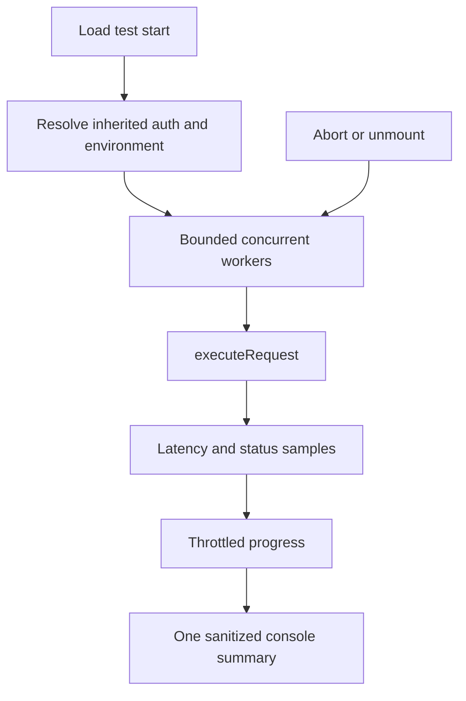

# Contracts, load testing, and mock server

These are adjacent quality tools, not protocol transports. They deliberately reuse the normal request model where correctness depends on matching an ordinary send.

## API contracts

`src/features/contracts/lib/` owns definition loading (`specLoader.ts`), operation matching, validation, and code generation. Contracts can guide OpenAPI-oriented inspection and generation, but an attached contract is not automatically a runtime response validator for every collection request. Keep source parsing/validation separate from UI state and add fixtures under `src/features/contracts/lib/__tests__/` when supporting a new schema case.

## In-app HTTP load tests

`useLoadTest` creates one abort controller per run, prevents concurrent starts, throttles UI progress, and aborts on component unmount. `runLoadTest` bounds requested iterations and concurrency to at least one, launches workers without duplicate slot claims, and reuses `executeRequest`. Before executing, it applies the same inherited auth and active-environment/settings context as ordinary HTTP sends; this prevents load tests from silently being unauthenticated.

It records one aggregate console entry, not one entry per request, to avoid evicting useful console history under load. Browser connection limits can make effective web concurrency lower than requested; desktop behavior can differ.

## Desktop mock server

`electron/main/handlers/mock-server-handler.ts` owns the desktop-only local listener and `useMockStore` owns renderer state. Its capability is gated because browser deployments cannot safely host a local listening server. Treat request/response definitions as local test fixtures, validate all IPC input, bind only the intended interface, and dispose the listener during teardown.

## Validation

Use load-runner tests in `src/features/load-testing/lib/__tests__/`, contracts tests in `src/features/contracts/lib/__tests__/`, and Electron mock-handler tests. For any behavior touching ordinary HTTP execution also run the narrow HTTP executor tests and `npm run type-check:all`.
