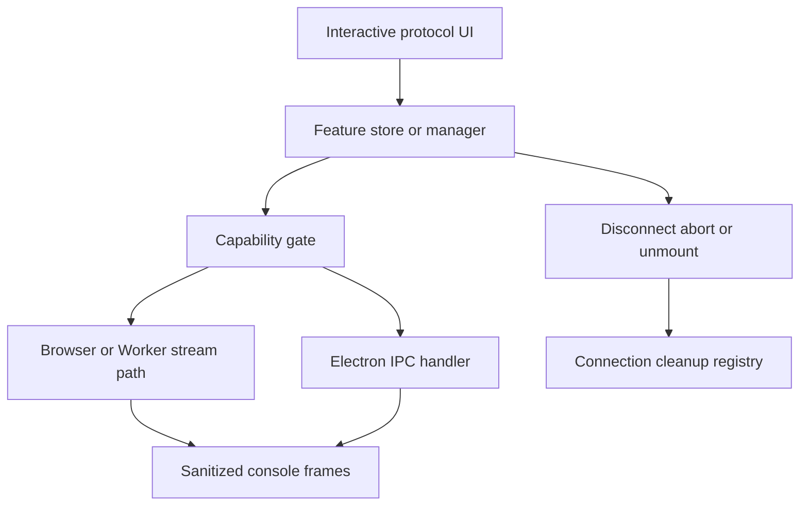

# Realtime protocol clients

SSE, WebSocket, Socket.IO, Kafka, and MQTT are interactive connection features rather than ordinary persisted one-shot requests. The registry describes their UI capability, but each feature/store and its platform handler own the live connection lifecycle.

## Runtime map

| Protocol | Renderer owner | Web/self-host support | Desktop owner |
| --- | --- | --- | --- |
| SSE | `src/features/sse/` | Worker streaming path | `electron/main/handlers/sse-handler.ts` |
| WebSocket | `src/features/websocket/` | `/api/ws-ticket` then `/api/ws` | `electron/main/handlers/websocket-handler.ts` |
| Socket.IO | `src/features/socketio/` and store | browser Socket.IO client | `electron/main/handlers/socketio-handler.ts` |
| Kafka | `src/features/kafka/` | unavailable: browser has no broker TCP | `electron/main/handlers/kafka-handler.ts`, serde modules |
| MQTT | `src/features/mqtt/` | unavailable: browser has no broker TCP | `electron/main/handlers/mqtt-handler.ts` |

`bootstrap.ts` registers their protocol metadata. `useRequestRunner` is still relevant for shared auth, values and cancellation where a feature uses the registry, but a connection UI owns connect, send, event/frame display and disconnect.

The cleanup path is a correctness boundary: long-lived connections must be explicitly closed on user disconnect, renderer disposal, and Electron main-process teardown.

## Platform and security distinctions

WebSocket custom headers cannot be passed through the browser WebSocket API. The web flow obtains a ticket from `/api/ws-ticket` before upgrading through `/api/ws`; desktop can use native transport options. Worker routes cover WebSocket but do not create Kafka, MQTT, or Socket.IO broker clients.

Kafka and MQTT are desktop-only because they require raw broker TCP. Kafka includes SASL/TLS and Schema Registry handling. Producer validation rejects malformed partitions, duplicate/blank enabled headers, invalid schema IDs and non-canonical Base64; consume output preserves arbitrary bytes as Base64 when text decoding would lose bytes. MQTT owns publish/subscribe and QoS/TLS configuration.

Connection frames enter the Network Console through its sanitizing frame path, but frames are session-only and never persisted. Do not log or persist live credentials in connection drafts or console entries.

## Change recipe

For a new realtime capability: define the feature protocol metadata and capability gate; keep renderer state/manager logic in the feature; add a typed Electron IPC/preload/main handler only if native access is needed; register disposal with the centralized stream/connection cleanup machinery; route observable traffic through sanitized console frames; and add a focused lifecycle test.

Focused checks include feature/store tests, `electron/main/__tests__` handler tests, and relevant Electron e2e. Kafka changes additionally use its producer validation, handler/serde tests and the broker-backed e2e path; see [Extensions and test services](../integrations/extensions-and-test-services.md).
