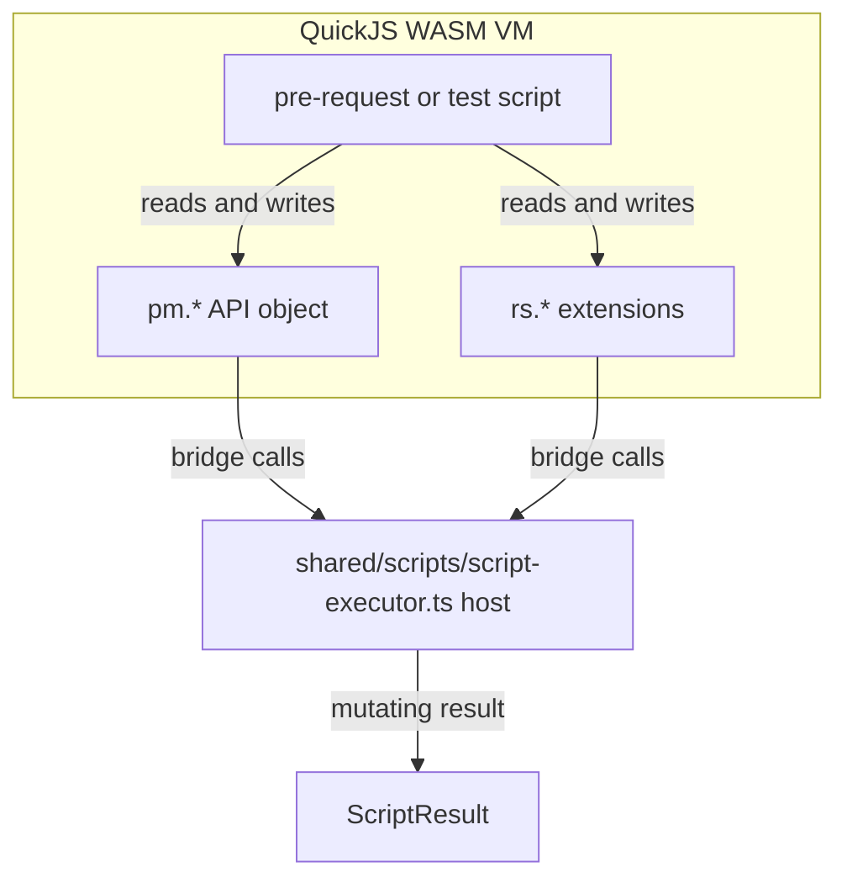
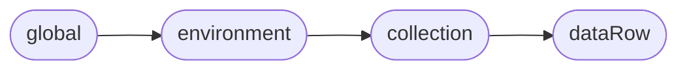
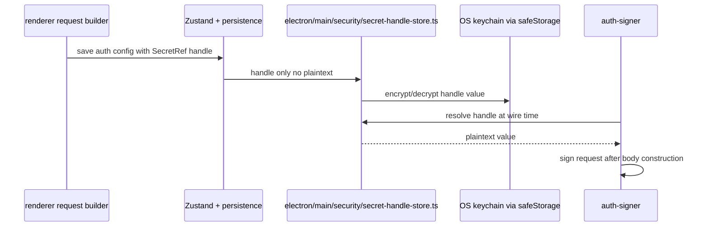

# Scripts, variables & storage

This page covers the QuickJS script sandbox, variable substitution and scoping, persistence adapters, and secret handling.

---

## QuickJS script sandbox

User-written pre-request and test scripts run inside a QuickJS WASM VM (`quickjs-emscripten`). There is no DOM, no filesystem, and no direct network access.

### Runtime limits

- 5 s sync / 30 s async wall-clock ceiling
- 64 MB memory
- Async APIs (`pm.sendRequest`, vault, cookies, AI judge) require bridge calls


_Scripts run in a QuickJS VM with no DOM, filesystem, or direct network; the host exposes `pm.*` and `rs.*` APIs via bridge calls and returns a `ScriptResult`._

### Postman-compatible API

`shared/scripts/script-executor.ts` exposes a `pm`-style object; the renderer path is a compatibility re-export:

- `pm.variables.get/set`
- `pm.environment.get/set`
- `pm.globals.get/set`
- `pm.collectionVariables.get/set`
- `pm.test(name, fn)` and `pm.expect(value)` (`shared/scripts/expect-bootstrap.ts`, re-exported by the renderer compatibility path)
- `pm.response.*`
- `pm.sendRequest(spec, callback)`
- `pm.cookies.*`
- `pm.vault.*` (desktop secret handles)
- `rs.judge(...)` (AI judge bridge)

The result shape (`ScriptResult`) is in `shared/types/scripts.ts` and includes:

- logs, errors, tests
- `variables` (environment mutations)
- `globalsMutations` / `collectionMutations`
- execution flow-control: `setNextRequest`, `skipRequest`
- optional `visualization`

### Context options

`src/features/scripts/lib/pmRunContextOptions.ts` carries the run-time context: `collectionVars`, `iterationData`, `info`, and `location` (collection/folder/request level). Recent PRs deduped protocol-options narrowing and collection-var mutation logic between the CLI and renderer runners.

### Migrations

`src/features/scripts/lib/scriptMigrations.ts` handles migration between `rs.*` and `pm.*` syntax in collections.

---

## Variables

### Token grammar

`src/lib/shared/variableTokens.ts` defines `{{var}}` tokens with optional whitespace. Dynamic helpers look like `{{ $randomUUID }}`.

### Scope precedence

`src/lib/shared/variableScopes.ts`:


_Lower-precedence scopes are shadowed by higher-precedence scopes, so a collection variable overrides an environment variable._

```
globals < environment < collection < dataRow
```

- `buildValueMap` returns the key-value map for substitution.
- `buildKnownNames` returns all names that can be resolved for validation/autocomplete.

### Active-request map

`src/lib/shared/activeRequestScopes.ts` gathers globals, active environment, and the request’s collection variables into the map used by `useRequestRunner.ts`.

The collection runner adds iteration data at the highest precedence. Protocol executors own final substitution after pre-request scripts, so `pm.variables` and `pm.collectionVariables` writes can affect the current wire request and subsequent requests without an earlier runner-level injection freezing stale values.

### Dynamic helpers

`shared/variables/dynamic.ts` provides ~100 Postman-compatible random/dynamic generators (`$randomUUID`, `$timestamp`, `$randomInt`, etc.). The helper registry `HELPERS` is merged with `POSTMAN_VARIABLES`.

### Pure injector

`src/features/workflows/lib/variableHelpers.ts` contains `injectString` and related helpers for replacing tokens in URLs, bodies, and headers without side effects.

---

## Storage model

### Web

- `src/lib/shared/dexie-storage.ts` — IndexedDB adapter for Zustand `persist`.
- `src/lib/shared/database.ts` defines `ResturaDB` with schema versions 1–13.
- Encrypted storage is not used on web; keys are ephemeral in-memory.

### Desktop

- `src/lib/shared/secure-storage.ts` — encrypted `electron-store` adapter; key wrapped by Electron `safeStorage` → OS keychain.
- Failed decrypts are quarantined rather than deleted.

### Collection runs

- `useCollectionRunStore.ts` persists run history to Dexie table `collectionRuns`.
- Deleting a collection does not delete these historical run records.
- Workflow executions are trimmed: 64 KiB values, 4 KiB log messages, 500 logs.

---

## Secrets

Restura is migrating secret-bearing auth fields from plaintext strings to `SecretValue` (a string or a `SecretRef` handle). This migration is incremental.

### `SecretRef`

`shared/secrets/secret-ref.ts`:

- `inline` — still a plaintext value, but typed.
- `handle` — `{ kind: 'handle'; id; label? }`. The renderer never sees the plaintext.


_`handle` references keep plaintext secrets out of stores, exports, crash logs, and MCP-server surfaces; values are resolved only in the main process at wire-signing time._

On desktop, actual values live in `electron/main/security/secret-handle-store.ts` (encrypted store + OS keychain). They are resolved only in the main process at wire-signing time.

### Where handles are safe

Handles keep secrets out of:

- Zustand stores
- Dexie / electron-store persistence
- Exported collections
- Crash logs
- MCP-server's agent-readable surface

### Export redaction

- `shared/secrets/collection-redaction.ts`
- `shared/secrets/key-value-redaction.ts`
- `electron/main/security/collection-export-redactor.ts`
- Inline secrets render as `{{handle:<label>}}` on export.

### Migrations

`src/lib/shared/secretRef-migrations.ts` widens legacy plaintext auth configs to `SecretValue`.

---

## Source map

| Area                | Key files                                                                                               |
| ------------------- | ------------------------------------------------------------------------------------------------------- |
| Script executor     | `shared/scripts/script-executor.ts`                                                                      |
| `pm.*` APIs         | `src/features/scripts/lib/pmExpect.ts`, `src/features/scripts/lib/scriptApiTypes.ts`                    |
| Context options     | `src/features/scripts/lib/pmRunContextOptions.ts`                                                       |
| Script migrations   | `src/features/scripts/lib/scriptMigrations.ts`                                                          |
| Variable tokens     | `src/lib/shared/variableTokens.ts`                                                                      |
| Variable scopes     | `src/lib/shared/variableScopes.ts`, `src/lib/shared/activeRequestScopes.ts`                             |
| Dynamic helpers     | `shared/variables/dynamic.ts`                                                                           |
| Variable injector   | `src/features/workflows/lib/variableHelpers.ts`                                                         |
| Web persistence     | `src/lib/shared/dexie-storage.ts`, `src/lib/shared/database.ts`                                         |
| Desktop persistence | `src/lib/shared/secure-storage.ts`                                                                      |
| Secret refs         | `shared/secrets/secret-ref.ts`, `src/lib/shared/secretRef-migrations.ts`                                |
| Secret handle store | `electron/main/security/secret-handle-store.ts`, `electron/main/security/auth-applier.ts`               |
| Export redaction    | `electron/main/security/collection-export-redactor.ts`, `shared/secrets/collection-redaction.ts`        |
