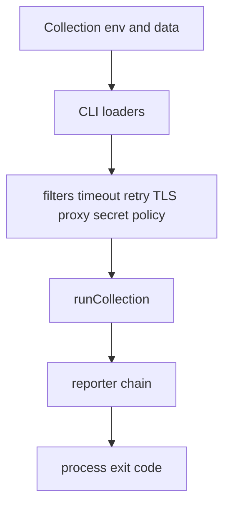

# Restura CLI

The `cli` workspace publishes the `restura` binary for CI-oriented execution. `cli/src/index.ts` registers public `run`, `agent`, and `workflow` commands and installs undici's environment proxy dispatcher when `HTTP_PROXY` or `HTTPS_PROXY` is set, honoring `NO_PROXY`.

## Commands and public behavior

| Command | Owner | Purpose |
| --- | --- | --- |
| `restura run [collection]` | `cli/src/commands/run.ts` | run a directory or bundled OpenCollection collection |
| `restura agent` | `cli/src/commands/agent.ts` | Agent Lab bridge and runtime configuration |
| `restura workflow` | `cli/src/commands/workflow.ts` | discover and run strict OWS workspace artifacts |

With no arguments, an interactive terminal routes to the run wizard; non-interactive use prints help. `run` never prompts in CI: missing collection is exit 2. Exit 0 means at least one request ran and all passed; 1 is test/request failure or an empty collection; 2 is invalid input, I/O, reporter/configuration, or other internal error.

## Run configuration

`run` accepts an OpenCollection directory or a single bundled `.yaml`/`.yml` file; `collectionLoader.ts` detects `opencollection.yml`/`.yaml` before a legacy `_collection.yaml` fallback and rejects invalid layouts. The configuration path is explicit rather than a hidden global config: `--env` reads JSON/YAML environment variables with expansion, `--data` reads CSV/JSON iteration rows, `--external-secrets-config` maps profile IDs to trusted identities, and standard `HTTP_PROXY`/`HTTPS_PROXY`/`NO_PROXY` are installed globally before `--proxy` can override the run's proxy. Command flags provide filters, timeout, retry, TLS and SSE limits. The resulting precedence is therefore runner collection/folder defaults plus loaded environment/data context, then resolved CLI execution options; request scripts/auth inheritance are resolved by the runner rather than duplicated by Commander. `run.ts` loads environment data, iteration CSV/JSON, reporters, TLS material, and optional external-secret configuration before it calls `runCollection`.  It supports folder/include/exclude filtering, bounded data iterations, per-request timeout, bail, retry count and conditions, bounded SSE duration/event count, TLS insecurity/CA/client certificate settings, explicit proxy override, and an opt-in localhost allowance. Defaults favor CI safety: SSRF-localhost access is off unless requested, and a failed secret resolution is not silently converted to an unauthenticated request.

Reporter selection is TTY-aware (`tui` interactively and `live` otherwise). `json`, `junit`, and `html` require a file output; multiple reporters use `CompositeReporter` and per-reporter output mapping. Reporter files are CI artifacts and must not contain raw secret diagnostics.

## Shared bridges and change surface

The runner owns collection/environment discovery, variable/script execution, filtering, retry/failure aggregation, protocol executors and `undiciFetcher`. OWS workspace loading/running uses the same bounded workflow rules documented in [Workflows](../workflows/overview.md). Agent commands use the Agent Lab runtime documented in [Agent Lab](../features/agent-lab.md). External secret profiles resolve only through explicitly configured trusted SDK providers.

For a CLI surface change, update the Commander command, parser/validator, runner contract, reporter/help text, tests under `cli/src/commands/__tests__/` and `cli/src/runner/__tests__/`, plus README reference if public behavior changes. Run `npm run --workspace cli test` and `npm run --workspace cli type-check`; use the full validation gate for shared contracts.
