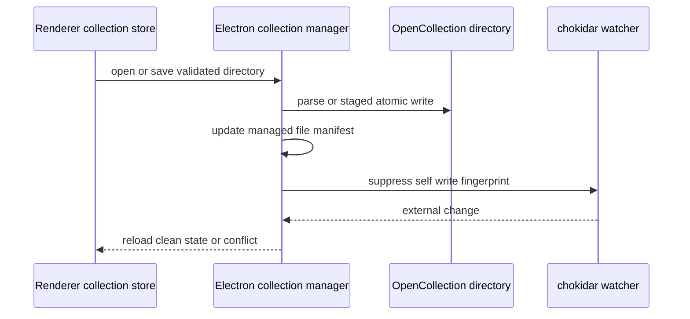

# OpenCollection, file collections, and capture

This is the canonical home for Restura's native collection format and desktop directory lifecycle. Format import/export breadth remains in [Integrations](overview.md); collection execution evidence is in [Console evidence and safety](../features/console-evidence.md).

## Format ownership

The source schema is `vendor/opencollection/v1.0.0/schema.json`; `shared/opencollection/spec-types.ts` is generated from it. `shared/opencollection/{schemas,to-internal,from-internal,serializer}.ts` validates and converts in both directions. Run `npm run gen:opencollection-types` after schema/generator changes and `npm run verify:opencollection-types` to ensure checked-in output has no drift.

OpenCollection directories start at `opencollection.yml` and contain request/folder YAML plus optional workflow artifacts. Conversion preserves native semantics where supported; Restura-specific extensions are used for features outside the portable core. Existing OpenCollection passthrough caches are intentionally stripped on edits so export rebuilds live model state rather than emitting stale source.

### Fixture-backed interoperability reference

`tests/fixtures/opencollection/simple-http.yaml` is the minimal bundled fixture: top-level `opencollection: "1.0.0"`, `bundled: true`, metadata, and an item whose `info.type: http` discriminator selects an `http` payload. `tests/fixtures/opencollection/multi-protocol.yaml` uses the same version/bundled form and an environment variable `API_HOST`; `{{API_HOST}}` is interpolated in HTTP, GraphQL, gRPC, WebSocket, and extension URLs.

| Fixture representation | Meaning and conversion boundary |
| --- | --- |
| `info.type: http` + `http` | Core HTTP item with method and URL. |
| `info.type: graphql` + `graphql` | Core GraphQL item with URL and query; the CLI conversion represents runnable GraphQL as HTTP with a GraphQL body. |
| `info.type: grpc` + `grpc` | Core gRPC item with endpoint, service, method, method type, and message. |
| `info.type: websocket` + `websocket` | Core WebSocket item. It is interactive state, not a CLI `LoadedRequest`; CLI conversion surfaces it as a folder rather than pretending it is runnable HTTP. |
| `extensions.x-restura-sse` | Restura extension list for SSE items and filters; it is not an ordinary core item. |
| `extensions.x-restura-socketio` | Restura extension list for Socket.IO namespace, transports, auth, and query; it is not an ordinary core item. |

The CLI loader tests in `cli/src/runner/__tests__/openCollectionLoad.test.ts` separately pin directory, bundled-file, legacy fallback, and invalid-layout behavior. Use these fixtures when changing portable item discriminators or interpolation; do not flatten protocol-specific semantics into generic HTTP.

## Desktop file lifecycle

`electron/main/storage/collection-manager.ts` owns path-real-safety checks, directory load/save, staged writes, managed-file manifests, secret-redacted export, watcher management, content-fingerprint self-write suppression, external-change/conflict delivery, and watcher-derived Git allowlisting. Never delete arbitrary files: the manifest controls only files Restura manages. A clean external change reloads; an external change while local state is dirty becomes a conflict.

`useFileCollectionStore` retains the renderer-side sync/conflict state. `App.tsx` restores watchers only after both file-collection and collection stores finish hydration, because Electron's in-memory allowlist is lost at restart. On deletion, stop watcher resources, unlink workflows, and detach saved request tabs to dirty standalone copies while keeping run history as evidence. Git operations pass through `electron/main/handlers/git-handler.ts`; watcher registration is authorization, not merely convenience.

## Capture bridge boundary

The Chrome extension shares normalization/redaction/export code under `shared/capture/`. Desktop `capture-bridge-handler.ts` accepts capture data on a loopback-only ingestion server. Pairing uses a token and accepts only expected origins; requests are rate limited before conversion to OpenCollection/renderer import. That boundary exists so arbitrary local or remote pages cannot inject collections or credentials.

`sessionToOpenCollection` applies defense-in-depth redaction again at export. Discovered values become `Captured` environment variables without plaintext values. REST and GraphQL captures map to their matching OpenCollection item forms; WebSocket and SSE use Restura extensions, gRPC-web is converted only where its supported mapping exists, and non-portable forms are deliberately not flattened into HTTP. The current writable desktop format is OpenCollection; `shared/collections/legacy-file-schema.ts` describes an older directory metadata/request-suffix layout and its HTTP, gRPC, SSE, and MCP request union plus sync/conflict states. Do not mistake that compatibility schema for the preferred write format.

Capture is not a substitute for safe storage: redact captured secrets before persistence/export and retain only format-safe collection data. The extension's UI/workspace details and test fixture services are in [Extensions and test services](extensions-and-test-services.md).

## Focused validation

Use `shared/opencollection/from-internal.test.ts`, merge and node workspace tests, collection importer/exporter tests, file-collection store tests, and Electron collection/Git handler tests according to the changed boundary. Always run `npm run verify:opencollection-types` after contract changes; run `npm run type-check:all` for Electron and renderer changes.
