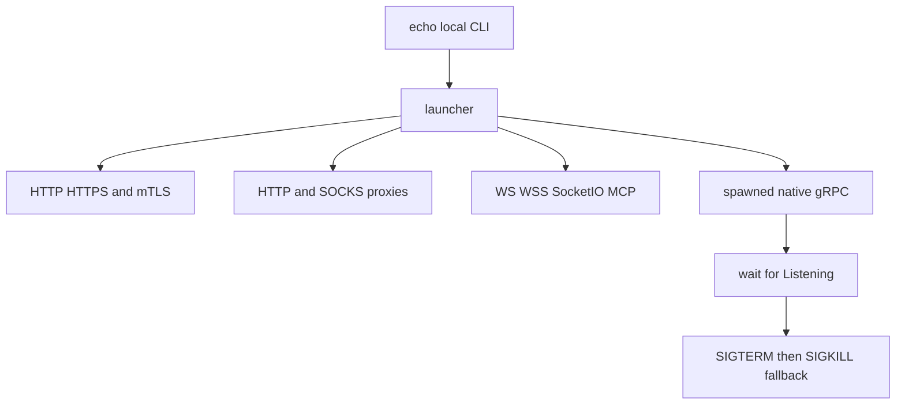

# Extensions and test services

Restura has two extension workspaces and controlled upstream services used by integration and end-to-end tests. They are test infrastructure with public integration boundaries, not production request execution dependencies.

## Extensions

- `extension/chrome/` (`@restura/extension`) captures browser traffic. It shares parsing, classification, redaction and HAR/OpenCollection exporters from `shared/capture/`; desktop receives paired data via the secure bridge described in [OpenCollection, file collections, and capture](collections-and-opencollection.md).
- `extension/vscode/` is a workspace extension, not a renderer plugin. It activates when a trusted local workspace contains `opencollection.yml` or `opencollection.yaml`; it explicitly refuses untrusted and virtual workspaces because it reads local collection files, runs the workspace's `restura` CLI, and can send the requests defined there.

### VS Code extension contract

`extension/vscode/src/extension.ts` activates three independently registered offerings:

1. `offering1_lang/diagnostics.ts` supplies OpenCollection YAML diagnostics. The manifest maps root collection filenames to the packaged `schemas/opencollection-v1.0.0.json`; schema ownership originates in the OpenCollection source/generation chain documented in [OpenCollection, file collections, and capture](collections-and-opencollection.md), not in arbitrary extension code. Per-request diagnostics accept only local YAML documents, validate open/save immediately and edits after a 300 ms debounce, build a line-range from each issue, and delete diagnostics at document close. Root collection files are deliberately left to the manifest JSON-Schema contribution. The collection, listeners, timers, and all other offering resources are added to `context.subscriptions` for disposal.
2. `offering2_test/testController.ts` scans `opencollection.{yml,yaml}` roots and local request files, builds stable collection/folder/leaf IDs from collection directory plus folder path/name, and refreshes through a debounced YAML watcher. A selected folder expands to its leaves; selected leaves are grouped by collection, so each group shells out once with an `--include`-equivalent relative request subset only when it is not the whole collection. VS Code cancellation aborts the shell process. CLI result folder/name keys reattach outcomes: passed, assertion failure, transport error, missing result as skipped, and cancellation as skipped.
3. `offering3_codelens/requestCodeLens.ts` makes Send and Run test capability-gated by request type. It resolves an explicit document URI or active editor. Run test finds the containing collection root, rejects a missing root or non-runnable request with a user warning, invokes the resolved CLI for one relative request, passes the optional environment file, and reports failures through the output channel and UI. Send maps the request with the collection's default environment variables, creates the extension-host Node fetcher with `allowLocalhost`/`allowPrivateIPs`, and calls shared `executeHttpProxy`; therefore it inherits SSRF validation, header policy, body construction, and redirect behavior rather than duplicating HTTP execution.

The public contributions in `extension/vscode/package.json` are `restura.refreshTests`, `restura.sendRequest`, and `restura.runRequestAsTest`, plus `restura.cliPath`, `restura.allowLocalhost`, `restura.allowPrivateIPs`, and `restura.env`. CLI resolution prefers the configured path, then workspace `node_modules/.bin`, then `PATH`. The local/private settings are an extension execution policy; cloud-metadata targets remain blocked regardless. Treat the extension → CLI process boundary as security-sensitive: validate any new workspace input, preserve cancellation forwarding, and do not make it work in untrusted or virtual workspaces without redesigning that boundary.

Validate narrowly with `npm run --workspace restura-vscode test:unit`; `test/unit/runner.test.ts` verifies discovery, stable result keys, and outcome classification, while `nodeFetcher.test.ts`, `mapper.test.ts`, and `validate.test.ts` cover execution/format helpers. Use `npm run --workspace restura-vscode type-check` after API or contribution changes; `npm run test:workspaces` runs the CLI and VS Code unit suites together. Build/package behavior is declared by `extension/vscode/package.json`.

Any shared capture format change must update the shared pipeline, extension consumer, desktop bridge, and focused extension/capture tests together.

## Hosted Echo Worker

`echo/index.ts` deploys a Cloudflare Worker used as a controlled upstream. It applies permissive CORS and its rate limiter, and serves HTTP, GraphQL, SSE, plain WebSocket, Connect/gRPC-Web, and OpenAI/Anthropic-shaped AI endpoints. It deliberately does **not** serve Socket.IO: that stateful Engine.IO upgrade flow is implemented by the Node fixture `e2e/mocks/socketioServer.ts`.

Use `npm run deploy:echo` or `npm run deploy:echo:preview` for hosted deploys. Changes need handler/middleware tests in `echo/__tests__/` and consumers that exercise the relevant route.

## Local Echo topology

`echo-local/cli.ts` builds/runs a local fixture stack. `launcher.ts` composes fixed-port HTTP, HTTPS, mTLS, HTTP proxy, SOCKS proxy, WS, WSS, Socket.IO, MCP, and a spawned native gRPC/reflection server. TLS services require generated cert material; `npm run echo:local:certs` produces it, while `npm run echo:local:collection` emits a fixture collection.

The gRPC child must announce readiness within 15 seconds; an early exit fails startup. Shutdown uses `Promise.allSettled`, sends SIGTERM, then SIGKILL after three seconds as a fallback. Do not make test cleanup rely on process exit.

Kafka and MQTT are intentionally excluded from this in-process launcher. Their e2e fixtures require real Redpanda and EMQX provisioning through `echo-local/docker-compose.yml`; Docker-dependent Electron tests skip when Docker is unavailable. The web Playwright suite, Electron suite, contract tests, and extension suite each consume only the fixture families their configs declare.

## Validation

Use the service's unit tests plus its consuming e2e spec. Run `npm run echo:local` for local stack diagnostics, `npm run test:e2e` for web, `npm run test:e2e:electron` after the required build for desktop, and `npm run test:e2e:extension` for Chrome extension coverage.
