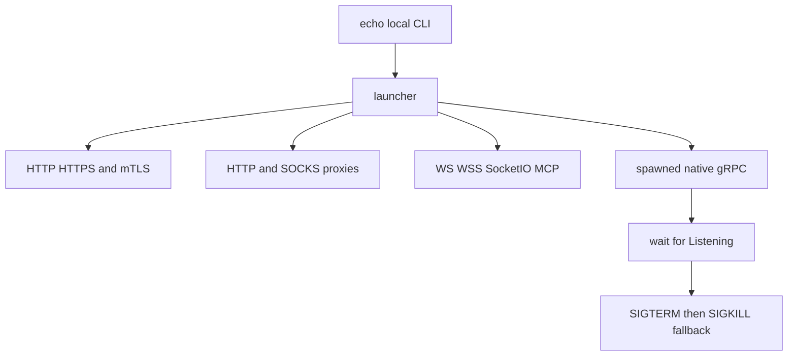

# Extensions and test services

Restura has two extension workspaces and controlled upstream services used by integration and end-to-end tests. They are test infrastructure with public integration boundaries, not production request execution dependencies.

## Extensions

- `extension/chrome/` (`@restura/extension`) captures browser traffic. It shares parsing, classification, redaction and HAR/OpenCollection exporters from `shared/capture/`; desktop receives paired data via the secure bridge described in [OpenCollection, file collections, and capture](collections-and-opencollection.md).
- `extension/vscode/` is the VS Code workspace with its own build, schema, source and unit-test configuration. Root workspace scripts build and test it alongside the CLI.

Any shared capture format change must update the shared pipeline, extension consumer, desktop bridge, and focused extension/capture tests together.

## Hosted Echo Worker

`echo/index.ts` deploys a Cloudflare Worker used as a controlled upstream. It applies permissive CORS and its rate limiter, and serves HTTP, GraphQL, SSE, plain WebSocket, Connect/gRPC-Web, and OpenAI/Anthropic-shaped AI endpoints. It deliberately does **not** serve Socket.IO: that stateful Engine.IO upgrade flow is implemented by the Node fixture `e2e/mocks/socketioServer.ts`.

Use `npm run deploy:echo` or `npm run deploy:echo:preview` for hosted deploys. Changes need handler/middleware tests in `echo/__tests__/` and consumers that exercise the relevant route.

## Local Echo topology

`echo-local/cli.ts` builds/runs a local fixture stack. `launcher.ts` composes fixed-port HTTP, HTTPS, mTLS, HTTP proxy, SOCKS proxy, WS, WSS, Socket.IO, MCP, and a spawned native gRPC/reflection server. TLS services require generated cert material; `npm run echo:local:certs` produces it, while `npm run echo:local:collection` emits a fixture collection.

The gRPC child must announce readiness within 15 seconds; an early exit fails startup. Shutdown uses `Promise.allSettled`, sends SIGTERM, then SIGKILL after three seconds as a fallback. Do not make test cleanup rely on process exit.

Kafka and MQTT are intentionally excluded from this in-process launcher. Their e2e fixtures require real Redpanda and EMQX provisioning through `echo-local/docker-compose.yml`; Docker-dependent Electron tests skip when Docker is unavailable. The web Playwright suite, Electron suite, contract tests, and extension suite each consume only the fixture families their configs declare.

## Validation

Use the service's unit tests plus its consuming e2e spec. Run `npm run echo:local` for local stack diagnostics, `npm run test:e2e` for web, `npm run test:e2e:electron` after the required build for desktop, and `npm run test:e2e:extension` for Chrome extension coverage.
