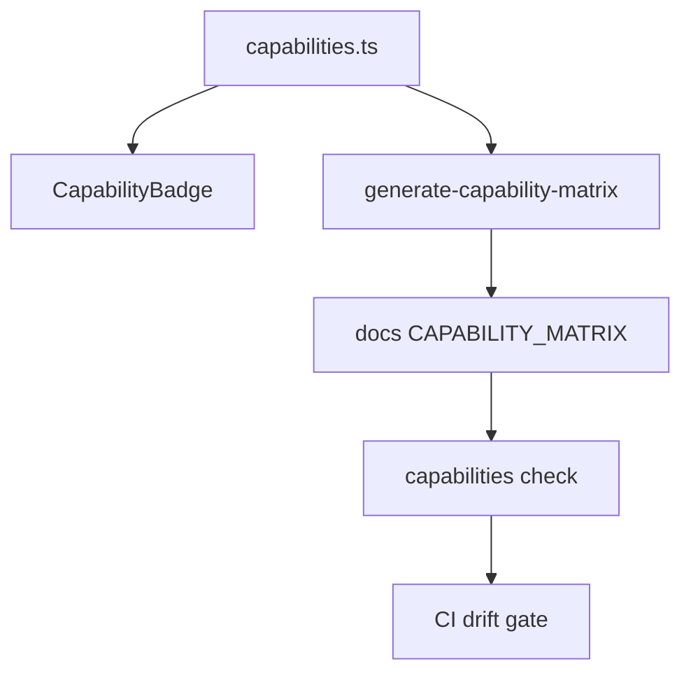

# Capabilities, observability, and critical desktop tests

## Capability matrix: code is authoritative

`src/lib/shared/capabilities.ts` is the single source of truth for feature availability across the web and Electron targets. Its stable `CapabilityName` keys are consumed by the renderer's `CapabilityBadge` and generated into `docs/CAPABILITY_MATRIX.md` by `scripts/generate-capability-matrix.mjs`; `npm run capabilities:check` regenerates and fails on drift.

Each row says whether a feature works on web and desktop and optionally carries the implementation reason. This is an architectural contract, not marketing copy: features that have partial handler scaffolding but no safe end-to-end path must remain false. For example, PAC proxying is unsupported because no renderer-to-`session.setProxy` path exists, and browser WebSocket custom headers are unavailable because browser APIs cannot set handshake headers. Worker ticket/relay routes exist, but the web renderer currently connects directly, so `websocket.viaWorkerProxy` remains false.


_The typed capability table drives both UI disclosure and the checked-in user-facing matrix, so a platform change has one source of truth._

When adding a capability, update the union and row, use the stable key at UI/logic call sites, regenerate the matrix, and test the actual implementation boundary. Do not mark a capability supported based only on a backend route or a type declaration. The broad target model is in [Architecture overview](../architecture/overview.md); protocol-specific behavior is in [Protocol features](../features/protocols.md).

## Logging, telemetry, and privacy

`shared/runtime/logger.ts` provides `createLogger(scope, baseFields)`. Records contain level, scope, message, primitive-friendly fields, and a timestamp; sinks can be console, no-op, or runtime-installed. Include `requestId` when available to correlate a renderer → IPC → upstream path. Never place request URLs, headers, bodies, credentials, tokens, file paths, or PII in log fields.

The runtime defaults differ deliberately:

| Runtime | Diagnostic path | Privacy boundary |
| --- | --- | --- |
| Renderer | Console-backed logger; global error and bug-report capture are installed in `src/main.tsx` | Error reporting is setting-gated. |
| Electron main | `initLogging`, consent-gated `initSentry`, structured local errors | Sentry starts only after synchronous consent lookup; main catches uncaught errors for local structured logs too. |
| Worker | No-op logger is appropriate for hot per-isolate paths | `/api/telemetry/error` accepts the bounded browser error payload; it is public only relative to proxy authority and still passes CORS, request IDs, and rate limits. |
| Self-hosted | Same Hono telemetry endpoint | No application-level usage analytics. |

`operations/overview.md` has deployment and telemetry settings; [Worker and self-hosted Node API](../architecture/worker-and-node-api.md) documents the route policy. A diagnostic change must preserve redaction and must not turn telemetry into an alternate privileged proxy endpoint.

## Critical Electron coverage

`npm run test:electron:critical-coverage` runs `vitest.electron-critical.config.ts`. It is intentionally narrower than `npm run test:ci`: it applies per-file thresholds to the HTTP handler, extracted response-stream and secure-connection helpers, IPC boundary, execution policy, and secret-handle store. These files enforce native requests, trusted-renderer checks, policy acknowledgment, and plaintext containment; a repository-wide percentage can pass while one of them loses essential coverage.

Run the relevant unit test before the coverage gate. For a native HTTP/IPC change, use:

```bash
vitest run electron/main/__tests__/http-handler.test.ts
npm run test:electron:critical-coverage
```

For capability source changes, also use:

```bash
npm run capabilities:check
npm run type-check:all
```

The reason these critical paths were split and gated is recorded in [Recent history and change rationale](recent-history-and-change-rationale.md).
