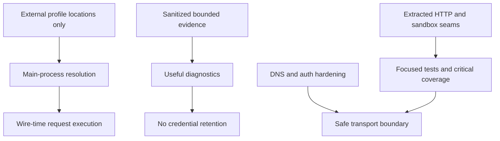

# Recent history and change rationale

This page selects the material progression from `4671a665` (`feat(desktop): configure external secret profiles`) through `7123bbd7` (`chore: strengthen toolchain and critical execution paths`). Git history is supporting evidence; current source and tests remain authoritative. Use this map before modifying a recently hardened boundary so a refactor does not restore the failure mode it was meant to eliminate.

| Change | Affected boundary and reason | Current change surface | Regression evidence |
| --- | --- | --- | --- |
| `4671a665` external secret profiles | Adds desktop configuration for cloud provider identity locations without putting actual cloud credentials in collections, renderer state, or IPC replies. | `shared/secrets/external-secret-profile.ts`, `electron/main/security/external-secret-profile-store.ts`, `external-secret-providers.ts`, Settings security UI | Profile schemas are strict and capped; profile-store tests and external-secret resolver tests protect persistence and fail-closed resolution. |
| `3fe81959` console redaction and safe drafts | Prevents Network Console evidence/export and native request drafts from retaining credentials while preserving enough sanitized evidence for debugging. | `src/lib/shared/console-sanitization.ts`, console export/store, request builder and collection-run evidence paths | `useConsoleStore.test.ts`, `console-export.test.ts`, and collection runner tests cover sanitation, draft reconstruction, trimming, and credential-free exports. |
| `4c678af7` bounded runner evidence | Retains response evidence for collection-run diagnosis while bounding stored data and redacting it; avoids an all-or-nothing history model. | `shared/collection-run/evidence.ts`, collection runner/export/store | `shared/collection-run/evidence.test.ts` and `collectionRunner.test.ts` assert retention/redaction behavior. |
| Security fixes around proxy and DNS behavior | Existing platform abstractions can reopen SSRF/TOCTOU vulnerabilities if resolution validation is separated from connection. Worker auth/CORS also must not become permissive by environment accident. | `shared/protocol/url-validation.ts`, Electron `safe-connect.ts`, Socket.IO and HTTP secure-connection handlers, `worker/app.ts` | `tests/security/socketio-dns-pinning.test.ts` asserts no socket after rejection and a pinned lookup after success. `worker/__tests__/index.test.ts` asserts no origin reflection and no unintended development bypass. |
| `7123bbd7` robustness foundations | Pins toolchain behavior across CI/Windows and extracts large, high-risk Electron HTTP and QuickJS responsibilities so testable seams and ownership are clearer. Adds a critical Electron coverage gate to prevent a global percentage from masking loss in policy-sensitive code. | `scripts/verify-toolchain.mjs`, setup action/workflows, `electron/main/handlers/http-response-stream.ts`, `http-secure-connection.ts`, `shared/scripts/script-executor-{namespaces,types,values}.ts`, `vitest.electron-critical.config.ts` | `scripts/__tests__/verify-toolchain.test.mjs`, HTTP handler suites, script phase tests, and `npm run test:electron:critical-coverage`. |

## How the decisions connect

_The recent work converges on explicit trusted boundaries: secrets resolve only where needed, evidence is useful without retaining credentials, network checks bind to the actual connection, and high-risk code has focused tests._

## Change guidance

- **External secrets:** retain the location-only schema. The renderer may manage profile metadata, but provider credentials remain with SDK credential sources and request-time main-process resolvers. See [Persistence and execution security](../architecture/persistence-and-security.md).
- **Console or runner evidence:** change sanitizers and exporters together; validate both in-memory persistence behavior and emitted formats. See [Console evidence and safety](../features/console-evidence.md).
- **Native networking:** do not replace validated/pinned connection helpers with one-time URL checks. Follow the downstream connector and the DNS-rebinding suite.
- **HTTP or sandbox refactors:** preserve the extraction boundaries rather than collapsing them back into orchestrators. Follow imports from `http-handler.ts` to its helpers and from `script-executor.ts` to namespaces/types/values; run their focused suites and the critical gate.
- **Toolchain/CI:** run `npm run toolchain:check` and `npm run test:tooling` after changing Node/npm setup or command execution logic, especially if behavior differs on Windows.

For the operational command map, see [Operations](overview.md). For the complete desktop lifecycle that consumes these security seams, see [Electron IPC and lifecycle](../architecture/electron-ipc-and-lifecycle.md).
