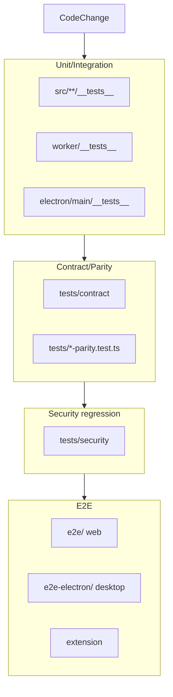

# Testing

Restura maintains a multi-layer test suite. This page maps the layers and tells you which tests are relevant when changing each major area.

---

## Test layers


_Fast unit and integration tests run first; contract, parity, security, and e2e layers run for broader changes before merge or release._

| Layer               | Tool       | Location                       | When to run                                              |
| ------------------- | ---------- | ------------------------------ | -------------------------------------------------------- |
| Unit / integration  | Vitest     | `**/__tests__/**/*.test.ts(x)` | Always during development                                |
| Contract / parity   | Vitest     | `tests/`                       | After shared-protocol or auth changes                    |
| Security regression | Vitest     | `tests/security/`              | After SSRF, header, redirect, secret, or sandbox changes |
| Web e2e             | Playwright | `e2e/`                         | Before merging UI or protocol flows                      |
| Electron e2e        | Playwright | `e2e-electron/`                | Before releasing desktop builds                          |

---

## Unit / integration (Vitest)

- Config: `vitest.config.ts`.
- `tests/setup.ts` mocks Dexie/IndexedDB and loads `@testing-library/jest-dom`.
- Aliases `@/` and `@shared` are configured.
- Co-located tests mirror the source tree, e.g. `src/features/workflows/lib/__tests__/owsFlowMapper.test.ts`.

### Notable test groups

- **OWS workflows**: `shared/ows/__tests__/{bindings,executor,graphql-operation,runtime-expression,workflow-profile}.test.ts`, `shared/ows/node/__tests__/workspace.test.ts`, `src/features/workflows/{lib,hooks}/__tests__/*`, and `src/store/__tests__/useWorkflowStore.ows.test.ts` cover the bounded workflow profile, saved-request bindings, runtime expressions, workspace artifacts, and renderer execution.
- **Script sandbox**: `src/features/scripts/lib/__tests__/*.test.ts`, `cli/src/runner/__tests__/scripts.test.ts`.
- **Shared protocol**: `shared/protocol/__tests__/*`, `worker/__tests__`, `electron/main/__tests__`.
- **Collections**: `src/features/collections/lib/__tests__/*`, `src/features/collections/hooks/__tests__/*`, and `src/lib/opencollection/__tests__/*` cover runner scope/outcomes, coordinated deletion, format round-trips, and managed-file reconciliation.
- **AI Lab**: `src/features/ai-lab/lib/__tests__/*`.
- **MCP**: `src/features/mcp-server/__tests__/*`, `src/features/mcp/lib/__tests__/*`.
- **Desktop Kafka producer**: `src/features/kafka/lib/__tests__/kafkaProducerValidation.test.ts`, `electron/main/__tests__/{kafka-handler,kafka-serde,kafka-validators}.test.ts`, and `src/features/kafka/lib/__tests__/kafkaManager.electron.test.ts` cover client-side payload/header/schema validation, strict Base64 wire decoding and byte-preserving consume display, IPC schema validation, and manager routing. These tests protect the desktop behavior described in [Protocol features](../features/protocols.md#kafka--mqtt).

Run selectively:

```bash
vitest run path/to/file.test.ts
vitest run -t "pattern"
```

---

## Contract and parity tests (`tests/`)

These verify identical behavior across backends for the same inputs.

- `tests/contract/http-proxy.contract.test.ts` — same `RequestSpec` through `globalThis.fetch` and undici; asserts `ExecuteResult` parity.
- `tests/contract/http-proxy-streaming.contract.test.ts` — streaming parity.
- `tests/auth-config-parity.test.ts`, `tests/body-type-parity.test.ts`, `tests/grpc-spec-parity.test.ts`, `tests/redirect-policy-parity.test.ts`, `tests/secret-ref-parity.test.ts`.

Run:

```bash
npm run test:contract
```

---

## Security tests (`tests/security/`)

Cover the main security boundaries:

- SSRF (`url-validation.ts` / desktop DNS guards)
- Header policy and hop-by-hop lists
- Redirect follower cross-origin auth stripping
- Secret redaction in AI prompts, capture pipeline, exports, and crash logs
- Sandbox iframe / CSP behavior

Run them after touching `shared/protocol/url-validation.ts`, `redirect-follower.ts`, `auth-signer.ts`, Electron security handlers, or the QuickJS sandbox.

---

## E2E

### Web (`playwright.config.ts`)

- Specs in `e2e/`.
- Boots the dev server automatically; requires `.dev.vars` at config-load time.
- Uses `workers: 1`, `fullyParallel: false` because suites share dev-server state.

### Electron (`e2e-electron/playwright.config.ts`)

- Runs against the unpacked production build `dist/electron/`.
- Needs a prior build (`npm run test:e2e:electron:build` or manual equivalent).
- Native gRPC tests need `npm run grpc:server`.
- Kafka/MQTT tests spin up Docker brokers via `echo-local/docker-compose.yml`; they auto-skip if Docker is missing. `e2e-electron/specs/kafka.spec.ts` specifically round-trips a Base64 binary payload through a live Redpanda broker, checking that the received value and text header survive the renderer → IPC → broker → renderer path.

### Browser extension

- `playwright.extension.config.ts` runs against built extension artifacts.

---

## CI coverage thresholds

`vitest.config.ts` thresholds:

- lines: 80%
- functions: 78%
- branches: 61%
- statements: 78%

`npm run test:ci` enforces the configured coverage budgets while collecting coverage. In addition to percentage floors, `vitest.config.ts` has an uncovered-branch budget; add coverage for newly introduced branches instead of weakening that guardrail.

---

## Source map

| Concern             | Files                                                      |
| ------------------- | ---------------------------------------------------------- |
| Vitest config       | `vitest.config.ts`                                         |
| Test setup          | `tests/setup.ts`                                           |
| Web e2e config      | `playwright.config.ts`, `e2e/global-setup.ts`              |
| Electron e2e config | `e2e-electron/playwright.config.ts`                        |
| Contract helpers    | `tests/contract/fetchers.ts`, `tests/contract/upstream.ts` |
| Security suite      | `tests/security/`                                          |
| Echo server         | `echo/`, `echo-local/`                                     |
